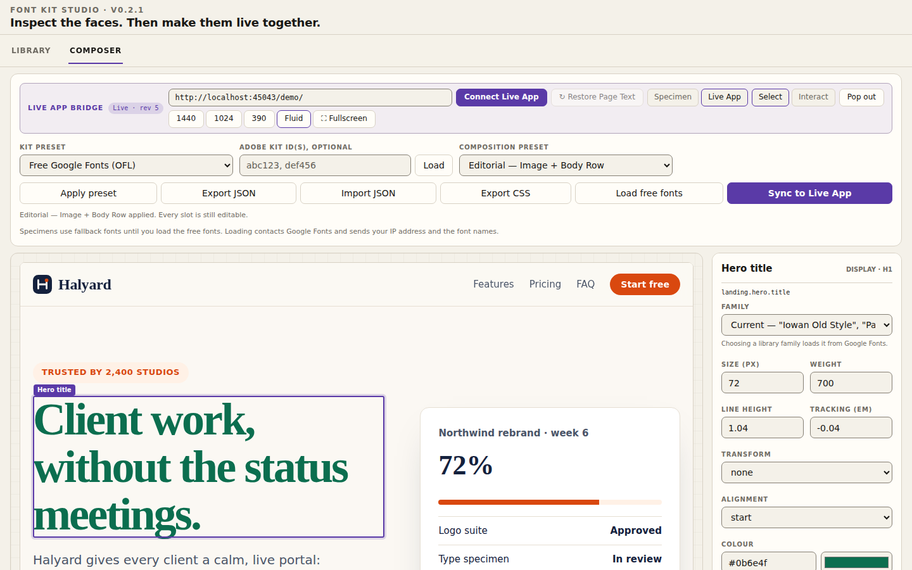
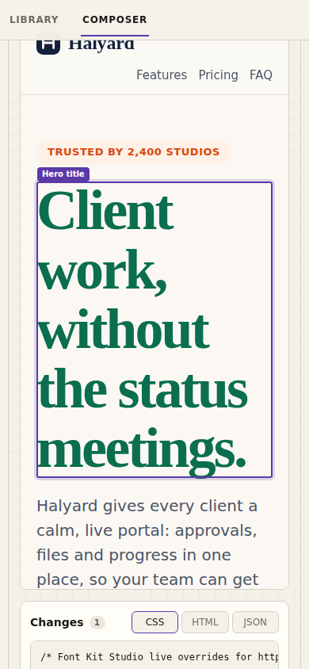
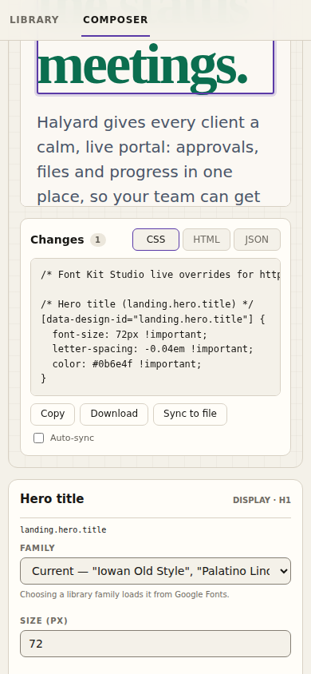
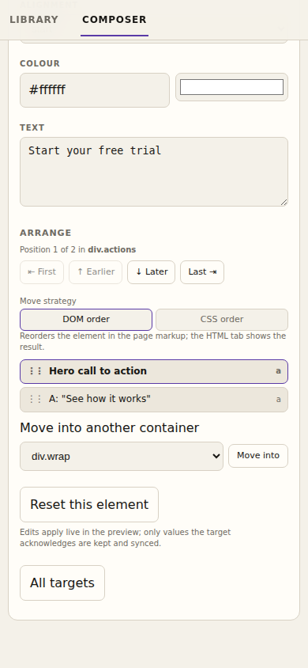
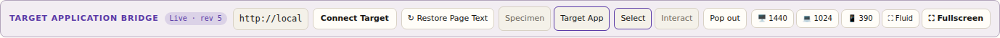
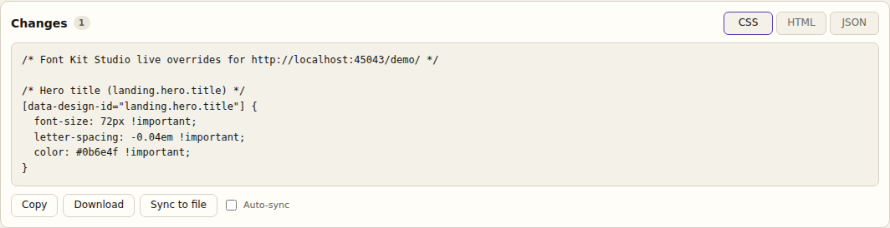
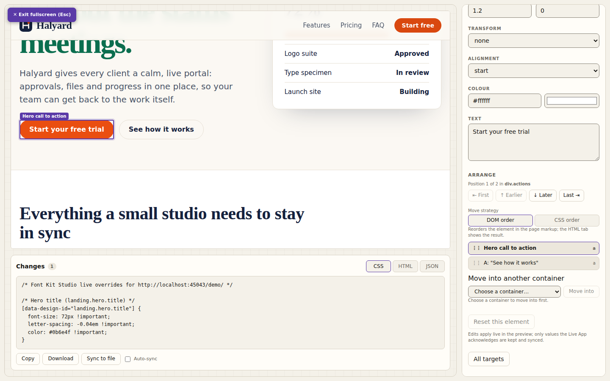
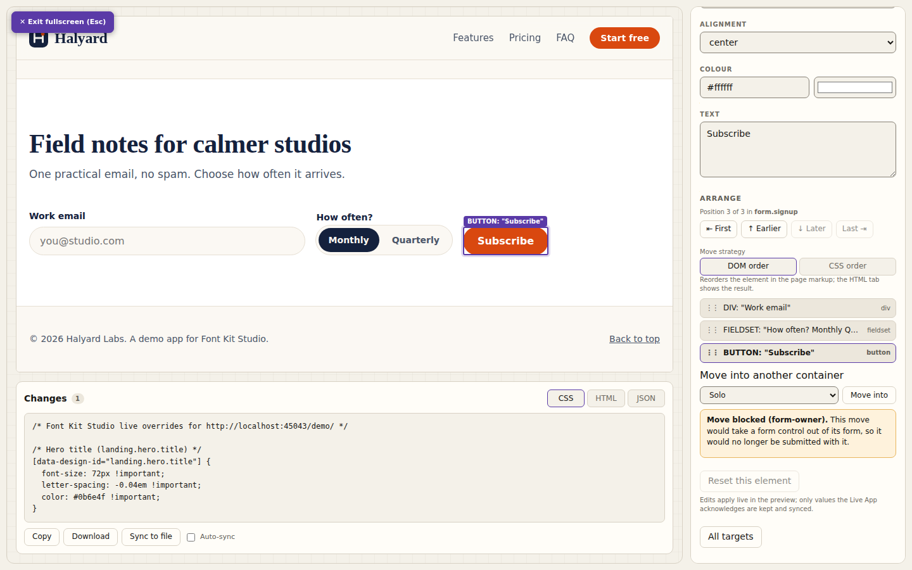
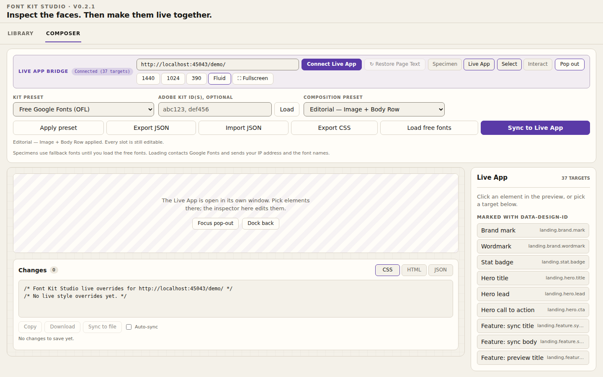

<p align="center">
<picture>
  <source media="(prefers-color-scheme: dark)" srcset="docs/assets/fontkit-logo-dark.svg">
  
</picture>
</p>

<p align="center"><strong>Edit the type and layout of your own web app in a live preview, then copy the CSS and HTML.</strong></p>

<p align="center">
  <a href="#quickstart">Quickstart</a> ·
  <a href="#workflows">Workflows</a> ·
  <a href="#faq">FAQ</a> ·
  <a href="#add-font-kit-studio-to-your-app">Add it to your app</a> ·
  <a href="#protocol-v1">Protocol</a> ·
  <a href="#security-model">Security</a> ·
  <a href="#roadmap">Roadmap</a>
</p>



## What it is

Font Kit Studio is a tool for changing how a web page looks while the page is running.

- You open your app next to Studio. **Studio runs in its own window or tab. It never runs inside the app you are tweaking.**
- You click a heading, a button or a card in the live page. You change the font, size, colour or text, or move the element to another place. The page updates as you type.
- Studio shows the CSS and HTML that those changes amount to. You copy it, download it, or let the dev server write it to a stylesheet.

It works on pages that load one small script, `fontkit-bridge.js`. That script is the "bridge": it reports what is on the page and applies the changes Studio asks for. It does nothing until Studio connects, and it belongs in development only. `npx fontkitstudio` adds it for you while you run your app; without that command, you add one script tag yourself.

Font Kit Studio does not change your source code. You decide what to apply.

Studio also still has the **Library** (a specimen browser for 16 free fonts) and the **Composer** (a layout tool for typographic specimens with rows, images and rules). Both still work without a bridge. The font library is free Google Fonts; see [Free fonts](#free-fonts).

## Quickstart

You need Node 22.12 or later. In a Vite project (Vite 7 or 8), run this in the project folder:

```bash
npx fontkitstudio
```

It runs your project's own dev server with Studio added, and opens Studio in your browser. It writes nothing to your project. To print the address instead of opening it, add `--no-open`. The command needs `fontkitstudio` 0.3.0 or later.

For any other local dev server, such as Next.js, start it as usual and give its address:

```bash
npx fontkitstudio http://localhost:3000
```

Studio runs a proxy in front of your app. The proxy adds the bridge script to your pages and passes everything else through, so you change nothing in your app.

For a permanent setup in a Vite project, install the package and add the plugin to `vite.config`:

```bash
npm install --save-dev fontkitstudio
```

```js
// vite.config.js
import { fontkitStudio } from 'fontkitstudio/vite'

export default {
  plugins: [fontkitStudio()],
}
```

Then run `npm run dev`. The dev server prints a `Font Kit Studio · dev only` line and an `Open:` address for Studio. The plugin is left out of `vite build`. See [Vite](#vite-react-vue-svelte), [Next.js](#nextjs) and [If Studio does not connect](#if-studio-does-not-connect).

### Try the demo, or work without Node

You need Python 3. It was developed and tested on Python 3.11, and nothing else is installed: the server uses only the standard library. If `python` is not found, use `python3`. On Windows, `python` may be the Microsoft Store stub that opens the Store instead of running; use `py -3` or `python3` there.

```bash
git clone https://github.com/pterw/font-kit-studio
cd font-kit-studio
python scripts/serve.py
```

1. Open the URL on the line that starts with **`Open:`**, the last line the command prints. It looks like `http://localhost:8000/fontkit-studio.html?target=http://localhost:8001/demo/`. The `Demo:` line is the demo app's own address, on its own port; you do not open it yourself. The command never opens a browser on its own. To have it do so, run `python scripts/serve.py --open`.
2. Studio opens the Composer in its **Live App** view and connects, because the URL names the demo. Wait for the badge to say **Connected (N targets)**. The demo app, "Halyard", is already instrumented.
3. **Click** the big headline in the preview. Change its size, colour or text in the panel on the right.
4. Watch the **Changes** panel under the preview. Press **Copy**, or press **Sync to file** to write the CSS to `demo/fontkit-overrides.css`, which the demo already links. Both stay disabled until you have made a change.
5. Press **Connect Live App** again to reload the preview. The style stays, because it now comes from the stylesheet. Studio asks whether to reapply the rest (see [Reconnect banner](#reconnect-banner)).

To use your own app without Node, add the one script tag from [Add Font Kit Studio to your app](#add-font-kit-studio-to-your-app), put your app's address in the **Live App URL** box and press **Connect Live App**.

A few things Studio tells you on the way in:

- Studio opens on the **Library** tab. The Live App bridge bar is in the **Composer** tab. A URL with `?target=` opens the Composer and connects for you.
- The **Live App URL** box starts empty. **Connect Live App** stays disabled, with "Enter your app's URL" in its tooltip and under the bar, until you type one. A URL needs `http://` or `https://`. Studio refuses its own address, and tells you why.
- When Studio is served by the dev server on `localhost` and opened without `?target=`, it fills in the demo address and the button reads **Connect to the demo**. It never connects on its own. Edit the address and the button reads **Connect Live App** again.
- If nothing answers within 4 seconds, the badge says `No bridge answered at <origin> within 4 s.` and the hint names both causes: nothing is running there, or the page does not load `fontkit-bridge.js`. Opened from disk, the hint adds how to start the dev server.
- If Studio is hosted on the web and your app is on `localhost`, Chromium may block the reach. After 4 seconds with no answer, Studio says so. Open Studio from the dev server or from the file on disk instead.
- Fullscreen never connects as a side effect. It covers the bridge bar, so leave it with the **Exit** button or `Esc`, then press **Connect Live App** when you are ready.
- A control that has nothing to act on is disabled, and its tooltip says why. **Sync to Live App** and **Restore Page Text** wait for a connected page, and Restore Page Text also waits for a text edit. **Reset this element**, **Copy**, **Download** and **Sync to file** wait for a change. **Select**, **Interact** and the width buttons work only in the Live App view. **Load free fonts** is off once every font has loaded. **Focus pop-out** is off while the pop-out is closed. **Sync to file** and **Auto-sync** also say when there is no dev server or sync is off. Because a tooltip is easy to miss, **Sync to file** and **Sync to Live App** also print their reason as a line of text next to the button.

### Open the Studio HTML file directly

`fontkit-studio.html` is a single file with no dependencies. The old name, `font_kit_studio_v0.1.1.html`, is now a small page that forwards to it (keeping any query and hash) and goes away at R2 (0.4.0). The version of the release shows in the browser tab's title and in the line above Studio's heading. You can double-click the file, or open it from disk, and it works for the Library and the Composer. You can also connect it to a running app by typing the app's URL into **Live App URL**, and the inspector, the Changes panel and Copy all work.

What does **not** work from a file: **Sync to file** and **Auto-sync** are switched off, because there is no server to write the file. Use `python scripts/serve.py` for those. The npm command does not serve Sync to file.

### Dev server options

| Flag | Default | What it does |
|---|---|---|
| `--studio-port` | `8000` | Port for Studio. Also serves `/__fontkit/status` and the sync endpoint. |
| `--target-port` | `8001` | Port for the demo and any file in this repo. Studio and the demo app use different ports on purpose, so they stay separate origins. |
| `--overrides` | `demo/fontkit-overrides.css` | The one file Sync may write. It must be a `.css` file inside this repo. |
| `--no-sync` | off | Refuses all writes. |
| `--open` | off | Opens the `Open:` URL in your default browser once both ports are listening. |
| `--host` | `127.0.0.1` | Interface to listen on (loopback by default). See the notes below. |
| `--quiet` | off | Turn off the per-request log. |

Two things to know:

- **A different `--overrides` path is written, but the demo does not link it.** The demo always links `demo/fontkit-overrides.css`. For your own app, add `<link rel="stylesheet" href="http://localhost:8001/<your overrides path>">` after your own CSS (in development), or just use Copy.
- **`--host 0.0.0.0` does not give your LAN access.** By default the server listens on loopback only. It accepts `localhost`, `127.0.0.1`, `[::1]` and the exact name you pass to `--host`. A phone or another computer that uses your machine's IP address gets `421 Misdirected Request`. This blocks DNS-rebinding attacks. A browser sees a short page that names the accepted addresses and says to pass `--host`. To allow one address, pass it explicitly, for example `--host 192.168.1.20`.
- **A busy port stops the server with a message that names it**, for example `--studio-port 8000 is in use; pick another with --studio-port <port>`. Pass a free port with that flag (and `--target-port` for the demo port).

## Workflows

### Live App inspector

Click anything in the preview and the panel on the right becomes its inspector.

| Control | What it changes |
|---|---|
| Family | The element's font. Lists the page's current font plus the 16 free families. Picking a free family also loads its Google Fonts stylesheet in the page. |
| Size, Line height, Tracking | `font-size` (px), `line-height` (ratio), `letter-spacing` (em). Typing works one key at a time. |
| Weight | `font-weight`. If the element declares `data-design-weights`, values snap to the nearest allowed weight. |
| Transform, Alignment, Colour | `text-transform`, `text-align`, `color` (hex box plus picker). |
| Text | The element's text. Only shown for text elements. |
| Arrange | Moves the element. See [Arrange](#arrange). |
| Reset this element | Puts this element back exactly as it was. |

Studio also works in a narrow window. At 390 px wide the inspector stacks under the preview, and the connected view does not scroll sideways:

<table>
  <tr>
    <td></td>
    <td></td>
    <td></td>
  </tr>
</table>

Values come back from the page, not from Studio. If the page snaps `550` to `600`, the box shows `600`. If the page rejects a value, the badge says `Rejected: <reason>` and nothing changes.

Elements with a `data-design-id` have stable names. Others are discovered automatically (headings, paragraphs in sections, links in nav, buttons, images, badges and so on). Their selectors are built from the page structure, so the CSS tab marks them "auto-discovered, add data-design-id for a stable selector". If you add the attribute while editing, the element keeps its edits and moves to the new name; the next sync writes the stable selector. If you remove an author `data-design-id` while editing, the edit moves to an automatic id (the element's manifest carries `previousId`, naming the id you removed), and the unstable-selector hint comes back.

The badge shows where you are: `Idle`, `Connecting…`, `Bridge detected`, `Connected (N targets)`, `Live · rev N`, `Rejected: <reason>`, `No bridge answered at <origin> within 4 s.` (with a hint that says what to check), `Disconnected (window closed)`.

### Select vs Interact

The **Select / Interact** switch sits in the bar above the preview.



- **Select** (default): clicks pick an element for editing. Links and buttons do not run.
- **Interact**: the page behaves normally. Links, buttons, form fields and menus all work, and Studio stops reporting hover and selection.

Use Interact to test what you changed: submit the form, open the menu, follow a link. Switch back to Select to keep editing.

### Code panel

Under the preview, **Changes** shows what you have done so far, built only from what the page confirmed.



| Tab | Shows |
|---|---|
| **CSS** | `@import` lines first for the free fonts in use (only once you have asked for free fonts, see [Free fonts](#free-fonts)), then one rule per changed element with `!important` declarations. This is the file Sync writes. |
| **HTML** | The changed elements as clean snippets: text edits, and the container for every element you moved. Bridge-added attributes and inline overrides are removed. |
| **JSON** | `{ "target", "revision", "overrides" }`: the Live App's URL, the revision, and the same changes keyed by element id. When a DOM move is saved it also holds `structure`, the saved DOM order. |

Buttons: **Copy** (clipboard), **Download** (`fontkit-overrides.css`, `fontkit-changes.html` or `fontkit-overrides.json`), **Sync to file**, and **Auto-sync**.

- **Sync to file** needs `python scripts/serve.py`. It writes the CSS tab to the overrides file in one atomic step. Under `npx fontkitstudio` Studio says Sync to file is not available and points to Copy and Download.
- **Auto-sync** rewrites the file about 400 ms after the last change. Writes never overlap, and the latest state wins.
- Text changes go in the HTML tab, not the stylesheet. DOM moves also live in the HTML tab. Studio keeps them in its saved state and in the live JSON (`structure`), so **Reapply** puts them back after a reload, but Sync never writes them: it adds no CSS rules for a DOM move (the file only gains a comment that points to the HTML tab). CSS-order moves are plain CSS (`order`), so they are in the stylesheet.
- A bridge from before `orderIds` (see [Bridge to Studio](#bridge-to-studio)) cannot have its DOM moves saved. Studio says so when you make one.
- If the page itself changes the order of a container Studio saved (for example when the app re-renders it), Studio keeps its saved order instead of adopting the page's order, and shows the reconnect banner at the next DOM move or reset it processes, or when the page reconnects. A DOM move is not saved when it would put an element in two saved containers (possible while that banner is open) or save more than 100 containers; the status says so, and **Reapply** or **Accept Live App state** resolves the first case.

Studio never writes the file until you press Sync (or turn on Auto-sync). It also never writes a placeholder over a file it has not changed:

- **A fresh session writes nothing.** Until Studio has held a saved change since the page loaded, **Sync to file** is disabled with "No changes to save yet." If you turn on **Auto-sync** anyway, it writes nothing and says so. A stylesheet you wrote by hand is left as it is.
- **After your own reset, Sync clears the file.** Once Studio has held a saved change, resetting the last one leaves nothing to save, but the file may still hold the old CSS. **Sync to file** then stays on, its tooltip says it writes an empty overrides file, and pressing it replaces the file with two comments: the header that names the Live App's URL, and `/* No live style overrides yet. */`. Auto-sync does the same on its own after the reset.

### Arrange

Arrange is the section at the bottom of the inspector. It reorders the selected element among its siblings or moves it into another container: buttons in a row, cards in a grid, items in a list.



- **First / Earlier / Later / Last** buttons.
- A **sibling list** you can drag, or focus and press `Alt` + `↑` / `↓`.
- **Move into another container**, with a list of valid destinations.
- Keyboard shortcuts: while Studio has focus (not the preview, which keeps its own keys) and you are not typing in a field, `Alt` + `↑` / `↓` moves the selected element, and `Alt` + `Shift` + `↑` / `↓` sends it to the start or end.

**Move strategy** appears when the parent is a flex or grid container:

| Strategy | What happens | Output |
|---|---|---|
| **DOM order** | The element really moves in the page's markup. | HTML tab (a "Structure" block with the container's cleaned HTML). Kept in Studio and replayed by Reapply; Sync writes no CSS for it. |
| **CSS order** | The markup stays as it is. Studio sets `order` on every sibling. | CSS tab, and Sync. |

CSS order is the default when the parent looks framework-managed (React, Vue or Svelte markers). It changes how the page looks, not the reading or Tab order, so check keyboard order yourself if that matters.

**Guards** stop moves that would break the page. A DOM move is refused, with the reason on screen, when it would:

| Guard | Stops |
|---|---|
| `form-owner` | Taking a form control out of its form, so it no longer submits with it. |
| `radio-group` | Separating a radio button from its group. |
| `label-reference`, `aria-reference` | Taking a control out of the `<label>` that wraps it, or moving an element across a shadow-DOM boundary so a `label for`, `aria-controls`, `aria-labelledby` or `aria-describedby` link would stop resolving. An ordinary move inside one document cannot break an `id` link, so those are not blocked. |
| `content-model` | Putting a block element (a `div`, a `ul`, a heading…) inside a paragraph, heading, `span`, link, button, label or `summary`. Cannot be overridden. |
| `framework-managed` | Touching a part of the page that React, Vue or Svelte owns, because the framework may undo it. This one has a **Move anyway** button. The others do not. A move made with Move anyway is kept in Studio, but Reapply cannot replay a guarded move: the guard refuses it again and Reapply stops with the reason. |
| `css-order` | Using the CSS order strategy on a parent that is not flex or grid, or to move between containers. |



A move can also be refused for plain reasons, such as an index out of range, an unknown container, a move into the element itself or one of its descendants, a void or replaced container (an ``, an `<input>`), or an unusable reference. The reason is shown in the same place.

If the page throws an error within one second of a change, Studio shows it as a warning in the status area and under the code panel. Reset any moved element with **Reset this element**, and the page goes back to its original order.

### Pop-out window

**Pop out** asks your browser for a separate window. Studio asks for a pop-up that is 80 pixels smaller than the available screen each way, never smaller than 600 by 400 or bigger than 1280 by 860, and offset 40 pixels from Studio's own window, so the two do not stack exactly. The browser decides in the end: some settings open a tab instead, and you can drag that tab out. The page then runs at its real size, and nothing is inside an iframe, which helps with apps that refuse to be framed.



- Pick elements in the pop-out. The inspector in Studio edits them.
- Studio cannot draw over another window, so the bridge draws a thin outline in the pop-out page. It is removed when you dock, and it never appears in the exported code.
- **Focus pop-out** brings the window forward. **Dock back** closes it and returns the preview to Studio.
- Closing the window gives `Disconnected (window closed)`.
- When the pop-out opens, and when you dock back, Studio may show the [reconnect banner](#reconnect-banner). The fresh page has none of your saved edits, so Studio asks before sending anything.
- Browsers may block the pop-up. If so, Studio says so and keeps the iframe.

### Reconnect banner

When the preview reloads, the new page has none of your live edits. Studio does **not** push them back, and it does not overwrite your saved overrides. It shows a banner and waits.

| Button | Does |
|---|---|
| **Reapply Studio overrides** | Sends Studio's saved changes to the page again, so you can keep editing them. Text, fonts and CSS-order moves are replayed first, then DOM-order moves in order, then composition tokens. If a leftover CSS order has to be cleared first, the banner says so. That reset puts the element back where it started, so it undoes a DOM move only when the move is not saved; a saved DOM move is replayed after the resets. |
| **Accept Live App state** | Replaces Studio's saved overrides and composition tokens with what the page has now, and keeps only the saved DOM order the page still holds exactly as saved. Saved overrides and tokens the page does not hold are dropped; containers that only the page reordered are not adopted. The overrides file is left alone until you press Sync, and the next Sync writes a smaller CSS file only when the page holds fewer style edits and tokens than Studio saved, and the banner says when (text edits never change the CSS file). |

After you press **Sync to file** and reload, the page can look right while the banner reports 0 live edits. The synced overrides file already styles the page, and the bridge counts only edits made through Studio, so there is nothing to count. That is expected. Nothing was applied automatically, and the overrides file only changes when you sync.

If Reapply fails, Studio keeps its saved state, writes nothing, and says what happened: which step the page refused and why (a guard explains itself), how many Reapply steps were already applied (so the page may be partly changed), or that a saved DOM-order container is gone from the page (nothing is sent then). You can press it again.

### Free fonts

- The default is **16 free open-source fonts** (SIL Open Font License) from Google Fonts: serif, sans, display and mono, several of them variable. Nothing is bundled and no kit ID is filled in.
- **Studio is silent until you ask.** On first load it makes no request outside the server it came from. Specimens render in fallback fonts, and a short hint next to the Library and Composer font controls says so. Fonts load when you press **Load free fonts** (Library or Composer), switch the Composer's Kit preset to Free Google Fonts (from another preset), or pick a library family in the Live App inspector (Live App view). Picking a family in the Composer's slot inspector does not load anything; it says the slot is shown in a fallback font until you load the free fonts. The Live App stays silent too: Studio sends it no library-font stylesheet until you ask. **Sync to Live App** in the Composer, importing a composition, and applying one with Sync or Reapply do not count as asking. Until you ask, saved or imported overrides and tokens add no Google Fonts `@import` to the CSS tab or the synced overrides file (stylesheets the page itself already loaded are still listed), and the page shows the fallback of each font stack (the stack itself is still sent). The reconnect banner, the Reapply and Sync statuses and the Composer say so: "Library fonts are not loaded until you press Load free fonts, which contacts Google Fonts; until then the page shows each font stack's fallback." Studio then remembers that choice in this browser (`localStorage` key `fontkit-free-fonts`, guarded: if storage is blocked it simply asks again each visit), and later visits load cards as they scroll into view. To forget it, clear the site data for Studio.
- Choosing one in the inspector loads its stylesheet in the page too, and the CSS tab starts with the matching `@import`. Saved or imported overrides that name a library font get their `@import` and page stylesheet only after you have asked.
- **Adobe Fonts** is bring-your-own. Choose "Bring your own Adobe kit" in the Composer's Kit preset and paste your own kit ID. Studio ships with the field empty.

Loading Google Fonts needs a network connection, and it sends a request to Google (your IP address and the font names) every time a font stylesheet loads, so that is what pressing Load free fonts agrees to. Until you press it, nothing contacts Google. Offline, or if you block those requests, the page shows each font stack's fallback and nothing breaks.

### Library and Composer

Both work with or without a Live App:

- **Library**: browse specimens for the free families. It says which fonts are loaded, including any you loaded from the Composer.
- **Composer**: build flow layouts from 2 to 4 leaf slots per row, with PNG/SVG brand marks, rules and spacers. Export JSON or CSS, and import it again. The **Composition preset** select applies the preset you pick as soon as you pick it. If you have edited the slots, the canvas width or the background since the last preset, Studio asks "Replace your edits?" first, and **Cancel** keeps them. **Apply preset** applies the showing preset again after the same question, or says there are no edits to reset.
- **Specimen / Live App** switches the Composer between its own canvas and your running app. The Live App view hides the fields that only change the composition.
- **Sync to Live App** is the explicit button that sends the Composer's composition to the page. Each slot finds its element by its role: a `data-design-id` that contains the role's name, or a role word such as title, body, brand, badge or image. A slot whose role finds nothing takes the element at its own position in the page's `data-design-id` elements (yours and the ones the bridge named itself), in page order, so the first slot takes the first one. Rule and Spacer slots usually land that way, so they can restyle an element you did not expect. In the page, Sync then does this:
  - It sets the page's font tokens: `--font-display`, and `--font-sans`, `--font-serif` and `--font-mono` when a slot's role or font fits them.
  - For a text slot, it restyles the element: family, size, weight, line height, tracking, colour, alignment and case. It changes the element's text only if you edited the slot's text.
  - For an image slot with a PNG or SVG chosen, it puts that image into the element, at the slot's width and opacity. It replaces an ``'s source, shows the image next to an inline `<svg>` (and hides the `<svg>`), and puts it inside any other element.
  - For a spacer slot, it sets the element's `margin-top` to the spacer's height.
  - For a rule slot, it sets the element's `width` (as a percentage), `border-top-width` and `border-color`.
  - Once you have asked for free fonts, it loads the stylesheets of the library fonts the composition uses. Before that it sends the font stacks only, and says so.
  - It adds a short CSS `transition` to the children of `<main>`, `#main-content-flow` and every element marked `data-design-order-container="true"` (each one with two or more children). It sets `order` on each child that holds a mapped element. When two or more children of one container do, it also moves them in the DOM into slot order, after that container's other children.

  The Changes panel shows the tokens (CSS tab), a DOM move (HTML tab, with a note in the CSS tab) and a text you edited (HTML tab). It does not list the element styles, `order`, `transition` or the image, spacer and rule changes, so Copy and Sync to file do not carry them. A placed image can still appear inside the snippet of a DOM move or a text change. Press **Connect Live App** again to reload the preview, which undoes all of it in the page.
- **Restore Page Text** (in the bar above the preview) puts every changed text back and keeps the styles.
- Device buttons (1440 / 1024 / 390 / Fluid) set the preview width, in the Live App view. A preview wider than the window scrolls sideways under its own scrollbar and is never scaled, so the inspector's measurements stay true to the page. **Fullscreen** uses the whole window; leave it with the **Exit** button in the top-left of the preview or with `Esc`.
- Importing a composition JSON while the Composer is linked to the page keeps the imported tokens and ends the link: nothing is sent, the status says so, and the reconnect banner appears if the page differs. Press **Sync to Live App** to send the import and link again.

Exported JSON stays at version `0.1.1`. It can carry an optional `live` field with your saved overrides, tokens and DOM order (`live.structure`). Older files without it still import.

## Why Font Kit Studio

Several kinds of tools touch a page's design. They solve different problems, and Font Kit Studio does not replace them.

| Kind of tool | What it is for | Where Font Kit Studio differs |
|---|---|---|
| **Visual builders** | Build whole pages or sites in their own editor and often their own runtime. | Font Kit Studio edits the app you already have, as it runs. It builds nothing and owns no pages. |
| **Component workbenches** | Show components in isolation with different inputs. | Font Kit Studio works on the real, composed page with real data, not on a component in a sandbox. |
| **DevTools-style extensions** | Change styles on any page, in the browser. | Font Kit Studio lives outside the page, in its own window. It focuses on type and layout, and turns your edits into code you can copy. |
| **Code-writing visual editors** | Edit visually and write the result into your source files. | Font Kit Studio never touches your source. It gives you CSS and HTML to review and apply, so there is nothing to undo in your repo. |

What Font Kit Studio is built around: **a separate window, the real page, small reviewable output, and a page that confirms every change.**

## FAQ

### What is it, and why bother?

It is a live editor for type and layout that sits next to your running app. You change a heading's font, tighten a button row or reorder cards, and you see the result immediately in the real page, with real content and at real screen sizes. Then you copy the CSS. You skip the cycle of editing a stylesheet, saving, waiting for a reload and judging by eye.

### Is it click and go? I do not touch backend code.

Close to it, with some honesty about the steps:

- **One command.** In a Vite project, `npx fontkitstudio` runs your dev server with Studio. For another local dev server, `npx fontkitstudio http://localhost:3000` puts a proxy in front of it. You change no source file, and nothing is written to your project. It needs Node 22.12 or later, and in a Vite project the project's own Vite 7 or 8.
- **Or one script tag.** Without Node, your page needs `fontkit-bridge.js`, in development only. No backend changes and no build step. See [Add Font Kit Studio to your app](#add-font-kit-studio-to-your-app).
- **A tiny dev server.** `python scripts/serve.py` gives you Studio and the Sync button, which the npm command does not serve. It is optional: Studio also opens from a file and works with the inspector and Copy.
- **Pages you cannot edit.** A [bookmarklet](#bookmarklet) can inject the bridge into a pop-out window. It is a workaround, not a polished path.
- **Sites you do not run.** For your own local app the command already removes the script tag. A [browser extension](docs/roadmap/browser-extension.md) for sites you do not run is on the roadmap. It does not exist yet.
- **You apply the output yourself.** Font Kit Studio does not edit your source files. Sync writes one separate stylesheet. For anything else you copy CSS or an HTML snippet, review it, and put it where it belongs.

### Will moving my custom segmented control break my form?

It can, and Font Kit Studio tries to stop the common cases before they happen.

- **Guards.** Moving a form control out of its form, splitting a radio group, taking a control out of its wrapping label, or putting a block element inside a paragraph or button is refused, with the reason shown. A segmented control made of radio buttons inside a form is the case these guards are for.
- **CSS order.** When the parent is flex or grid, you can reorder with the CSS `order` strategy. The markup does not change, so the form still submits the same way. This is the default for framework-managed parents. It changes only the visual order, not the Tab or reading order.
- **Framework warning.** If React, Vue or Svelte seems to own that part of the page, a DOM move may be undone on the next render. Studio warns, and offers **Move anyway** only for that guard. Reapply cannot replay a move made that way, so a reload can lose it from the page.
- **Runtime errors.** If the page throws within a second of your change, you see the message.
- **Test it.** Switch to **Interact**, then submit the form and click through it.
- **You apply it.** Nothing reaches your source until you copy the output and apply it. Reset puts the page back.

The guards are checks, not proof. They look at the markup the page has right now. Test the result in your app before you ship it.

## Add Font Kit Studio to your app

> **Development only.** Do not ship the bridge to production. It stays inactive until Studio connects, but there is no reason to include it for real users. Do not load it from a CDN or a branch URL you do not control.

With `npx fontkitstudio` you add no script tag: the command or the plugin adds it while you develop. The recipes below add the tag by hand, or show the plugin. The tag recipes use `python scripts/serve.py`, which serves `fontkit-bridge.js` at `http://localhost:8000/fontkit-bridge.js`. You can also copy the file into your project.

> **How these recipes were checked.** The plain HTML script tag, the `data-auto-init`, `data-allowed-origins`, `FONTKIT_BRIDGE_OPTIONS` and `allowedOrigins` settings, the overlay option and the bookmarklet were run in tests against the real bridge (see [Development and testing](#development-and-testing)). The other options (`autoDiscover`, `autoDiscoverSemantic`, `enableClickToSelect`, `tokens`, `onApplied`) and `data-design-kind` are implemented but have no test yet. What runs in CI: the plugin and the command on Vite 7 and Vite 8 fixtures, and the proxy command in front of a Next.js 16 fixture. The **Next.js script-tag layout, Astro, SvelteKit and Nuxt recipes are illustrative**: their syntax was checked against the frameworks' documentation, but no test runs them in a framework project. Try them and tell us what breaks.

### Plain HTML

```html
<!-- Development only: remove before you ship. Put it after your own scripts. -->
<script src="http://localhost:8000/fontkit-bridge.js"></script>
```

### Vite (React, Vue, Svelte)

For a permanent setup, use the plugin from the package. It starts Studio with `npm run dev`, adds the bridge tag to your pages, and comes with TypeScript types. CI runs it on the fixtures (Vite 7 and 8):

```js
// vite.config.js
import { fontkitStudio } from 'fontkitstudio/vite'

export default {
  plugins: [/* react(), vue(), svelte(), */ fontkitStudio()],
}
```

Install it with `npm install --save-dev fontkitstudio`. The plugin applies only to `vite dev`. A `vite build` leaves it out and prints `Font Kit Studio · dev only: not added to this build`. It refuses a dev server opened to the network (`server.host` or `--host`), because Studio runs on localhost only. To only try Studio, `npx fontkitstudio` in the project does the same with no change to `vite.config`.

The plugin adds its tag in Vite's `transformIndexHtml` step, so it works when Vite serves your `index.html`. Frameworks that handle the HTML entry themselves (SvelteKit, for example) do not call `transformIndexHtml`, so the plugin does not inject there, and neither does `npx fontkitstudio` in such a project, which adds the same plugin. Use the proxy command or see the recipes below.

### Next.js

Start your app as usual, then run the proxy in front of it in a second terminal. Nothing in your app changes. CI runs this on a Next.js 16 fixture:

```bash
next dev
npx fontkitstudio http://localhost:3000
```

Open the `Open:` address the command prints. The proxy passes Next's hot reload through.

The alternative is the script tag, in the root layout, only in development:

```tsx
// app/layout.tsx
import Script from 'next/script'

export default function RootLayout({ children }: { children: React.ReactNode }) {
  return (
    <html lang="en">
      <body>
        {children}
        {process.env.NODE_ENV === 'development' && (
          <Script src="http://localhost:8000/fontkit-bridge.js" strategy="afterInteractive" />
        )}
      </body>
    </html>
  )
}
```

For the Pages Router, put the same `<Script>` in `pages/_app.tsx`.

### Astro

In your layout (illustrative). The `is:inline` keeps Astro from processing a conditional script:

```astro
{import.meta.env.DEV && (
  <script is:inline src="http://localhost:8000/fontkit-bridge.js"></script>
)}
```

### SvelteKit

In the root layout (illustrative). `dev` comes from SvelteKit and is false in production builds:

```svelte
<!-- src/routes/+layout.svelte -->
<script>
  import { dev } from '$app/environment'
</script>

<svelte:head>
  {#if dev}<script src="http://localhost:8000/fontkit-bridge.js"></script>{/if}
</svelte:head>

<slot />
```

If your app renders only in the browser, a script placed this way may not run. In that case put the tag in `src/app.html` while you work and take it out before you build.

### Nuxt

In `nuxt.config.ts` (illustrative). Nuxt adds entries in `app.head.script` to every page:

```ts
// nuxt.config.ts
export default defineNuxtConfig({
  app: {
    head: {
      script: process.env.NODE_ENV === 'development'
        ? [{ src: 'http://localhost:8000/fontkit-bridge.js' }]
        : [],
    },
  },
})
```

### Tailwind

Font Kit Studio does not read or rewrite utility classes, and it does not patch class strings. It sets inline styles while you edit, and writes CSS rules that target `[data-design-id="…"]` or an auto-discovered selector. To bring the result into a Tailwind project:

- Put the Copy or Sync output in any stylesheet. Every generated declaration is `!important`, so it wins over utility classes whatever the load order. Or
- Better, route your fonts through **semantic tokens** (a `--font-display` custom property or a theme font family) and change the token's value. The bridge reports custom properties such as `--font-display` and `--font-sans`.

### Marking up elements (optional)

Without any markup, Font Kit Studio discovers headings, paragraphs inside sections, nav links, buttons, images and badges. Add attributes where you want stable names:

| Attribute | Meaning |
|---|---|
| `data-design-id="landing.hero.title"` | A stable id. CSS rules use `[data-design-id="…"]`, so the selector survives refactors. Must be unique on the page. Any characters work: quotes and backslashes are backslash-escaped, and `; { } < > ( ) / * !` and control characters are written as CSS escapes such as `\3b `. |
| `data-design-role="display"` | A role label such as `display`, `title`, `body`, `button`, `metadata` or `image`. |
| `data-design-name="Hero title"` | The friendly name shown in Studio. |
| `data-design-weights="400 600 800"` | The weights this element allows. Studio snaps requests to the nearest one. |
| `data-design-order-container="true"` | Lists this element as a destination for **Move into another container**. |
| `data-design-kind="text"` or `"image"` | Overrides the guess about whether the element has editable text. |

```html
<h1 data-design-id="landing.hero.title" data-design-role="display"
    data-design-name="Hero title" data-design-weights="400 700">
  Client work, without the status meetings.
</h1>
```

### Limiting which Studio can connect

By default the bridge accepts a `design:hello` from the window that framed or opened the page, and **pins** that window, its origin and its session. You can also restrict it to chosen origins. Use any one of these:

```html
<!-- 1. On the script tag -->
<script src="http://localhost:8000/fontkit-bridge.js"
        data-allowed-origins="http://localhost:8000"></script>

<!-- 2. Before the script tag -->
<script>window.FONTKIT_BRIDGE_OPTIONS = { allowedOrigins: ['http://localhost:8000'] }</script>
<script src="http://localhost:8000/fontkit-bridge.js"></script>

<!-- 3. Turn off auto-start and start it yourself -->
<script src="http://localhost:8000/fontkit-bridge.js" data-auto-init="false"></script>
<script>initFontKitBridge({ allowedOrigins: ['http://localhost:8000'] })</script>
```

Separate several origins with spaces or commas. Origins are compared without regard to case. `new FontKitBridge({ allowedOrigins: […] })` also works. Loading the script twice (for example on hot reload) keeps the first instance. Once a Studio has talked to the bridge, calling `new FontKitBridge(...)` again returns that bridge and ignores the new options, with one exception: an `allowedOrigins` list that narrows the current policy is applied, and a connected Studio at an origin that is no longer allowed loses its session. A wider list, `*` or a non-list value is ignored. `initFontKitBridge({ allowedOrigins: […] })` on a bridge that is already running does the same, whether or not a Studio has connected, including when you pass back the same options object after editing its list: it narrows the policy, never widens it, and ignores its other options. Passing the original options object unchanged is quiet. A console warning says what was applied and what was ignored. `new FontKitBridge` replaces a bridge that no Studio has talked to yet, or one that was disposed, so changed options apply during hot reload; `initFontKitBridge` never replaces a bridge. To configure the first bridge, use `window.FONTKIT_BRIDGE_OPTIONS`, `data-allowed-origins` or `data-auto-init="false"`. Options are `allowedOrigins`, `autoDiscover`, `autoDiscoverSemantic`, `enableClickToSelect`, `enableHighlightOverlay`, `tokens` and `onApplied`.

### Bookmarklet

For a page where you cannot add the tag, you can inject the bridge by hand. A bookmarklet cannot run inside Studio's iframe, so use it in a **pop-out**:

1. In Studio, enter the page's URL and press **Connect Live App**. It says `No bridge answered at <origin> within 4 s.`
2. Press **Pop out**. The page opens in its own window.
3. In that window, run the bookmarklet below. Create a bookmark whose URL is that line, and click the bookmark. Or open the DevTools console and paste only the part after `javascript:` (Chrome asks you to type `allow pasting` first). Browsers remove `javascript:` from text pasted into the address bar, so pasting the whole line there does nothing.

```javascript
javascript:(()=>{if(window.__fontkitBridge)return;var s=document.createElement('script');s.src='http://localhost:8000/fontkit-bridge.js';document.head.appendChild(s)})()
```

Studio then says `Connected`. Reloading the page removes the bridge.

Two cautions. The script URL uses port 8000, the default `--studio-port`. If you started the server on another port, change the number, and click the bookmark only on pages you trust: it runs whatever answers on that port, so anything else listening on 8000 would run inside the page. Pages with a strict Content-Security-Policy may refuse the script.

### If Studio does not connect

`npx fontkitstudio` and the plugin check the page and say what they find in the terminal where they run. Look there first:

- **The page loads its own bridge.** The terminal says the page also loads its own `fontkit-bridge.js`. Remove that script while you use the command.
- **A Content-Security-Policy blocks the bridge.** The terminal says the policy does not allow the page's own scripts. Add `'self'` to `script-src` while you develop.
- **The address is not local.** Proxy mode accepts only an `http:` address on `localhost`, `127.0.0.1` or `[::1]`. The plugin refuses a Vite server opened to the network and says to remove `--host` or `server.host`.
- **No Vite project here.** Run the command in your Vite project, or give your dev server's address.
- **Another Vite major.** Vite mode works with Vite 7 and 8, and refuses other versions with a message.

### Known limits of the npm package

- **No Sync to file.** The npm command does not serve it, and Studio says so. Use Copy or Download, or run `python scripts/serve.py` (see [Dev server options](#dev-server-options)).
- **Cookies follow the host name.** For an app used at `localhost`, Studio and the proxy also use `localhost`, so its `SameSite=Lax`, `Strict` and omitted-SameSite cookies reach the embedded app. For `127.0.0.1` targets, Studio and the proxy keep `127.0.0.1`. Use the same host name where you sign in and in the address you give the command: cookies set for `localhost` do not carry over to `127.0.0.1`. An IPv6 `[::1]` target still uses IPv4 Studio/proxy addresses, so its same-site cookies can be missing inside Studio. The proxy passes `Set-Cookie` through unchanged; cookies ignore ports.
- **In proxy mode your app runs at the proxy's address.** The page loads from `http://localhost:<port>` for localhost targets or `http://127.0.0.1:<port>` for IP targets. The port changes each run; no flag sets it. The app's own localStorage, sessionStorage, IndexedDB and service workers are separate from the ones it has at its usual address, so they start empty. In Vite mode the app keeps its own address and its storage.
- **Studio's saved settings follow Studio's address.** Studio keeps its settings (the free-font choice, kit IDs) with its own origin, including its host and port. The port is random each run unless `--studio-port <n>` pins it. If that port is busy, Studio picks another and says so on the terminal. If you used a localhost app with `--studio-port` in 0.3.0, the host change in 0.3.1 starts your Studio settings fresh once.
- **Vite config changes restart Studio.** Both the command and `fontkitStudio()` close the old Studio server and print a new `Open:` URL when Vite restarts after a config change. Open the latest URL. Without a pinned Studio port, its settings belong to the new origin; a pinned port keeps them when the host stays the same and the port remains available.
- **Policies set by middleware.** In Vite mode the Content-Security-Policy check reads the page's meta tag and `server.headers`. A policy that your own middleware sets is not checked.

## Protocol v1

Studio and the bridge talk with `window.postMessage`. This is a summary of what the code does today. The requirements are in [`font-kit-studio-v0.2.0-design-bridge-protocol-v1.md`](font-kit-studio-v0.2.0-design-bridge-protocol-v1.md), and the exact contract is in [the v0.2.0 plan](docs/plans/2026-10-02-v0.2.0-live-preview-code-sync.md).

Every message has `protocolVersion: 1`. Every message except `design:bridge-ready` also has the `sessionId` that Studio chose; Studio proposes it in `design:hello`.

```text
Bridge                                   Studio
  | -- design:bridge-ready ------------>  |   no page data
  | <------------------ design:hello ---  |   new sessionId
  | -- design:ready (targets, ledger) ->  |
  | <------------ design:update/move ---  |
  | -- design:applied | rejected ------>  |
```

### Studio to bridge

| Message | Fields | Result |
|---|---|---|
| `design:hello` | `sessionId` | Pins this window, origin and session. Replies `design:ready`. |
| `design:update` | `requestId, baseRevision, targetId, patch` | Validates the whole patch, applies it or rejects it. |
| `design:update` (legacy composition) | `requestId, baseRevision, patch {tokens, slots, layout, fontStylesheets?}`, no `targetId` | The Composer's **Sync to Live App**. Replies `design:applied` with `targetId: "global"`. Token names must match `--[a-z0-9-]{1,120}` and values follow the `fontFamily` rule. A `null` value removes Studio's override of that token and restores the page's own value. One invalid token rejects the whole update with `unsupported-value` (`detail.property`) and changes nothing. `slots[].tracking` is in thousandths of an em (`20` is `0.02em`). `fontStylesheets` is an optional list of at most 16 stylesheet URLs, each held to the `fontStylesheet` rule below. It is the complete set: sheets left out are released unless a target still uses them, and an omitted key leaves the set alone. One bad value rejects the whole update with `unsupported-value` (`detail.property: "fontStylesheets"`) and changes nothing, not even the tokens. |
| `design:select` | `targetId` or `null`, optional `requestId` | Selects, scrolls into view. Replies `design:selected`, which echoes a `requestId` that is a string of 1 to 100 characters. |
| `design:mode` | `mode: "select" \| "interact"` and/or `overlay: boolean` | Switches click handling. `overlay: true` makes the bridge draw its own outline (pop-out). No reply. |
| `design:move` | `requestId, baseRevision, targetId, to, strategy?, force?` | `to` is one of `{index}`, `{before}`, `{after}`, `{container, index?}`. `strategy` is `"dom"` (default) or `"css-order"`. |
| `design:reset` | `requestId, baseRevision, targetId?` | Removes overrides and undoes moves for one target, or for everything. |
| `design:restore-text` | `requestId?, baseRevision?` | Restores the original text of every target and keeps styles. |
| `design:highlight`, `fontkit:change` | legacy | `highlight` acts like `select`. `fontkit:change` sets font tokens and replies `fontkit:ack`. |

### Bridge to Studio

| Message | Meaning |
|---|---|
| `design:bridge-ready` | The bridge is loaded. Sent to the parent or opener, with no page data. |
| `design:ready` | Reply to `hello`: revision, capabilities, viewport, tokens, target manifests and the change ledger. |
| `design:applied` | A request succeeded: revision, canonical patch, fresh manifest and the change ledger. |
| `design:rejected` | Nothing changed. `reason` is `invalid-message`, `unknown-target`, `unsupported-property`, `unsupported-value` or `revision-conflict`, with `detail`. Move guards use `unsupported-value` with `detail.guard`; other refused moves use `detail.reason` (`index-out-of-range`, `unknown-container`, `into-self`, `into-descendant`, `relative-to-self`, `void-or-replaced-container`, `unarrangeable-reference`). |
| `design:hover` | The target under the pointer changed (select mode only). |
| `design:selected` | A click or `design:select` picked a target (or none). Includes the full manifest. |
| `design:bounds` | Where the selected target is now, after scroll, resize or layout changes. |
| `design:targets` | New targets appeared (for example after a re-render), or an auto-discovered target gained a `data-design-id`. A target whose id changed carries `previousId` in its manifest, the id it had before: an auto-discovered target that gained a `data-design-id`, or one whose author `data-design-id` was removed (it moves to an auto id). |
| `design:warning` | An error was thrown within one second of a change (`kind: "runtime-error"`). |
| `fontkit:ack` | Reply to the legacy `fontkit:change`. |

The change ledger in `design:ready` and `design:applied` lists each container whose children were moved in `structure[]`, with `order` (the children's names) and `orderIds` (the same children by target id; names can repeat, ids cannot). Studio saves and replays DOM moves from `orderIds`.

### Patch keys

| Key | Accepts | Becomes |
|---|---|---|
| `fontFamily` | text of 1 to 300 characters, no `; { } < > \`, `url(` or `expression(` | `font-family` |
| `fontSize` | 4 to 400 | `font-size` in px |
| `fontWeight` | 1 to 1000 | `font-weight`, snapped if the element limits weights |
| `lineHeight` | 0.5 to 5 | `line-height`, no unit |
| `letterSpacing` | -0.5 to 2 | `letter-spacing` in em |
| `color` | `#rgb`, `#rrggbb`, `#rrggbbaa`, or `rgb()`, `rgba()`, `hsl()`, `hsla()` | `color` |
| `textAlign` | `left center right justify start end` | `text-align` |
| `textTransform` | `none uppercase lowercase capitalize` | `text-transform` |
| `text` | up to 5000 characters, text targets only | the element's text |
| `fontStylesheet` | `null`, a Google Fonts `css2` URL or an Adobe Fonts kit URL | a `<link>` in the page's head |

`null` removes an override. The bridge applies each value as an inline `!important` style, and each successful change adds one to `revision`. A change that was built on an old revision is rejected with `revision-conflict`.

## Security model

Font Kit Studio edits a live page from another window, so both sides check every message.

**Messages.** Studio accepts a message only if it comes from the iframe (or pop-out) it opened, from the expected origin, with the right protocol version and session id. The bridge accepts `design:hello` only from its parent or opener, optionally only from `allowedOrigins`. After that it accepts only messages from the pinned window, origin and session. Each side posts to the pinned origin, never to `*`, except for the opaque `null` origin and the data-free `bridge-ready`.

**Inert by default.** Before Studio connects, the bridge does not change the page or block clicks. The only thing it sends is a `design:bridge-ready` that carries no page data, to the window that framed or opened the page. Your app works as normal.

**What gets through.** Studio only loads `http:` and `https:` Live App URLs (`file:` only when Studio itself is a file) and never itself. The bridge only accepts the values in the patch table above. Text goes in as text, never as markup. Font stylesheets, one per patch or a composition's list of up to 16, must each be a Google Fonts `css2` URL or an Adobe Fonts kit URL. Placed images are `` elements with PNG or SVG data, never inserted markup.

**The dev server.** By default it listens on loopback only. It checks the `Host` header (so a hostile website cannot reach it by DNS rebinding), checks `Origin` on writes, limits a write to 1 MiB, writes atomically to the single `.css` file you named inside this repo, and sends `Cache-Control: no-store`. `--no-sync` turns writes off. It serves the files of this repo on both ports, so do not expose it to untrusted networks.

**Pop-out and `window.opener`.** For the bridge to answer Studio, a pop-out keeps `window.opener`. A page you pop out can therefore navigate the Studio window. You choose the page, so only pop out pages you trust. A page that sends `Cross-Origin-Opener-Policy: same-origin` would sever the link. That was not tested.

**The npm package.** `npx fontkitstudio` and the plugin serve Studio on loopback, with a per-run token in its URL, and check the `Host` header and the `Origin` of requests. The token is not sent to your app. The command is for development only, and refuses a Vite server opened to the network. The proxy adds one script tag to HTML pages and serves the bridge from your app's own origin. It serves no local file but the bridge, passes your app's Content-Security-Policy header through unchanged, and passes WebSocket upgrades through.

**No source rewriting.** Font Kit Studio never writes to your source files. The one file it can write is the overrides stylesheet, and only if you press Sync.

## Development and testing

```bash
python -m pip install -r requirements-dev.txt     # pins Playwright
python -m playwright install chromium firefox     # on your own machine
pre-commit install                                # git hooks: the fast checks below on each commit, signatures on each message
python scripts/verify.py --static-only            # unique IDs, inline JS syntax, provenance hashes
node --check fontkit-bridge.js
npm --prefix packages/fontkitstudio test          # the npm package's own tests
python -m ruff check .                            # unused or undefined names, syntax errors
python -m unittest discover -s tests -v           # all suites; or: python scripts/verify.py
PYTHONPATH=tests FKS_ENGINES=firefox python -m unittest firefox_canary -v   # Firefox canary
python scripts/dev/frontend_gate.py               # browser gate: phone, desktop, touch, dark mode, logos
```

**Fixtures.** Tests that run the npm package on real framework projects use the apps in `fixtures/`. Install each one first, for example `npm ci --prefix fixtures/vite-react` (the others that need an install are `vite7-react`, `vite-ts` and `next-app`). Without `node_modules` those tests skip on your machine. CI sets `FKS_REQUIRE_FIXTURES=1`, so a missing install fails there. Next.js sends telemetry unless `NEXT_TELEMETRY_DISABLED=1`; the Next.js test sets it.

`scripts/verify.py` checks the original v0.1.1 file against the `supplied-v0.1.1` tag. If your clone does not have it, run `git fetch origin tag supplied-v0.1.1`.

**Environment variables** (read by `tests/support.py` and by the frontend gate):

| Variable | Default | Purpose |
|---|---|---|
| `FKS_ENGINES` | `chromium` for the test suite; `chromium,firefox` for the frontend gate | Comma list of engines to run. The full suite runs on Chromium; Firefox runs the short canary in `tests/firefox_canary.py`. |
| `FKS_CHROMIUM_EXECUTABLE` | unset | Path to a Chromium binary to use instead of Playwright's download. |
| `FKS_FIREFOX_EXECUTABLE` | unset | Same, for Firefox. |

In a container with a browser already installed: `FKS_ENGINES=chromium FKS_CHROMIUM_EXECUTABLE=/path/to/chromium`.

**Test files** (`tests/`):

| File | Covers |
|---|---|
| `test_font_kit_studio_v011.py` | The original Studio: rows, inspector, presets, import and export, mobile layout. |
| `test_bridge_runtime.py` | The bridge against a real cross-origin host page: handshake, validation, moves and guards, ledger, pop-out overlay, font stylesheets, re-render handling, hostile messages. |
| `test_studio_live.py` | Studio against a fake bridge: protocol client, inspector, code panel, sync, reconnect, arrange, pop-out, free fonts, hostile messages. |
| `test_preview_server.py` | `scripts/serve.py` and the demo: ports, sync endpoint, Host and Origin checks, size limit, atomic writes. |
| `test_studio_first_run.py` | First run: the empty URL box, the demo offer, the no-bridge messages, fullscreen and the favicon. |
| `test_studio_controls.py` | Controls that would do nothing: each is disabled with its reason, and Sync to file never writes a placeholder over a file. |
| `test_studio_dead_controls.py` | The composition preset and its question, single-cut chips, Move into, sibling clicks and refused inputs. |
| `test_studio_import_link.py` | Importing a composition while it is linked to the page. |
| `test_studio_stage.py` | Width buttons never crop the preview, and the font tokens follow a slot's role. |
| `test_studio_visual.py` | Version labels, one primary action per panel, control heights, focus rings, contrast and the width of the Live App URL box. |
| `test_studio_review_findings.py` | Saved DOM order with a duplicate `data-design-id`, and the 16-stylesheet limit. |
| `test_studio_rename.py` | The old Studio file name forwards to `fontkit-studio.html` with its query and hash. |
| `test_node_studio_server.py` | The npm package's Studio server in a real browser: the app never sees the per-run token, and a URL without it shows no Studio. |
| `test_one_command_vite.py` | `npx fontkitstudio` in a real Vite project, on both fixtures: one bridge tag, and a hot update that keeps Studio connected. |
| `test_one_command_proxy.py` | `npx fontkitstudio <url>` over a Bootstrap page with a strict Content-Security-Policy: select and edit, with no violation and no request to an https origin. |
| `test_one_command_next.py` | `npx fontkitstudio <url>` in front of a real Next.js dev server: the proxy passes its hot reload through and Studio keeps its edit. |
| `test_one_command_messages.py` | A Vite server opened to the network is refused by the real command with one plain line and exit 1; through the proxy a Bootstrap page gets exactly one script tag and an otherwise identical body, before and after a live edit; a page whose Content-Security-Policy blocks the bridge is reported once on the terminal and Studio does not connect. |
| `test_vite_build_guarantee.py` | `vite build` with the plugin in the config ships nothing of Font Kit Studio. |
| `test_vite_types.py` | The types of `fontkitstudio/vite`, checked by the TypeScript compiler on a strict fixture. |
| `test_friction.py` | The one command with no person in the loop, within a time budget, from start until Studio shows the page connected. |
| `test_studio_npx_hints.py` | Studio's hints under `npx fontkitstudio`: no pointer to `scripts/serve.py`, and Sync to file says it is not available. |
| `test_precommit_hooks.py` | The pre-commit and commit-msg hooks refuse what they promise to, in a real git commit. |
| `test_support.py` | The shared test harness: engine selection (an engine list that runs no browser is refused), the shared browser with a fresh context per test, the Firefox canary's test list, the Composer canvas snapshot helper, and a guard against reading a page's markup raw. |
| `test_commit_messages.py` | The commit-message check, with a throwaway git repository: each forbidden form, allowed human co-authors, range parsing. |
| `test_frontend_gate_*.py` | The gate's own logic: colour maths, contrast and layout judgements, report lines, the exit-code rule, CLI flags and the check table. `test_frontend_gate_fonts.py` and `test_frontend_gate_theme_browser.py` run a real browser; the others need none. |
| `test_live_integration.py` | Everything together, with nothing faked: real server, real Studio, real bridge, real demo and the real clipboard. It also runs the README's own script tag and bookmarklet. |

**Screenshots** in this README come from `docs/assets/screenshots/capture.py`, which drives the same real setup.

**Frontend gate** (`scripts/dev/frontend_gate.py`). The unit tests prove behaviour; the gate proves what a real browser computes. It starts `scripts/serve.py` on two free loopback ports, drives each engine through phone (390x844, touch), desktop (1280x720) and wide touch (1280x800, touch) profiles, and stops the server when it is done. It needs no secrets and downloads nothing: if Playwright or a browser is missing it prints the install command and exits 1.

```bash
python scripts/dev/frontend_gate.py                         # chromium + firefox (or $FKS_ENGINES)
python scripts/dev/frontend_gate.py --engines chromium      # one engine
python scripts/dev/frontend_gate.py --offline               # skip the one check that needs the network
python scripts/dev/frontend_gate.py --headed                # watch it run
python scripts/dev/frontend_gate.py --enforce all           # strict: every engine and profile can fail
# a container with a browser already installed:
FKS_ENGINES=chromium FKS_CHROMIUM_EXECUTABLE=/path/to/chromium python scripts/dev/frontend_gate.py
```

Every finding is one line that names its check, profile and engine:

```text
[frontend_gate] FAIL <check> [<profile>, <engine>]: <detail>
[frontend_gate] REPORT <check> [<profile>, <engine>]: <detail>
[frontend_gate] SKIP <check> [<profile>, <engine>]: <reason>
[frontend_gate] ADVISORY <check> [<profile>, <engine>]: <detail>
```

**Blocking and advisory.** Font Kit Studio is a desktop-first tool, so only Chromium at the desktop profile blocks: a `FAIL` there fails the gate. Every other run (Firefox, and the phone and wide-touch profiles) still runs and still prints what it finds, as `ADVISORY` lines that never change the exit code. The summary counts blocking and advisory results separately. `--enforce chromium:desktop` is the default; `--enforce all` (or a list such as `chromium:desktop,firefox:desktop`) makes more runs blocking, and `--enforce none` makes the whole gate advisory on purpose. A policy that leaves no blocking run among the selected engines is an error, so a typo cannot make the gate pass by checking nothing. If an engine with no blocking runs (Firefox by default) is not installed, the gate prints one `ADVISORY engine` line, counts its runs as not run, and carries on. In CI the Chromium gate and Chromium test suite block, and the Firefox canary runs in its own non-blocking step.

`FAIL` changes the exit code. `REPORT` is advisory and never does. `SKIP` says a check could not run. The last line, `SUMMARY`, counts runs passed, failed and skipped against the number planned, plus the REPORT and SKIP lines, so a check that silently stops running shows as a smaller number. A check that raises is a `FAIL`, not a crash. A failing run saves a screenshot under `work/frontend-gate/`.

| Check | Profiles | What it proves | Enforced |
|---|---|---|---|
| network isolation | desktop | Studio (Library, Composer, connected) and the demo ask for nothing outside the two served origins on first load, Google Fonts included: fonts load only after the user asks. | yes |
| free fonts load | desktop | After Load free fonts, every library family resolves a real face. Needs the network; `--offline` prints `SKIP`. | yes |
| no horizontal overflow | all three | Library, Composer, the connected Live App view, the pop-out placeholder and the demo never scroll sideways. | yes |
| initial visibility | desktop, phone | Things a script reveals later (banner, code panel, pop-out placeholder, overlays) compute `display: none` on load. | yes |
| live edit | all three | Select a demo element (by tap on touch), change its size, the iframe follows and the CSS tab shows the rule, Reset restores the page byte for byte. | yes |
| logo paint | desktop | Both README logos have no text, script or external reference, and every painted colour reaches 3:1 on GitHub's light and dark pages, as an image and as inline markup. | yes |
| theme contrast | desktop, phone | Light and dark: text on the v0.2 surfaces (bridge bar, Live App inspector, code panel, reconnect banner, warning states) reaches 4.5:1. | v0.2 surfaces yes, legacy surfaces `REPORT` |
| touch targets | phone, wide touch | Tappable elements are at least 44px on the smaller side. A label and its input count as one target. | no, `REPORT` only |

A Google Fonts request on first load is a `FAIL`: Studio is silent until the user presses Load free fonts (see Free fonts).

**Commit messages.** `python scripts/dev/check_commit_messages.py [--range origin/main..HEAD | --message-file PATH]` (stdlib only) fails on a `*-Session:` trailer with a URL or `session_<id>`, a `Co-authored-by` trailer for an AI assistant (judged by vendor email domain or exact assistant name, so people named Claude or Devin are fine), or a "Generated with/by" banner that names an AI tool. The rule is explained in [CONTRIBUTING.md](CONTRIBUTING.md); CI runs the check on every push, pull request and manual run, and the `commit-msg` hook from `pre-commit install` runs it on each message before the commit is written.

**CI.** `.github/workflows/quality-gate.yml` runs on pushes to `main`, on pull requests and on manual dispatch, with read-only permissions and no secrets. Cheapest first: `scripts/verify.py --static-only`, `node --check fontkit-bridge.js` (Node 22), `ruff check .` (pyflakes rules only), the commit-message check, the pre-commit hooks over the whole tree (`pre-commit run --all-files`) and a whitespace check on the lines the change adds, then it installs Chromium and Firefox and runs the frontend gate on both engines (only Chromium at desktop can fail it), the Chromium test suite (`FKS_ENGINES=chromium`, blocking) and, after installing its required Vite fixture and bundling the package, a short Firefox canary (`tests/firefox_canary.py`, in a separate step marked `continue-on-error`, so it is visible but never fails the build). It uploads gate screenshots when there are any. It checks out full history and tags, because provenance compares against the `supplied-v0.1.1` tag.

**Firefox status.** The full test suite runs on Chromium only. Firefox runs a canary: the bridge's trust boundary (hostile frames, forged sessions, handshake, origin list, session lifecycle, targeted updates), real Studio editing a real page through the bridge (edit, code panel, sync, reload), Studio's own rendering and localhost cookies in Vite/proxy modes, listed in `tests/firefox_canary.py`, plus the frontend gate's Firefox runs. Both are advisory and do not block merging. Features outside the canary (arrange, pop-out, the Composer link, import) are not checked on Firefox.

Known gaps:

- Reapply cannot replay a DOM move made with **Move anyway**, and cannot place an element in a container the page no longer holds (or one that holds none of the saved elements). It stops and says why.
- Edits made while the page is reloading are dropped.
- At 390 px wide, the "No bridge answered" badge can push the page sideways.
- Rows hold 2 to 4 leaf slots. Nested rows and JPEG assets are out of scope.

## Roadmap

For your own local app, `npx fontkitstudio` already removes the script tag. A **browser extension** for sites you do not run is an idea and is not built. See [`docs/roadmap/browser-extension.md`](docs/roadmap/browser-extension.md) for goals, a sketch, security rules and open questions. Where Font Kit Studio is heading, and why typography stays at its centre, is in [`docs/roadmap/product-direction.md`](docs/roadmap/product-direction.md).

## Provenance

The original supplied v0.1.1 file is preserved at the Git tag `supplied-v0.1.1`.

- [Design Bridge Protocol v1 requirements](font-kit-studio-v0.2.0-design-bridge-protocol-v1.md)
- [Original design document](docs/reference/2026-09-17-font-kit-studio-v0.1.1-responsive-rows-design.md)
- [Source provenance ledger](docs/reference/SOURCES.json)
- Logo fonts and licences: [`docs/assets/README.md`](docs/assets/README.md)

## License

MIT. See [LICENSE](LICENSE). The logo outlines derive from SIL Open Font License 1.1 fonts; see [docs/assets/README.md](docs/assets/README.md).
