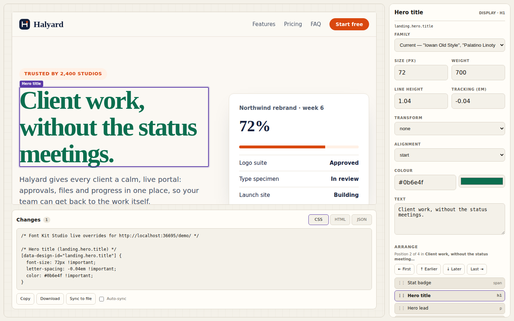
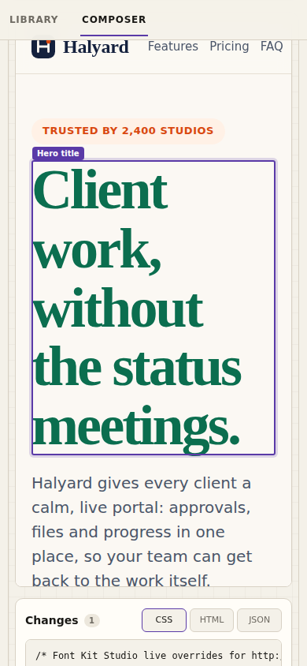

<p align="center">
<picture>
  <source media="(prefers-color-scheme: dark)" srcset="docs/assets/fontkit-logo-dark.svg">
  
</picture>
</p>

<p align="center"><strong>Edit the type and layout of your own web app in a live preview, then copy the CSS and HTML.</strong></p>

<p align="center">
  <a href="#quickstart">Quickstart</a> ·
  <a href="#workflows">Workflows</a> ·
  <a href="#faq">FAQ</a> ·
  <a href="#add-fontkit-to-your-app">Add it to your app</a> ·
  <a href="#protocol-v1">Protocol</a> ·
  <a href="#security-model">Security</a> ·
  <a href="#roadmap">Roadmap</a>
</p>



## What it is

fontkit (Font Kit Studio) is a tool for changing how a web page looks while the page is running.

- You open your app next to Studio. **Studio runs in its own window or tab. It never runs inside the app you are tweaking.**
- You click a heading, a button or a card in the live page. You change the font, size, colour or text, or move the element to another place. The page updates as you type.
- Studio shows the CSS and HTML that those changes amount to. You copy it, download it, or let the dev server write it to a stylesheet.

It works on pages that load one small script, `fontkit-bridge.js`. That script is the "bridge": it reports what is on the page and applies the changes Studio asks for. It does nothing until Studio connects, and you only add it in development.

fontkit does not change your source code. You decide what to apply.

Studio also still has the **Library** (a specimen browser for 16 free fonts) and the **Composer** (a layout tool for typographic specimens with rows, images and rules). Both still work without a bridge. The font library is free Google Fonts; see [Free fonts](#free-fonts).

## Quickstart

You need Python 3. It was developed and tested on Python 3.11, and nothing else is installed: the server uses only the standard library. If `python` is not found, use `python3`.

```bash
git clone https://github.com/pterw/font-kit-studio
cd font-kit-studio
python scripts/serve.py
```

1. Open the **Studio URL** the command prints. It looks like `http://localhost:8000/font_kit_studio_v0.1.1.html?target=http://localhost:8001/demo/`.
2. Wait for the badge to say **Connected (N targets)**. The demo app, "Halyard", is already instrumented.
3. **Click** the big headline in the preview. Change its size, colour or text in the panel on the right.
4. Watch the **Changes** panel under the preview. Press **Copy**, or press **Sync to file** to write the CSS to `demo/fontkit-overrides.css`, which the demo already links.
5. Reload the preview. The style stays, because it now comes from the stylesheet. Studio asks whether to reapply the rest (see [Reconnect banner](#reconnect-banner)).

To use your own app, add the one script tag from [Add fontkit to your app](#add-fontkit-to-your-app) and put your app's address in the **Target URL** box.

### Open the Studio HTML file directly

`font_kit_studio_v0.1.1.html` is a single file with no dependencies. You can double-click it, or open it from disk, and it works for the Library and the Composer. You can also connect it to a running app by typing the app's URL into **Target URL**, and the inspector, the Changes panel and Copy all work.

What does **not** work from a file: **Sync to file** and **Auto-sync** are switched off, because there is no server to write the file. Use `python scripts/serve.py` for those.

### Dev server options

| Flag | Default | What it does |
|---|---|---|
| `--studio-port` | `8000` | Port for Studio. Also serves `/__fontkit/status` and the sync endpoint. |
| `--target-port` | `8001` | Port for the demo and any file in this repo. Studio and the target use different ports on purpose, so they stay separate origins. |
| `--overrides` | `demo/fontkit-overrides.css` | The one file Sync may write. It must be a `.css` file inside this repo. |
| `--no-sync` | off | Refuses all writes. |
| `--host` | `127.0.0.1` | Interface to listen on (loopback by default). See the notes below. |
| `--quiet` | off | Turn off the per-request log. |

Two things to know:

- **A different `--overrides` path is written, but the demo does not link it.** The demo always links `demo/fontkit-overrides.css`. For your own app, add `<link rel="stylesheet" href="http://localhost:8001/<your overrides path>">` after your own CSS (in development), or just use Copy.
- **`--host 0.0.0.0` does not give your LAN access.** By default the server listens on loopback only. It accepts `localhost`, `127.0.0.1` and the exact name you pass to `--host`. A phone or another computer that uses your machine's IP address gets `421 Misdirected Request`. This blocks DNS-rebinding attacks. To allow one address, pass it explicitly, for example `--host 192.168.1.20`.

## Workflows

### Live Target inspector

Click anything in the preview and the panel on the right becomes its inspector.

| Control | What it changes |
|---|---|
| Family | The element's font. Lists the page's current font plus the 16 free families. Picking a free family also loads its Google Fonts stylesheet in the page. |
| Size, Line height, Tracking | `font-size` (px), `line-height` (ratio), `letter-spacing` (em). Typing works one key at a time. |
| Weight | `font-weight`. If the element declares `data-design-weights`, values snap to the nearest allowed weight. |
| Transform, Alignment, Colour | `text-transform`, `text-align`, `color` (hex box plus picker). |
| Text | The element's text. Only shown for text elements. |
| Arrange | Moves the element. See [Arrange](#arrange). |
| Reset this element | Puts this element back exactly as it was. |

Studio also works in a narrow window. At 390 px wide the inspector stacks under the preview, and nothing scrolls sideways:

<table>
  <tr>
    <td></td>
    <td></td>
    <td></td>
  </tr>
</table>

Values come back from the page, not from Studio. If the page snaps `550` to `600`, the box shows `600`. If the page rejects a value, the badge says `Rejected: <reason>` and nothing changes.

Elements with a `data-design-id` have stable names. Others are discovered automatically (headings, paragraphs in sections, links in nav, buttons, images, badges and so on). Their selectors are built from the page structure, so the CSS tab marks them "auto-discovered, add data-design-id for a stable selector".

The badge shows where you are: `Idle`, `Connecting…`, `Bridge detected`, `Connected (N targets)`, `Live · rev N`, `Rejected: <reason>`, `No bridge detected` (after 4 seconds, with a hint), `Disconnected (window closed)`.

### Select vs Interact

The **Select / Interact** switch sits in the bar above the preview.


- **Select** (default): clicks pick an element for editing. Links and buttons do not run.
- **Interact**: the page behaves normally. Links, buttons, form fields and menus all work, and Studio stops reporting hover and selection.

Use Interact to test what you changed: submit the form, open the menu, follow a link. Switch back to Select to keep editing.

### Code panel

Under the preview, **Changes** shows what you have done so far, built only from what the page confirmed.


| Tab | Shows |
|---|---|
| **CSS** | `@import` lines for any free fonts first, then one rule per changed element with `!important` declarations. This is the file Sync writes. |
| **HTML** | The changed elements as clean snippets: text edits, and the container for every element you moved. Bridge-added attributes and inline overrides are removed. |
| **JSON** | `{ "target", "revision", "overrides" }`: the same changes keyed by target id. |

Buttons: **Copy** (clipboard), **Download** (`fontkit-overrides.css`, `fontkit-changes.html` or `fontkit-overrides.json`), **Sync to file**, and **Auto-sync**.

- **Sync to file** needs `python scripts/serve.py`. It writes the CSS tab to the overrides file in one atomic step.
- **Auto-sync** rewrites the file about 400 ms after the last change. Writes never overlap, and the latest state wins.
- Text changes go in the HTML tab, not the stylesheet. DOM moves also live in the HTML tab. CSS-order moves are plain CSS (`order`), so they are in the stylesheet.

Studio never writes the file until you press Sync (or turn on Auto-sync).

### Arrange

Arrange is the section at the bottom of the inspector. It reorders the selected element among its siblings or moves it into another container: buttons in a row, cards in a grid, items in a list.


- **First / Earlier / Later / Last** buttons.
- A **sibling list** you can drag, or focus and press `Alt` + `↑` / `↓`.
- **Move into another container**, with a list of valid destinations.
- Keyboard shortcuts: while Studio has focus (not the preview, which keeps its own keys) and you are not typing in a field, `Alt` + `↑` / `↓` moves the selected element, and `Alt` + `Shift` + `↑` / `↓` sends it to the start or end.

**Move strategy** appears when the parent is a flex or grid container:

| Strategy | What happens | Output |
|---|---|---|
| **DOM order** | The element really moves in the page's markup. | HTML tab (a "Structure" block with the container's cleaned HTML). Not saved by Sync. |
| **CSS order** | The markup stays as it is. Studio sets `order` on every sibling. | CSS tab, and Sync. |

CSS order is the default when the parent looks framework-managed (React, Vue or Svelte markers). It changes how the page looks, not the reading or Tab order, so check keyboard order yourself if that matters.

**Guards** stop moves that would break the page. A DOM move is refused, with the reason on screen, when it would:

| Guard | Stops |
|---|---|
| `form-owner` | Taking a form control out of its form, so it no longer submits with it. |
| `radio-group` | Separating a radio button from its group. |
| `label-reference`, `aria-reference` | Taking a control out of the `<label>` that wraps it, or moving an element across a shadow-DOM boundary so a `label for`, `aria-controls`, `aria-labelledby` or `aria-describedby` link would stop resolving. An ordinary move inside one document cannot break an `id` link, so those are not blocked. |
| `content-model` | Putting a block element (a `div`, a `ul`, a heading…) inside a paragraph, heading, `span`, link, button, label or `summary`. Cannot be overridden. |
| `framework-managed` | Touching a part of the page that React, Vue or Svelte owns, because the framework may undo it. This one has a **Move anyway** button. The others do not. |
| `css-order` | Using the CSS order strategy on a parent that is not flex or grid, or to move between containers. |


A move can also be refused for plain reasons, such as an index out of range, an unknown container, a move into the element itself or one of its descendants, a void or replaced container (an ``, an `<input>`), or an unusable reference. The reason is shown in the same place.

If the page throws an error within one second of a change, Studio shows it as a warning in the status area and under the code panel. Reset any moved element with **Reset this element**, and the page goes back to its original order.

### Pop-out window

**Pop out** asks your browser for a separate window (a pop-up of about 1280 by 860 pixels, placed near Studio, so the two can sit side by side). The browser decides in the end: some settings open a tab instead, and you can drag that tab out. The page then runs at its real size, and nothing is inside an iframe, which helps with apps that refuse to be framed.


- Pick elements in the pop-out. The inspector in Studio edits them.
- Studio cannot draw over another window, so the bridge draws a thin outline in the pop-out page. It is removed when you dock, and it never appears in the exported code.
- **Focus pop-out** brings the window forward. **Dock back** closes it and returns the preview to Studio.
- Closing the window gives `Disconnected (window closed)`.
- When the pop-out opens, and when you dock back, Studio may show the [reconnect banner](#reconnect-banner). The fresh page has none of your saved edits, so Studio asks before sending anything.
- Browsers may block the pop-up. If so, Studio says so and keeps the iframe.

### Reconnect banner

When the preview reloads, the new page has none of your live edits. Studio does **not** push them back, and it does not overwrite your saved overrides. It shows a banner and waits.

| Button | Does |
|---|---|
| **Reapply Studio overrides** | Sends Studio's saved changes to the page again. Text, fonts, and CSS-order moves are replayed. If a leftover CSS order has to be cleared first, the banner says so, and that also undoes DOM moves in that group. |
| **Accept target state** | Studio adopts what the page has now. The overrides file is left alone until you press Sync. |

If Reapply fails, Studio keeps its saved state, writes nothing, and says what happened. You can press it again.

### Free fonts

- The default is **16 free open-source fonts** (SIL Open Font License) from Google Fonts: serif, sans, display and mono, several of them variable. Nothing is bundled and no kit ID is filled in.
- **Studio is silent until you ask.** On first load it makes no request outside the server it came from. Specimens render in fallback fonts, and a short hint next to the Library and Composer font controls says so. Fonts load when you press **Load free fonts** (Library or Composer), switch the Composer's Kit preset to Free Google Fonts (from another preset), or pick a library family in the Live Target inspector (Target App view). Picking a family in the Composer's slot inspector does not load anything; it says the slot is shown in a fallback font until you load the free fonts. Studio then remembers that choice in this browser (`localStorage` key `fontkit-free-fonts`, guarded: if storage is blocked it simply asks again each visit), and later visits load cards as they scroll into view. To forget it, clear the site data for Studio.
- Choosing one in the inspector loads its stylesheet in the page too, and the CSS tab starts with the matching `@import`.
- **Adobe Fonts** is bring-your-own. Choose "Bring your own Adobe kit" in the Composer's Kit preset and paste your own kit ID. Studio ships with the field empty.

Loading Google Fonts needs a network connection, and it sends a request to Google (your IP address and the font names) every time a font stylesheet loads, so that is what pressing Load free fonts agrees to. Until you press it, nothing contacts Google. Offline, or if you block those requests, the page keeps its fallback fonts and nothing breaks.

### Library and Composer

Both work with or without a target app:

- **Library**: browse specimens for the free families.
- **Composer**: build flow layouts from 2 to 4 leaf slots per row, with PNG/SVG brand marks, rules and spacers. Export JSON or CSS, and import it again.
- **Specimen / Target App** switches the Composer between its own canvas and your live app. **Sync to Live App** is the explicit button that sends the Composer's composition to the page. It sets the page's font tokens, and it also reorders the page's main sections by slot order and adds a short CSS `transition` to them. That reordering does not show in the Changes panel. Reload the preview to undo it.
- **Restore Page Text** (in the bar above the preview) puts every changed text back and keeps the styles.
- Device buttons (390 / 1024 / 1440 / Fluid) set the preview width. **Fullscreen** uses the whole window (`Esc` leaves).

Exported JSON stays at version `0.1.1`. It can carry an optional `live` field with your saved overrides and tokens. Older files without it still import.

## Why fontkit

Several kinds of tools touch a page's design. They solve different problems, and fontkit does not replace them.

| Kind of tool | What it is for | Where fontkit differs |
|---|---|---|
| **Visual builders** | Build whole pages or sites in their own editor and often their own runtime. | fontkit edits the app you already have, as it runs. It builds nothing and owns no pages. |
| **Component workbenches** | Show components in isolation with different inputs. | fontkit works on the real, composed page with real data, not on a component in a sandbox. |
| **DevTools-style extensions** | Change styles on any page, in the browser. | fontkit lives outside the page, in its own window. It focuses on type and layout, and turns your edits into code you can copy. |
| **Code-writing visual editors** | Edit visually and write the result into your source files. | fontkit never touches your source. It gives you CSS and HTML to review and apply, so there is nothing to undo in your repo. |

What fontkit is built around: **a separate window, the real page, small reviewable output, and a page that confirms every change.**

## FAQ

### What is it, and why bother?

It is a live editor for type and layout that sits next to your running app. You change a heading's font, tighten a button row or reorder cards, and you see the result immediately in the real page, with real content and at real screen sizes. Then you copy the CSS. You skip the cycle of editing a stylesheet, saving, waiting for a reload and judging by eye.

### Is it click and go? I do not touch backend code.

Close to it, with some honesty about the steps:

- **One script tag.** Your page needs `fontkit-bridge.js`, in development only. No backend changes, no build step, no npm package. See [Add fontkit to your app](#add-fontkit-to-your-app).
- **A tiny dev server.** `python scripts/serve.py` gives you Studio and the Sync button. It is optional: Studio also opens from a file and works with the inspector and Copy.
- **Pages you cannot edit.** A [bookmarklet](#bookmarklet) can inject the bridge into a pop-out window. It is a workaround, not a polished path.
- **A simpler way is planned.** A [browser extension](docs/roadmap/browser-extension.md) that needs no script tag is on the roadmap. It does not exist yet.
- **You apply the output yourself.** fontkit does not edit your source files. Sync writes one separate stylesheet. For anything else you copy CSS or an HTML snippet, review it, and put it where it belongs.

### Will moving my custom segmented control break my form?

It can, and fontkit tries to stop the common cases before they happen.

- **Guards.** Moving a form control out of its form, splitting a radio group, taking a control out of its wrapping label, or putting a block element inside a paragraph or button is refused, with the reason shown. A segmented control made of radio buttons inside a form is the case these guards are for.
- **CSS order.** When the parent is flex or grid, you can reorder with the CSS `order` strategy. The markup does not change, so the form still submits the same way. This is the default for framework-managed parents. It changes only the visual order, not the Tab or reading order.
- **Framework warning.** If React, Vue or Svelte seems to own that part of the page, a DOM move may be undone on the next render. Studio warns, and offers **Move anyway** only for that guard.
- **Runtime errors.** If the page throws within a second of your change, you see the message.
- **Test it.** Switch to **Interact**, then submit the form and click through it.
- **You apply it.** Nothing reaches your source until you copy the output and apply it. Reset puts the page back.

The guards are checks, not proof. They look at the markup the page has right now. Test the result in your app before you ship it.

## Add fontkit to your app

> **Development only.** Do not ship the bridge to production. It stays inactive until Studio connects, but there is no reason to include it for real users. Do not load it from a CDN or a branch URL you do not control.

The recipes below use `python scripts/serve.py`, which serves `fontkit-bridge.js` at `http://localhost:8000/fontkit-bridge.js`. You can also copy the file into your project.

> **How these recipes were checked.** The plain HTML script tag, the `data-auto-init`, `data-allowed-origins`, `FONTKIT_BRIDGE_OPTIONS` and `allowedOrigins` settings, the overlay option and the bookmarklet were run in tests against the real bridge (see [Development and testing](#development-and-testing)). The other options (`autoDiscover`, `autoDiscoverSemantic`, `enableClickToSelect`, `tokens`, `onApplied`) and `data-design-kind` are implemented but have no test yet. The **Vite, Next.js, Astro, SvelteKit and Nuxt recipes are illustrative**: their syntax was checked against the frameworks' documentation, but they were not run in a real framework project. Try them and tell us what breaks.

### Plain HTML

```html
<!-- Development only: remove before you ship. Put it after your own scripts. -->
<script src="http://localhost:8000/fontkit-bridge.js"></script>
```

### Vite (React, Vue, Svelte)

A plugin that adds the tag only while `vite dev` runs (illustrative):

```js
// vite.config.js
const fontkit = () => ({
  name: 'fontkit-bridge',
  apply: 'serve', // never part of `vite build`
  transformIndexHtml: () => [{
    tag: 'script',
    attrs: { src: 'http://localhost:8000/fontkit-bridge.js' },
    injectTo: 'body',
  }],
})

export default {
  plugins: [/* react(), vue(), svelte(), */ fontkit()],
}
```

This works when Vite serves your `index.html`. Frameworks that handle the HTML entry themselves (SvelteKit, for example) do not call `transformIndexHtml`; see the recipes below.

### Next.js

In the root layout, only in development (illustrative):

```tsx
// app/layout.tsx
import Script from 'next/script'

export default function RootLayout({ children }: { children: React.ReactNode }) {
  return (
    <html lang="en">
      <body>
        {children}
        {process.env.NODE_ENV === 'development' && (
          <Script src="http://localhost:8000/fontkit-bridge.js" strategy="afterInteractive" />
        )}
      </body>
    </html>
  )
}
```

For the Pages Router, put the same `<Script>` in `pages/_app.tsx`.

### Astro

In your layout (illustrative). The `is:inline` keeps Astro from processing a conditional script:

```astro
{import.meta.env.DEV && (
  <script is:inline src="http://localhost:8000/fontkit-bridge.js"></script>
)}
```

### SvelteKit

In the root layout (illustrative). `dev` comes from SvelteKit and is false in production builds:

```svelte
<!-- src/routes/+layout.svelte -->
<script>
  import { dev } from '$app/environment'
</script>

<svelte:head>
  {#if dev}<script src="http://localhost:8000/fontkit-bridge.js"></script>{/if}
</svelte:head>

<slot />
```

If your app renders only in the browser, a script placed this way may not run. In that case put the tag in `src/app.html` while you work and take it out before you build.

### Nuxt

In `nuxt.config.ts` (illustrative). Nuxt adds entries in `app.head.script` to every page:

```ts
// nuxt.config.ts
export default defineNuxtConfig({
  app: {
    head: {
      script: process.env.NODE_ENV === 'development'
        ? [{ src: 'http://localhost:8000/fontkit-bridge.js' }]
        : [],
    },
  },
})
```

### Tailwind

fontkit does not read or rewrite utility classes, and it does not patch class strings. It sets inline styles while you edit, and writes CSS rules that target `[data-design-id="…"]` or an auto-discovered selector. To bring the result into a Tailwind project:

- Put the Copy or Sync output in any stylesheet. Every generated declaration is `!important`, so it wins over utility classes whatever the load order. Or
- Better, route your fonts through **semantic tokens** (a `--font-display` custom property or a theme font family) and change the token's value. The bridge reports custom properties such as `--font-display` and `--font-sans`.

### Marking up elements (optional)

Without any markup, fontkit discovers headings, paragraphs inside sections, nav links, buttons, images and badges. Add attributes where you want stable names:

| Attribute | Meaning |
|---|---|
| `data-design-id="landing.hero.title"` | A stable id. CSS rules use `[data-design-id="…"]`, so the selector survives refactors. Must be unique on the page. |
| `data-design-role="display"` | A role label such as `display`, `title`, `body`, `button`, `metadata` or `image`. |
| `data-design-name="Hero title"` | The friendly name shown in Studio. |
| `data-design-weights="400 600 800"` | The weights this element allows. Studio snaps requests to the nearest one. |
| `data-design-order-container="true"` | Lists this element as a destination for **Move into another container**. |
| `data-design-kind="text"` or `"image"` | Overrides the guess about whether the element has editable text. |

```html
<h1 data-design-id="landing.hero.title" data-design-role="display"
    data-design-name="Hero title" data-design-weights="400 700">
  Client work, without the status meetings.
</h1>
```

### Limiting which Studio can connect

By default the bridge accepts a `design:hello` from the window that framed or opened the page, and **pins** that window, its origin and its session. You can also restrict it to chosen origins. Use any one of these:

```html
<!-- 1. On the script tag -->
<script src="http://localhost:8000/fontkit-bridge.js"
        data-allowed-origins="http://localhost:8000"></script>

<!-- 2. Before the script tag -->
<script>window.FONTKIT_BRIDGE_OPTIONS = { allowedOrigins: ['http://localhost:8000'] }</script>
<script src="http://localhost:8000/fontkit-bridge.js"></script>

<!-- 3. Turn off auto-start and start it yourself -->
<script src="http://localhost:8000/fontkit-bridge.js" data-auto-init="false"></script>
<script>initFontKitBridge({ allowedOrigins: ['http://localhost:8000'] })</script>
```

Separate several origins with spaces or commas. `new FontKitBridge({ allowedOrigins: […] })` also works. Loading the script twice (for example on hot reload) keeps the first instance. Options are `allowedOrigins`, `autoDiscover`, `autoDiscoverSemantic`, `enableClickToSelect`, `enableHighlightOverlay`, `tokens` and `onApplied`.

### Bookmarklet

For a page where you cannot add the tag, you can inject the bridge by hand. A bookmarklet cannot run inside Studio's iframe, so use it in a **pop-out**:

1. In Studio, enter the page's URL and press **Connect Target**. It says `No bridge detected`.
2. Press **Pop out**. The page opens in its own window.
3. In that window, run the bookmarklet below. Create a bookmark whose URL is that line, and click the bookmark. Or open the DevTools console and paste only the part after `javascript:` (Chrome asks you to type `allow pasting` first). Browsers remove `javascript:` from text pasted into the address bar, so pasting the whole line there does nothing.

```javascript
javascript:(()=>{if(window.__fontkitBridge)return;var s=document.createElement('script');s.src='http://localhost:8000/fontkit-bridge.js';document.head.appendChild(s)})()
```

Studio then says `Connected`. Reloading the page removes the bridge.

Two cautions. The script URL uses port 8000, the default `--studio-port`. If you started the server on another port, change the number, and click the bookmark only on pages you trust: it runs whatever answers on that port, so anything else listening on 8000 would run inside the page. Pages with a strict Content-Security-Policy may refuse the script.

## Protocol v1

Studio and the bridge talk with `window.postMessage`. This is a summary of what the code does today. The requirements are in [`font-kit-studio-v0.2.0-design-bridge-protocol-v1.md`](font-kit-studio-v0.2.0-design-bridge-protocol-v1.md), and the exact contract is in [the v0.2.0 plan](docs/plans/2026-10-02-v0.2.0-live-preview-code-sync.md).

Every message has `protocolVersion: 1`. Every message except `design:bridge-ready` and `design:hello` also has the `sessionId` that Studio chose.

```text
Bridge                                   Studio
  | -- design:bridge-ready ------------>  |   no page data
  | <------------------ design:hello ---  |   new sessionId
  | -- design:ready (targets, ledger) ->  |
  | <------------ design:update/move ---  |
  | -- design:applied | rejected ------>  |
```

### Studio to bridge

| Message | Fields | Result |
|---|---|---|
| `design:hello` | `sessionId` | Pins this window, origin and session. Replies `design:ready`. |
| `design:update` | `requestId, baseRevision, targetId, patch` | Validates the whole patch, applies it or rejects it. |
| `design:update` (legacy composition) | `requestId, baseRevision, patch {tokens, slots, layout}`, no `targetId` | The Composer's **Sync to Live App**. Replies `design:applied` with `targetId: "global"`. Token names must match `--[a-z0-9-]{1,120}` and values follow the `fontFamily` rule. A `null` value removes Studio's override of that token and restores the page's own value. One invalid token rejects the whole update with `unsupported-value` (`detail.property`) and changes nothing. |
| `design:select` | `targetId` or `null` | Selects, scrolls into view. Replies `design:selected`. |
| `design:mode` | `mode: "select" \| "interact"` and/or `overlay: boolean` | Switches click handling. `overlay: true` makes the bridge draw its own outline (pop-out). No reply. |
| `design:move` | `requestId, baseRevision, targetId, to, strategy?, force?` | `to` is one of `{index}`, `{before}`, `{after}`, `{container, index?}`. `strategy` is `"dom"` (default) or `"css-order"`. |
| `design:reset` | `requestId, baseRevision, targetId?` | Removes overrides and undoes moves for one target, or for everything. |
| `design:restore-text` | `requestId?, baseRevision?` | Restores the original text of every target and keeps styles. |
| `design:highlight`, `fontkit:change` | legacy | `highlight` acts like `select`. `fontkit:change` sets font tokens and replies `fontkit:ack`. |

### Bridge to Studio

| Message | Meaning |
|---|---|
| `design:bridge-ready` | The bridge is loaded. Sent to the parent or opener, with no page data. |
| `design:ready` | Reply to `hello`: revision, capabilities, viewport, tokens, target manifests and the change ledger. |
| `design:applied` | A request succeeded: revision, canonical patch, fresh manifest and the change ledger. |
| `design:rejected` | Nothing changed. `reason` is `invalid-message`, `unknown-target`, `unsupported-property`, `unsupported-value` or `revision-conflict`, with `detail`. Move guards use `unsupported-value` with `detail.guard`; other refused moves use `detail.reason` (`index-out-of-range`, `unknown-container`, `into-self`, `into-descendant`, `relative-to-self`, `void-or-replaced-container`, `unarrangeable-reference`). |
| `design:hover` | The target under the pointer changed (select mode only). |
| `design:selected` | A click or `design:select` picked a target (or none). Includes the full manifest. |
| `design:bounds` | Where the selected target is now, after scroll, resize or layout changes. |
| `design:targets` | New targets appeared (for example after a re-render). |
| `design:warning` | An error was thrown within one second of a change (`kind: "runtime-error"`). |
| `fontkit:ack` | Reply to the legacy `fontkit:change`. |

### Patch keys

| Key | Accepts | Becomes |
|---|---|---|
| `fontFamily` | text of 1 to 300 characters, no `; { } < > \`, `url(` or `expression(` | `font-family` |
| `fontSize` | 4 to 400 | `font-size` in px |
| `fontWeight` | 1 to 1000 | `font-weight`, snapped if the target limits weights |
| `lineHeight` | 0.5 to 5 | `line-height`, no unit |
| `letterSpacing` | -0.5 to 2 | `letter-spacing` in em |
| `color` | `#rgb`, `#rrggbb`, `#rrggbbaa`, or `rgb()`, `rgba()`, `hsl()`, `hsla()` | `color` |
| `textAlign` | `left center right justify start end` | `text-align` |
| `textTransform` | `none uppercase lowercase capitalize` | `text-transform` |
| `text` | up to 5000 characters, text targets only | the element's text |
| `fontStylesheet` | `null`, a Google Fonts `css2` URL or an Adobe Fonts kit URL | a `<link>` in the page's head |

`null` removes an override. The bridge applies each value as an inline `!important` style, and each successful change adds one to `revision`. A change that was built on an old revision is rejected with `revision-conflict`.

## Security model

fontkit edits a live page from another window, so both sides check every message.

**Messages.** Studio accepts a message only if it comes from the iframe (or pop-out) it opened, from the expected origin, with the right protocol version and session id. The bridge accepts `design:hello` only from its parent or opener, optionally only from `allowedOrigins`. After that it accepts only messages from the pinned window, origin and session. Each side posts to the pinned origin, never to `*`, except for the opaque `null` origin and the data-free `bridge-ready`.

**Inert by default.** Before Studio connects, the bridge does not change the page or block clicks. The only thing it sends is a `design:bridge-ready` that carries no page data, to the window that framed or opened the page. Your app works as normal.

**What gets through.** Studio only loads `http:` and `https:` targets (`file:` only when Studio itself is a file) and never itself. The bridge only accepts the values in the patch table above. Text goes in as text, never as markup. Font stylesheets must be a Google Fonts `css2` URL or an Adobe Fonts kit URL. Placed images are `` elements with PNG or SVG data, never inserted markup.

**The dev server.** By default it listens on loopback only. It checks the `Host` header (so a hostile website cannot reach it by DNS rebinding), checks `Origin` on writes, limits a write to 1 MiB, writes atomically to the single `.css` file you named inside this repo, and sends `Cache-Control: no-store`. `--no-sync` turns writes off. It serves the files of this repo on both ports, so do not expose it to untrusted networks.

**Pop-out and `window.opener`.** For the bridge to answer Studio, a pop-out keeps `window.opener`. A page you pop out can therefore navigate the Studio window. You choose the page, so only pop out pages you trust. A page that sends `Cross-Origin-Opener-Policy: same-origin` would sever the link. That was not tested.

**No source rewriting.** fontkit never writes to your source files. The one file it can write is the overrides stylesheet, and only if you press Sync.

## Development and testing

```bash
python -m pip install -r requirements-dev.txt     # pins Playwright
python -m playwright install chromium firefox     # on your own machine
python scripts/verify.py --static-only            # unique IDs, inline JS syntax, provenance hashes
node --check fontkit-bridge.js
python -m unittest discover -s tests -v           # all suites; or: python scripts/verify.py
python scripts/dev/frontend_gate.py               # browser gate: phone, desktop, touch, dark mode, logos
```

`scripts/verify.py` checks the original v0.1.1 file against the `supplied-v0.1.1` tag. If your clone does not have it, run `git fetch origin tag supplied-v0.1.1`.

**Environment variables** (read by `tests/support.py` and by the frontend gate):

| Variable | Default | Purpose |
|---|---|---|
| `FKS_ENGINES` | `chromium,firefox` | Comma list of engines to run. |
| `FKS_CHROMIUM_EXECUTABLE` | unset | Path to a Chromium binary to use instead of Playwright's download. |
| `FKS_FIREFOX_EXECUTABLE` | unset | Same, for Firefox. |

In a container with a browser already installed: `FKS_ENGINES=chromium FKS_CHROMIUM_EXECUTABLE=/path/to/chromium`.

**Test files** (`tests/`):

| File | Covers |
|---|---|
| `test_font_kit_studio_v011.py` | The original Studio: rows, inspector, presets, import and export, mobile layout. |
| `test_bridge_runtime.py` | The bridge against a real cross-origin host page: handshake, validation, moves and guards, ledger, pop-out overlay, font stylesheets, re-render handling, hostile messages. |
| `test_studio_live.py` | Studio against a fake bridge: protocol client, inspector, code panel, sync, reconnect, arrange, pop-out, free fonts, hostile messages. |
| `test_preview_server.py` | `scripts/serve.py` and the demo: ports, sync endpoint, Host and Origin checks, size limit, atomic writes. |
| `test_commit_messages.py` | The commit-message check, with a throwaway git repository: each forbidden form, allowed human co-authors, range parsing. |
| `test_frontend_gate_*.py` | The gate's own logic, with no browser: colour maths, contrast and layout judgements, report lines, the exit-code rule, CLI flags and the check table. |
| `test_live_integration.py` | Everything together, with nothing faked: real server, real Studio, real bridge, real demo and the real clipboard. It also runs the README's own script tag and bookmarklet. |

**Screenshots** in this README come from `docs/assets/screenshots/capture.py`, which drives the same real setup.

**Frontend gate** (`scripts/dev/frontend_gate.py`). The unit tests prove behaviour; the gate proves what a real browser computes. It starts `scripts/serve.py` on two free loopback ports, drives each engine through phone (390x844, touch), desktop (1280x720) and wide touch (1280x800, touch) profiles, and stops the server when it is done. It needs no secrets and downloads nothing: if Playwright or a browser is missing it prints the install command and exits 1.

```bash
python scripts/dev/frontend_gate.py                         # chromium + firefox (or $FKS_ENGINES)
python scripts/dev/frontend_gate.py --engines chromium      # one engine
python scripts/dev/frontend_gate.py --offline               # skip the one check that needs the network
python scripts/dev/frontend_gate.py --headed                # watch it run
python scripts/dev/frontend_gate.py --enforce all           # strict: every engine and profile can fail
# a container with a browser already installed:
FKS_ENGINES=chromium FKS_CHROMIUM_EXECUTABLE=/path/to/chromium python scripts/dev/frontend_gate.py
```

Every finding is one line that names its check, profile and engine:

```text
[frontend_gate] FAIL <check> [<profile>, <engine>]: <detail>
[frontend_gate] REPORT <check> [<profile>, <engine>]: <detail>
[frontend_gate] SKIP <check> [<profile>, <engine>]: <reason>
[frontend_gate] ADVISORY <check> [<profile>, <engine>]: <detail>
```

**Blocking and advisory.** Font Kit Studio is a desktop-first tool, so only Chromium at the desktop profile blocks: a `FAIL` there fails the gate. Every other run (Firefox, and the phone and wide-touch profiles) still runs and still prints what it finds, as `ADVISORY` lines that never change the exit code. The summary counts blocking and advisory results separately. `--enforce chromium:desktop` is the default; `--enforce all` (or a list such as `chromium:desktop,firefox:desktop`) makes more runs blocking, and `--enforce none` makes the whole gate advisory on purpose. A policy that leaves no blocking run among the selected engines is an error, so a typo cannot make the gate pass by checking nothing. If an engine with no blocking runs (Firefox by default) is not installed, the gate prints one `ADVISORY engine` line, counts its runs as not run, and carries on. In CI the Chromium gate and Chromium test suite block, and the Firefox suite runs in its own non-blocking step.

`FAIL` changes the exit code. `REPORT` is advisory and never does. `SKIP` says a check could not run. The last line, `SUMMARY`, counts runs passed, failed and skipped against the number planned, plus the REPORT and SKIP lines, so a check that silently stops running shows as a smaller number. A check that raises is a `FAIL`, not a crash. A failing run saves a screenshot under `work/frontend-gate/`.

| Check | Profiles | What it proves | Enforced |
|---|---|---|---|
| network isolation | desktop | Studio (Library, Composer, connected) and the demo ask for nothing outside the two served origins on first load, Google Fonts included: fonts load only after the user asks. | yes |
| free fonts load | desktop | After Load free fonts, every library family resolves a real face. Needs the network; `--offline` prints `SKIP`. | yes |
| no horizontal overflow | all three | Library, Composer, the connected target view, the pop-out placeholder and the demo never scroll sideways. | yes |
| initial visibility | desktop, phone | Things a script reveals later (banner, code panel, pop-out placeholder, overlays) compute `display: none` on load. | yes |
| live edit | all three | Select a demo element (by tap on touch), change its size, the iframe follows and the CSS tab shows the rule, Reset restores the page byte for byte. | yes |
| logo paint | desktop | Both README logos have no text, script or external reference, and every painted colour reaches 3:1 on GitHub's light and dark pages, as an image and as inline markup. | yes |
| theme contrast | desktop, phone | Light and dark: text on the v0.2 surfaces (bridge bar, Live Target inspector, code panel, reconnect banner, warning states) reaches 4.5:1. | v0.2 surfaces yes, legacy surfaces `REPORT` |
| touch targets | phone, wide touch | Tappable elements are at least 44px on the smaller side. A label and its input count as one target. | no, `REPORT` only |

A Google Fonts request on first load is a `FAIL`: Studio is silent until the user presses Load free fonts (see Free fonts).

**Commit messages.** `python scripts/dev/check_commit_messages.py [--range origin/main..HEAD]` (stdlib only) fails on a `*-Session:` trailer with a URL or `session_<id>`, a `Co-authored-by` trailer for an AI assistant (judged by vendor email domain or exact assistant name, so people named Claude or Devin are fine), or a "Generated with/by" banner that names an AI tool. The rule is explained in [CONTRIBUTING.md](CONTRIBUTING.md); CI runs the check on every push, pull request and manual run.

**CI.** `.github/workflows/quality-gate.yml` runs on pushes to `main`, on pull requests and on manual dispatch, with read-only permissions and no secrets. Cheapest first: `scripts/verify.py --static-only`, `node --check fontkit-bridge.js` (Node 22), the commit-message check, then it installs Chromium and Firefox and runs the frontend gate on both engines (only Chromium at desktop can fail it), the Chromium test suite (`FKS_ENGINES=chromium`, blocking) and the Firefox test suite (`FKS_ENGINES=firefox`, in a separate step marked `continue-on-error`, so it is visible but never fails the build). It uploads gate screenshots when there are any. It checks out full history and tags, because provenance compares against the `supplied-v0.1.1` tag.

**Firefox status.** The tests run on Chromium and Firefox when both are installed. Firefox was **not installed** in the environment where v0.2.0 was built, so the v0.2.0 tests ran on Chromium only. Treat Firefox as unverified for the live preview, arrange and pop-out features until the Firefox steps of the Quality Gate workflow have run clean; they are advisory and do not block merging.

Known gaps:

- The composition button **Sync to Live App** sends font stacks as tokens without their stylesheets. A free font used only that way is not loaded into the page unless the page or the synced overrides import it. Targeted edits in the inspector do load them.
- Edits made while the page is reloading are dropped.
- Rows hold 2 to 4 leaf slots. Nested rows and JPEG assets are out of scope.

## Roadmap

A simpler **browser extension**, with no script tag, is an idea and is not built. See [`docs/roadmap/browser-extension.md`](docs/roadmap/browser-extension.md) for goals, a sketch, security rules and open questions.

## Provenance

The original supplied v0.1.1 file is preserved at the Git tag `supplied-v0.1.1`.

- [Design Bridge Protocol v1 requirements](font-kit-studio-v0.2.0-design-bridge-protocol-v1.md)
- [Original design document](docs/reference/2026-09-17-font-kit-studio-v0.1.1-responsive-rows-design.md)
- [Source provenance ledger](docs/reference/SOURCES.json)
- Logo fonts and licences: [`docs/assets/README.md`](docs/assets/README.md)

## License

MIT. See [LICENSE](LICENSE). The logo outlines derive from SIL Open Font License 1.1 fonts; see [docs/assets/README.md](docs/assets/README.md).
