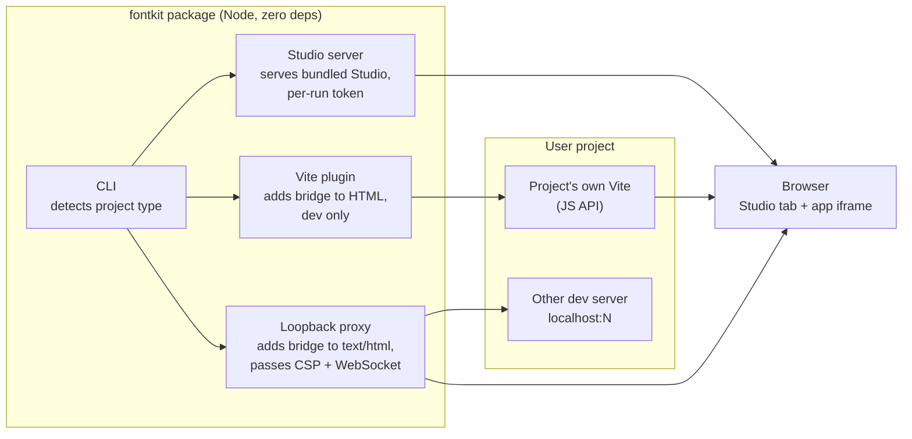
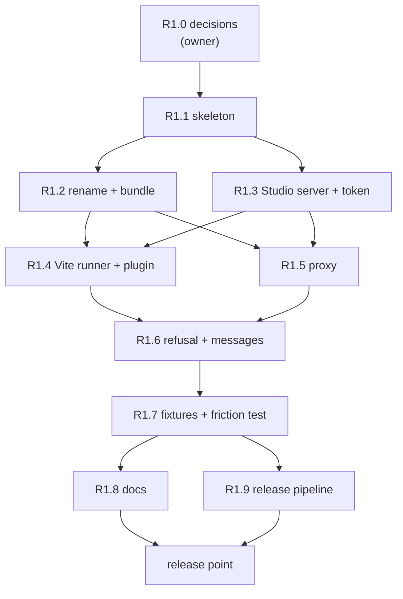

# R1 One command: implementation plan

Status: **draft for owner approval** (2026-10-03). Becomes binding when the owner approves
it and decisions 1, 2 and 4 in the [roadmap](2026-10-03-roadmap.md#decisions-register) are
taken. Starts after v0.2.1 PR B merges.
Design: [typography system design](../specs/2026-10-03-typography-system-design.md),
sections 1 (Starting fontkit), 1.1 (Releasing), 4.1, 4.3 to 4.5 (Testing).

## Goal

A developer runs one command in their own project and Studio opens connected to their app,
with no config edit and no script tag, and nothing written until they confirm. This is the
first public release.

## Scope

In:

- A Node package (name: decision 1; written `<pkg>` below) with zero runtime dependencies
  that uses the project's own Vite (global rule 8, D030).
- `npx <pkg>` in a Vite project: runs the project's Vite through its JavaScript API with the
  fontkit plugin added in memory.
- `fontkit()` in `vite.config` for a permanent setup.
- `npx <pkg> http://localhost:<port>`: proxy mode in front of any other local dev server.
- A per-run token, the dev-only refusal, a visible "fontkit · dev only" marker, and clear
  failure messages.
- Studio and the bridge bundled at matching versions; Studio renamed (decision 2).
- Real-app fixtures (Vite + React, Bootstrap 5 static behind the proxy, Next.js behind the
  proxy) and the friction test in CI.
- The release pipeline: semver, changelog, npm provenance, an OS and Node matrix.

Out (later releases): text-style detection (R2), the pairing UI (R3), the type-system file
and its write endpoint (R4), the extension (R5). Sync to file keeps working through
`scripts/serve.py`; whether the Node entry also serves the existing overrides sync is open
question 3 below.

## Architecture

## Tasks

Each task is one brief, one report and one independent review under
`docs/implementation/tasks/r1-task-<n>-*.md`. Owned files are exclusive while a task runs.
Node code lives under `packages/<pkg>/` (exact layout fixed in R1.1).

- [ ] **R1.0 Decisions and name registration.** Owner confirms decisions 1, 2 and 4; the
  name is registered on npm with a placeholder `0.0.0` that says "not released yet".
  Owner action; the controller records the answers in `deviations.md`.

- [ ] **R1.1 Package skeleton.** `package.json` with no `dependencies`, `bin`, `exports`;
  Node's built-in test runner; a test that fails if a runtime dependency is added (spec
  4.5); CI job for `node --test`. Owns: `packages/<pkg>/`, `.github/workflows/` (a new job).

- [ ] **R1.2 Studio rename and bundling.** Replace `font_kit_studio_v0.1.1.html` and the
  `v0.1.1` labels (D009, D009a) with the decided name and the real version; keep the old
  path working for one release (redirect or copy) and write the migration note; the build
  copies Studio and the bridge into the package with a version check that fails if they
  differ. Owns: the Studio file name, `README.md` references, `scripts/verify.py`
  provenance handling (the `supplied-v0.1.1` blob check must keep passing), the copy step.
  Risk: every test, bookmarklet and doc names the old file; grep and update in the same
  commit (anti-pattern 11, 12).

- [ ] **R1.3 Studio server and per-run token.** The package serves the bundled Studio on a
  free loopback port with a random token in the URL; requests without it are refused; Host
  and Origin checks as in `serve.py`. Hostile cases: missing and wrong token, wrong Host,
  wrong Origin. Owns: `packages/<pkg>/src/studio-server.*`, its tests.

- [ ] **R1.4 Vite runner and plugin.** `npx <pkg>` finds the project's Vite, starts it
  through the JavaScript API with the plugin in memory, and opens Studio connected to it;
  `fontkit()` in `vite.config` does the same through `npm run dev`. The plugin adds the
  bridge only in `serve` mode; `vite build` output contains no bridge (guarantee test,
  spec 4.2). Hot reload keeps the connection. Owns: `src/vite-*`, the Vite + React fixture.

- [ ] **R1.5 Proxy mode.** A loopback proxy in front of an existing dev server: injects the
  bridge only into `text/html` responses, serves the bridge from the app's own origin so
  `script-src 'self'` allows it, passes the app's CSP header through unchanged, passes
  WebSocket upgrades (hot reload) through untouched, limits sizes. Hostile cases (spec
  4.3): non-loopback target, wrong Host (DNS rebinding), path traversal, non-HTML content,
  oversized response. Owns: `src/proxy.*`, the Bootstrap 5 and Next.js fixtures.

- [ ] **R1.6 Dev-only refusal, visibility and failure messages.** The plugin and proxy
  refuse to run for a production build or a non-loopback bind and say so; the page and the
  terminal show "fontkit · dev only"; every connection failure (another bridge, a security
  policy, an unsupported project) gets a message that says what and why. Owns: the CLI
  messages, a small bridge option for the marker (additive, protocol unchanged).

- [ ] **R1.7 Fixtures and the friction test.** Committed fixtures with lockfiles, installed
  with `npm ci` in CI: Vite + React (plain CSS), Bootstrap 5 static with vendored CSS behind
  the proxy and a `script-src 'self'` CSP, Next.js behind the proxy. The friction test runs
  the one command on the Vite fixture and measures the time until Studio shows the page
  connected, with no manual step; it fails over a budget fixed in this task. Owns:
  `fixtures/`, `tests/` for the friction test, the CI job.

- [ ] **R1.8 Docs.** README Quickstart leads with the one command; `serve.py` and the script
  tag stay documented as the no-Node path; CONTRIBUTING covers the Node package. Owns:
  `README.md`, `CONTRIBUTING.md`.

- [ ] **R1.9 Release pipeline.** Tag-triggered GitHub Actions workflow: tests on Linux,
  macOS and Windows and the decided Node LTS versions, then `npm publish` with provenance
  (decision 3: trusted publishing or a token secret, set up by the owner); semver and a
  `CHANGELOG.md`. The first real release is cut by the owner. Owns:
  `.github/workflows/release.yml`, `CHANGELOG.md`.

- [ ] **R1 release point.** Full gates (Python suite, Node tests, fixtures, friction test,
  frontend gate), evidence in a new `docs/implementation/verification-r1.md`, roadmap
  updated. Owner merges and publishes.

## Waves

R1.4 and R1.5 run in parallel (disjoint files); so do R1.8 and R1.9. Fixtures for R1.4 and
R1.5 are created inside those tasks; R1.7 adds the CI wiring and the friction test.

## Open questions (answer before approval)

1. Package layout: `packages/<pkg>/` in this repository (a small monorepo) or the package at
   the repository root. Proposal: `packages/<pkg>/`, so the Python tooling stays where it is.
2. Studio's new file name, for example `studio.html`, and how long the old path keeps
   working. Proposal: one release with a redirect.
3. Does the Node entry also serve the v0.2 overrides sync (today `serve.py` only)?
   Proposal: no; R4 brings writes to both servers together, and R1 docs point Sync users to
   `serve.py`.
4. Friction-test budget. Proposal: measured on the first green CI run, budget set at that
   time plus 50 percent.

## Risks

- **The rename touches everything.** Mitigation: R1.2 is its own task with a grep list and
  the full suite.
- **Vite's JavaScript API changes between majors.** Mitigation: the Vite majors under test
  are fixed (decision 4), and the runner fails with a clear message on an untested major.
- **Proxy as a new trust boundary.** Mitigation: hostile cases from spec 4.3 are part of
  R1.5's definition of done, not a follow-up.
- **CI time.** Fixtures with `npm ci` add minutes. Mitigation: cache npm, run fixtures in
  their own job in parallel with the Python suite.
- **npm account and provenance setup need the owner.** Mitigation: R1.0 and R1.9 name the
  owner actions explicitly.

## Ledger

| Date | Event |
|---|---|
| 2026-10-03 | Draft written from the approved design. Waits on PR B and decisions 1, 2, 4. |
