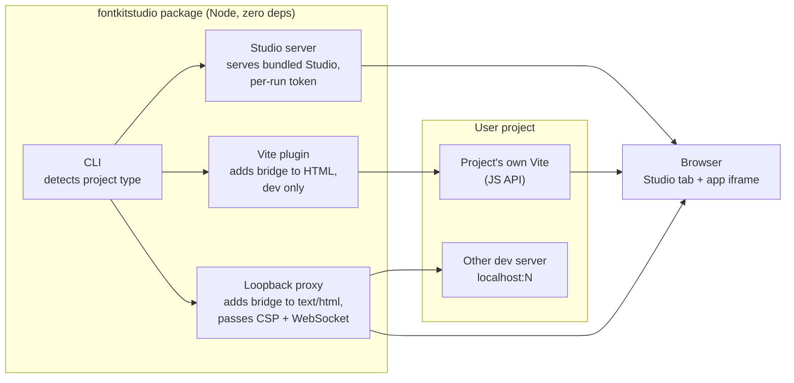
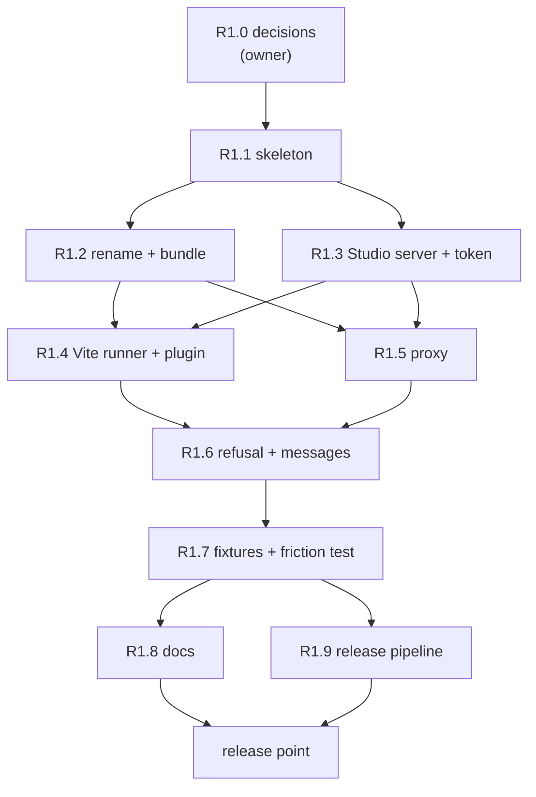

# R1 One command: implementation plan

Status: **active** (2026-10-04). PR A (R1.0-R1.3) merged as PR #8. PR B (R1.4-R1.6) is
planned in `2026-10-04-r1-pr-b-sdd.md` (addendum 2 in the ledger below). The package name, Studio's file name, publishing and the
versions under test are decided (D040 to D044 in
`docs/implementation/deviations.md`; [roadmap register](2026-10-03-roadmap.md#decisions-register)),
and the open questions below are answered. v0.2.1 is merged. This release is
version 0.3.0 (D044).
Design: [typography system design](../specs/2026-10-03-typography-system-design.md),
sections 1 (Starting fontkit), 1.1 (Releasing), 4.1, 4.3 to 4.5 (Testing).

## Goal

A developer runs one command in their own project and Studio opens connected to their app,
with no config edit and no script tag, and nothing written until they confirm. This is the
first public release.

## Scope

In:

- A Node package, `fontkitstudio` (D040), with zero runtime dependencies
  that uses the project's own Vite (global rule 8, D030).
- `npx fontkitstudio` in a Vite project: runs the project's Vite through its JavaScript API with the
  fontkit plugin added in memory.
- `fontkitStudio()` from `fontkitstudio/vite` in `vite.config` for a permanent setup.
- `npx fontkitstudio http://localhost:<port>`: proxy mode in front of any other local dev server.
- A per-run token, the dev-only refusal, a "Font Kit Studio · dev only" line in the terminal (D051), and clear
  failure messages.
- Studio and the bridge bundled at matching versions; Studio renamed to `fontkit-studio.html` (D041).
- Real-app fixtures (Vite + React, Bootstrap 5 static behind the proxy, Next.js behind the
  proxy) and the friction test in CI.
- The release pipeline: semver, changelog, trusted publishing with provenance (D042), the OS and
  Node matrix of D043.

Out (later releases): text-style detection (R2), the pairing UI (R3), the type-system file
and its write endpoint (R4), the extension (R5). Sync to file keeps working through
`scripts/serve.py`; the Node entry does not serve the overrides sync (question 3 below).

## Architecture

## Tasks

Each task is one brief, one report and one independent review under
`docs/implementation/tasks/r1-task-<n>-*.md`. Owned files are exclusive while a task runs.
Node code lives under `packages/fontkitstudio/` (exact layout fixed in R1.1).

- [x] **R1.0 Name registration and publishing setup.** Owner actions (D042): publish the
  `0.0.0` placeholder of `fontkitstudio` by hand from the owner's npm account with 2FA,
  deprecate it ("not released yet"), configure the trusted publisher for this repository's
  release workflow, and set the package to require 2FA and disallow tokens. The controller
  writes the steps as a checklist and records the outcome in the ledger.

- [x] **R1.1 Package skeleton.** `package.json` with no `dependencies`, `bin`, `exports`;
  Node's built-in test runner; a test that fails if a runtime dependency is added (spec
  4.5); CI job for `node --test`. Owns: `packages/fontkitstudio/`, `.github/workflows/` (a new job).

- [x] **R1.2 Studio rename and bundling.** Rename `font_kit_studio_v0.1.1.html` to
  `fontkit-studio.html` (D041); the version labels already follow D039. The old name stays
  for one release as a stub that forwards with its query and hash, with a test, and the
  migration note says when it goes; the build
  copies Studio and the bridge into the package with a version check that fails if they
  differ. Owns: the Studio file name, `README.md` references, `scripts/verify.py`
  provenance handling (the `supplied-v0.1.1` blob check must keep passing), the copy step.
  Risk: every test, bookmarklet and doc names the old file; grep and update in the same
  commit (anti-pattern 11, 12).

- [x] **R1.3 Studio server and per-run token.** The package serves the bundled Studio on a
  free loopback port with a random token in the URL; requests without it are refused; Host
  and Origin checks as in `serve.py`. Hostile cases: missing and wrong token, wrong Host,
  wrong Origin. Owns: `packages/fontkitstudio/src/studio-server.*`, its tests.

- [ ] **R1.4 Vite runner and plugin.** `npx fontkitstudio` finds the project's Vite, starts it
  through the JavaScript API with the plugin in memory, and opens Studio connected to it;
  `fontkitStudio()` in `vite.config` does the same through `npm run dev`. The plugin adds the
  bridge only in `serve` mode; `vite build` output contains no bridge (guarantee test,
  spec 4.2). Hot reload keeps the connection. Owns: `src/vite-*`, the Vite + React fixture.

- [ ] **R1.5 Proxy mode.** A loopback proxy in front of an existing dev server: injects the
  bridge only into `text/html` responses, serves the bridge from the app's own origin so
  `script-src 'self'` allows it, passes the app's CSP header through unchanged, passes
  WebSocket upgrades (hot reload) through untouched, limits sizes. Hostile cases (spec
  4.3): non-loopback target, wrong Host (DNS rebinding), path traversal, non-HTML content,
  oversized response. Owns: `src/proxy.*`, the Bootstrap 5 and Next.js fixtures.

- [ ] **R1.6 Dev-only refusal, visibility and failure messages.** The plugin and proxy
  refuse to run for a production build or a non-loopback bind and say so; the terminal
  shows "Font Kit Studio · dev only" (no page marker, D051); every connection failure (another bridge, a security
  policy, an unsupported project) gets a message that says what and why. Owns: the CLI
  messages (the bridge does not change: no page marker, D051).

- [ ] **R1.7 Fixtures and the friction test.** Committed fixtures with lockfiles, installed
  with `npm ci` in CI: Vite + React (plain CSS), Bootstrap 5 static with vendored CSS behind
  the proxy and a `script-src 'self'` CSP, Next.js behind the proxy. The friction test runs
  the one command on the Vite fixture and measures the time until Studio shows the page
  connected, with no manual step; it fails over a budget fixed in this task. Owns:
  `fixtures/`, `tests/` for the friction test, the CI job.

- [ ] **R1.8 Docs.** README Quickstart leads with the one command; `serve.py` and the script
  tag stay documented as the no-Node path; CONTRIBUTING covers the Node package; user-facing
  text says Font Kit Studio, not the bare "fontkit" (D040). Owns:
  `README.md`, `CONTRIBUTING.md`.

- [ ] **R1.9 Release pipeline.** Workflow triggered by a `v*` tag (D042): the gates on
  the D043 matrix, then `npm publish` from `packages/fontkitstudio/` by trusted publishing
  (`id-token: write`, `contents: read`), in a GitHub environment that needs the owner's
  approval; the release notes come from `CHANGELOG.md`. The owner creates the tag and
  approves the run. Owns:
  `.github/workflows/release.yml`, `CHANGELOG.md`.

- [ ] **R1 release point.** Full gates (Python suite, Node tests, fixtures, friction test,
  frontend gate), evidence in a new `docs/implementation/verification-r1.md`, roadmap
  updated. Owner merges and publishes.

## Waves

R1.4 and R1.5 run in parallel (disjoint files); so do R1.8 and R1.9. Fixtures for R1.4 and
R1.5 are created inside those tasks; R1.7 adds the CI wiring and the friction test.

## Open questions (answered 2026-10-04)

1. Package layout: `packages/fontkitstudio/` in this repository, so the Python tooling stays
   where it is.
2. Studio's new file name: `fontkit-studio.html`; the old path forwards for one release
   (D041).
3. The Node entry does not serve the v0.2 overrides sync. R4 brings writes to both servers
   together, and R1 docs point Sync users to `serve.py`.
4. Friction-test budget: measured on the first green CI run, then set at that time plus 50
   percent.

## Risks

- **The rename touches everything.** Mitigation: R1.2 is its own task with a grep list and
  the full suite.
- **Vite's JavaScript API changes between majors.** Mitigation: the Vite majors under test
  are fixed (D043), and the runner fails with a clear message on an untested major.
- **Proxy as a new trust boundary.** Mitigation: hostile cases from spec 4.3 are part of
  R1.5's definition of done, not a follow-up.
- **CI time.** Fixtures with `npm ci` add minutes. Mitigation: cache npm, run fixtures in
  their own job in parallel with the Python suite.
- **npm account and provenance setup need the owner.** Mitigation: R1.0 and R1.9 name the
  owner actions explicitly.

## Ledger

| Date | Event |
|---|---|
| 2026-10-03 | Draft written from the approved design. Waits on PR B and decisions 1, 2, 4. |
| 2026-10-04 | Decisions taken (D040 to D044); open questions answered. Waits on PR B. |
| 2026-10-04 | Addendum 1: R1 ships as three PRs under D050 (material lines counted, churn reported): A = R1.1-R1.3 (`2026-10-04-r1-pr-a-sdd.md`), B = R1.4-R1.6, C = R1.7-R1.9 and the release point. R1.0 runs beside PR A; only R1.9 depends on it. Trusted publisher fields fixed for R1.9: workflow `release.yml`, environment `npm-release`; the publish job runs Node 24 (npm 11.5.1 or later is required). |
| 2026-10-04 | PR A merged (PR #8). Addendum 2, binding once PR B's plan is approved: the Next.js fixture moves from R1.5 to R1.7 (it needs a large `npm ci` and its own CI job; the proxy is proven first on the static Bootstrap fixture), and the Vite fixture's CI job lands in PR B, so the one-command path is tested in CI from the PR that adds it. |
