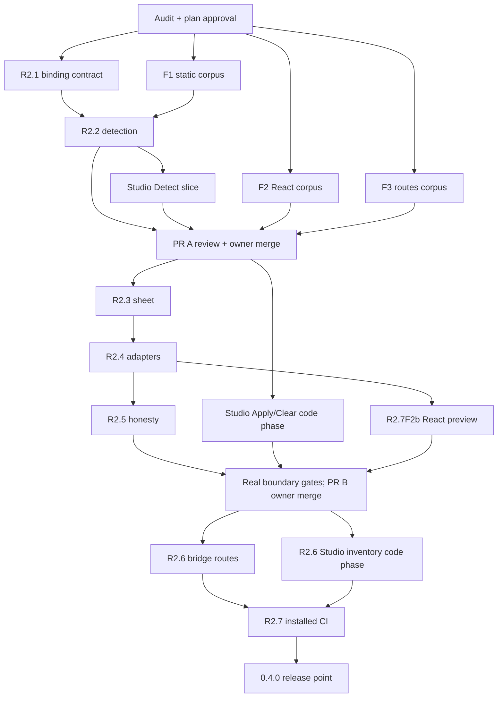

# R2 Engine Implementation Plan

> **For agentic workers:** use the repository's subagent-driven development
> workflow in AGENTS.md. Steps use checkbox (`- [ ]`) syntax. Implementers
> return patches and reports; the controller reviews, gates, commits and pushes.

Status: **approved for implementation** (2026-10-08). Planning branch:
`docs/r2-engine-plan`, from `13482685faff7519459804335ad54cfdc4f8dc0f`.
Release: **0.4.0** (D044). Implementation starts with PR A on
`feat/r2-detection`; intermediate slices remain unreleased.
Design: [typography system](../specs/2026-10-03-typography-system-design.md),
section 2 items 1-3, 8-10 and 13; sections 4.1-4.3 and 5.

**Goal:** detect the text styles a live page uses, apply validated role CSS from
one bridge-owned stylesheet, explain preview disagreements, and retain evidence
from the pages visited in Studio. This is the engine R3's pairing UI will use.

**Architecture:** the bridge owns detection, selector matching, canonical CSS
and computed outcomes. Studio owns the session's visited-page inventory and a
minimal explicit Detect / Apply / Clear surface. Additive protocol v1 messages
connect them. Keep existing inspector edits and Composer data separate until
their planned R3/R4 migration; nothing writes a new source or output file in R2.

**Tech Stack:** dependency-free single-file Studio and bridge; existing Node
package; Python unittest and pinned Playwright; React/Vite in fixtures only.
Keep repository-tested Node 22/24/26, Vite 7/8 and Next 16 (D043).

## Approval and prerequisites

- The product design and this detailed plan, choices, binding protocol and
  three implementation PRs are approved. Addendum 3 records execution start.
- The Library/Composer audit prerequisite is complete and independently reviewed. Its
  [read-only report](../implementation/audit-2026-10-08-library-composer.md)
  records reachable Library and Composer controls, screenshots, rough or confusing
  behavior, design gaps and explicit coverage limits. The approved brief governs
  its execution; findings change this plan only through a dated addendum.
  Findings about pairing/canvas redesign are assigned to R3 rather than folded
  into engine work. Addendum 2 reconciles the report and links the accepted
  evidence review. Addendum 3 records final engine approval.
- 0.3.1 publication closeout is recorded in
  [verification](../implementation/verification-0.3.1.md#publication-checks-2026-10-08).
- Approved thresholds (2026-10-08): 5,000 eligible text elements,
  detection <=2 seconds in desktop Chromium, cooperative work; near-duplicate
  flags require identical family and case, size difference <=1 px, weight
  difference <=100 and tracking difference <=0.02 em. D058 records these values.

## Addendum 1: prerequisite audit execution (2026-10-08)

The read-only Library/Composer audit brief is approved for execution. PR #17
merges the reviewed work order at `142aa9d`; audit records use a fresh branch,
`docs/library-composer-audit`, from that updated main. The audit implements no
engine feature or product fix. Its findings are reconciled before final plan
approval; all R2 runtime tasks and the binding protocol remain unapproved.

No threshold, fixture, release or product scope changes. The reviewed audit
outcome and R2.0 prerequisite closure are recorded in Addendum 2.

## Addendum 2: audit reconciliation (2026-10-08)

The [Library/Composer audit](../implementation/audit-2026-10-08-library-composer.md)
records the released behavior and its limits. Its [final independent review](../implementation/tasks/r2-task-audit-review.md#final-scoped-verdict-2026-10-08)
is Approved. That bounded evidence satisfies R2.0's audit execution and
classification items; it does not approve runtime work.

| Audit result | Phase ownership and R2 consequence |
|---|---|
| LC-01, supplied light-canvas text contrast | R3 specimen preservation and accessibility work. Preserve the existing sheet in R2; no canvas redesign or default-colour fix is added. |
| LC-02/LC-03, unnamed legacy controls and pointer-only slot selection | Legacy remediation belongs to R3. R2.S1/S2's new Detect/Apply/Clear surface must meet its existing accessible-name, focus and keyboard contract. |
| LC-04/LC-05, invalid specimen colour feedback and SVG colour wording | R3 specimen control clarity. No colour validation refactor or SVG rewriting is added to the engine. |
| Working specimen edits, JSON 0.1.1 round trip, image reselect, explicit sync and reconnect | R2.S2 retains its existing characterization requirement. Unsent specimen changes must stay outside acknowledged live Changes. |
| Missing catalogue, pairing, scale and unified role workflow | R3, as already scoped. Library mode changes do not transfer a selected family. |
| Missing standalone specimen output and persistent type-system handoff | R4/later. Existing token and acknowledged live exports remain separate from role-preview CSS. |
| Initial audit HTTPS isolation failure | D059 limits the affected evidence. Fresh regex-guarded probes replace font-dependent observations; R2 fixture tests must verify their own HTTPS interception before claiming isolation. |

No new implementation task, owned runtime file, threshold, protocol message or
release change follows. Read the audit's residual gaps before using it as
acceptance evidence; it is not a full security, assistive-technology or Gecko
compatibility sweep. Final approval of the engine work order remains open.

## Addendum 3: approved engine execution (2026-10-08)

PR #18 merges the accepted audit and reconciliation at `39ca945`. The reconciled
work order, choices, thresholds and PR A/B/C split are approved for execution.
The protocol below is binding before any bridge and Studio work splits.
PR A starts on a fresh `feat/r2-detection` branch from that updated main.

R2.0 records the approval and execution constraints before code dispatch.
F1 and F2a are the first disjoint fixture code phases; reviewed landings remain
serial. R2.1 protocol tests land with R2.2, after F1's literal oracle is committed.
Each later PR still starts from updated main after the preceding PR merges.
No audit fix, runtime dependency, output format or release scope is added.
The existing 0.3.1 labels stay until the R2 release point.

## Addendum 4: portable fixture provenance (2026-10-08)

F1's exact vendor-byte check exposed checkout newline conversion under
core.autocrlf=true. D060 records the necessary correction. The controller owns
.gitattributes only to mark fixtures/bootstrap4-static/vendor/** as -text;
the new tagged Bootstrap 4 CSS/licence then retain their exact upstream bytes
on Windows and Linux. No existing vendor file or global newline policy changes.

The F1 writer's existing owned metadata/test paths record Bootstrap 5's canonical
LF blob hashes and its exact existing CRLF checkout hashes. Tests accept only
the documented byte forms, with canonical-source provenance retained. The new
Bootstrap 4 files require their single raw upstream form. This adds no runtime,
fixture behavior, dependency, threshold or protocol scope. Independent fixture
review includes the attribute and a fresh Windows checkout portability probe.

## Scope and global constraints

In: read-only text detection; suggested roles and reviewed selector bindings;
Bootstrap 5/4 and CSS-module adapters; reversible role CSS; honest preview;
visited-route evidence; minimal Studio controls; fixtures, hostile tests and
the 0.4.0 release point.

Out: font catalogue or loading, pairing candidates, role rename/merge/split UI,
scale, guardrails, inspector exceptions migration, file format/state block,
new CSS exports or write endpoints, licence lookup, font downloads, extension,
README product reframing and a product website. Those retain R3-R5 ownership.

- Preserve Library, specimen Composer, legacy JSON 0.1.1 import/export,
  inspector, existing sync, reconnect decisions and production refusal.
- Zero runtime dependencies and empty package devDependencies. Do not split
  Studio or bridge into a build or add a module-loading requirement.
- Every request/reply checks source window, pinned origin, protocol and session.
  Never interpret a reported route as permission to change the pinned origin.
- No raw CSS, arbitrary custom properties, markup, URLs or font loads in role
  input. Page names, classes, samples and reasons render with textContent.
- Role CSS stays in the target; Studio chrome stays in Studio (global rule 4).
- No silent replay, clearing, saving or adoption on reconnect. New role state
  stays in memory; no changes to localStorage or composition JSON schema.
- Tests block external HTTPS; vendored fixture assets have licences and source
  hashes. Node fixture installs use pinned lockfiles and npm ci. Next telemetry
  stays off. Fixture source edits use scratch copies and owned-process cleanup.
- Every task gets an independent verdict before an atomic controller commit.
  A commit contains one working slice and its tests, changelog and records.
  Do not combine unrelated fixes, restructure uncovered code or bypass hooks.
- One writer per file. All bridge code phases are serial; all Studio code
  phases are serial. These two writers and disjoint fixtures may overlap only
  after this contract is approved. Landings are always serial.
- Maximum 8,000 material lines per PR; stop adding scope at 7,700. Report
  rename-aware material and named churn files separately (D050).
- R2 removes the old forwarding page at its release point (D052), with the
  documented bookmark break. No tag, merge or npm write is performed by agents.

## Implementation choices and tradeoffs

Use one bridge-owned normal-priority stylesheet. Keep the existing important
inline inspector overrides; report when they win. Converting them to exception
rules now would expand R2 into R3. Repeated inline role edits would instead
break React replacement and clean undo. Neither is part of this plan.

Keep visited-page observations in Studio memory. A bridge-only inventory is
lost on full navigation; a persistent or crawled inventory introduces R4's
file format and unsupported whole-site claims. A Studio reload starts fresh.

For cross-page comparisons, detection measures app baseline with only the
owned role sheet disabled during each synchronous read batch. Restore it in
finally before yielding; never leave it disabled across tasks or a paint.
This avoids treating preview CSS as the app's original styles. Existing
inspector edits remain part of that baseline. Current rendered preview outcomes
are measured separately, with the role sheet enabled.

Computed mismatch counts are authoritative. Name a winning selector only when
proved in the supported readable-rule cases; otherwise give an explicit unknown
reason. Do not implement a general CSS cascade engine. CSSOM can deny access
to sheet rules ([CSSOM cssRules](https://drafts.csswg.org/cssom/#dom-cssstylesheet-cssrules)).

## Binding protocol contract

This entire section is binding under Addendum 3. A contract
change needs a dated addendum and both writers' updated briefs before dispatch.
New messages remain protocol **1**. Missing capability means unsupported.

### Envelope, limits and types

All new requests carry `type`, `protocolVersion:1`, current `sessionId` and
`requestId` (1-200 characters). Apply/clear also carry integer `baseRevision`,
`documentId` and `pageVersion`. Detect is read-only and does not bump revision.
Mutations use the existing revision queue; successful apply/clear bump revision
once. Detect also carries the documentId from authenticated ready; it reads the
current page rather than requiring a previously observed pageVersion. Studio
matches its latest pending detect request, ready document and nondecreasing page
version. Invalid requests preserve the previous stylesheet, roles and revision.

The bridge assigns a new `documentId` (1-200 characters) per new instance and a
nonnegative `pageVersion` on URL/content/style invalidation. A role job captures
window, origin, session, document, page version, revision and request generation.
Check them before committing and before posting an asynchronous result. A new
detect supersedes the previous detect; hello, navigation, reset or dispose
cancels stale measurement. Send no old result through a newly pinned session.
R2.2 establishes document identity in ready, content/style generations and actual
URL checks at every yield and terminal result. A URL-only change during detection
invalidates that job before PR C's automatic route notifications exist.

Same-session/document detect invalidation returns complete:false/page-changed
for that request with captured and current page identity. It cannot enter checked
evidence. Studio can use the authenticated current version/URL to show the stale
status and permit a fresh Detect. Unknown documents, superseded requests and older
versions cannot establish or replace current identity. A complete scan requires
captured/current version and URL equality at terminal validation.

Limits below are approved plan choices:

| Field | Limit |
|---|---|
| Role/group count | 128 per scan/request and 128 in the session collection |
| Selectors per role | 32, individually validated |
| Selector length | 2,000 characters, matching the existing Studio ceiling |
| Role ID / label / author-role name | 100 / 200 / 200 characters; IDs unique in each request |
| Sample text / shared classes | 200 characters / 16 classes of <=200 characters |
| Signature variants per author role | 8; overflow makes the scan incomplete |
| Request / reply | 256 KiB / 1 MiB UTF-8 JSON; reject oversize input |
| Canonical CSS | 128 KiB UTF-8 |
| Visited routes / detected text elements | 32 / 10,000 |
| Route text | 2,000 characters, same authenticated origin |

Limits never silently turn partial results into complete evidence. An incomplete
scan returns `complete:false` and one of `time-budget`, `element-limit`,
`group-limit`, `variant-limit`, `identity-limit`, `reply-limit` or `page-changed`, plus measured
counts. Only complete current results enter the checked-page inventory. At the
route limit, retain earlier records and show that the new page is not stored;
the user can explicitly Clear visited pages. Do not silently evict old evidence.

```typescript
type Case = 'none' | 'uppercase' | 'lowercase' | 'capitalize';
type StyleSignature = {
  fontFamily: string; fontSize: number; fontWeight: number;
  textTransform: Case; letterSpacing: number; // px size, em tracking
};
type RoleIdentity =
  { kind: 'author-role'; name: string } |
  { kind: 'style'; style: StyleSignature };
type SelectorBinding = {
  value: string; stable: boolean;
  reason: 'author-role' | 'author-id' | 'class' | 'css-module' | 'dom-path';
};
type RoleInput = {
  id: string; name: string; selectors: string[];
  adapter: 'plain' | 'bootstrap5-body' | 'bootstrap5-mono' | 'bootstrap5-heading';
  properties: { fontFamily?: string; fontSize?: number; fontWeight?: number;
    lineHeight?: number; letterSpacing?: number; textTransform?: Case };
};
type DetectedGroup = {
  id: string; identity: RoleIdentity;
  suggestedName: string; authorRole: string | null;
  signatures: { style: StyleSignature; count: number }[];
  elementCount: number; sampleText: string; sharedClasses: string[];
  selectors: SelectorBinding[]; bindingComplete: boolean;
  nearDuplicateIds: string[];
};
type SelectorCheck = {
  roleId: string; selector: string; matchCount: number;
  signatures: { style: StyleSignature; count: number }[];
};
type RoleOutcome = {
  id: string; matched: number; checked: number; mismatched: number;
  complete: boolean;
  losses: { property: string; count: number; winningSelector: string | null;
    reason: 'author-rule' | 'inline' | 'inherited' | 'unreadable-sheet' |
      'complex-cascade' | 'stylesheet-blocked' | 'budget-exceeded' }[];
};
```

Unknown fields, `__proto__`/`constructor`/`prototype` keys, arrays in object
positions, nonfinite numbers, duplicate IDs and invalid enums reject the whole
operation. Do not describe the current loose isPlainObject helper as sufficient
validation; apply exact field/shape checks to the new contract on both sides.

### Messages

| Direction / type | Required body beyond envelope | Result |
|---|---|---|
| Studio -> `design:detect` | documentId from ready; knownRoles: {id, selectors:string[]}[] (may be empty) | Fresh baseline scan and bounded selector checks for previously visited roles |
| Bridge -> `design:detected` | requestId, revision, documentId, pageVersion, pageURL, currentPageVersion, currentPageURL, complete, reason (null on success), elapsedMs, scannedElements, groups:DetectedGroup[], selectorChecks:SelectorCheck[] | Read-only; captured/current identity match on complete results |
| Studio -> `design:roles-apply` | baseRevision, documentId, pageVersion, roles:RoleInput[] | Atomic replacement of the whole role set; empty array clears |
| Studio -> `design:roles-clear` | baseRevision, documentId, pageVersion | Explicit idempotent removal |
| Bridge -> `design:roles-applied` | requestId, operation:'apply' or 'clear', revision, documentId, pageVersion, currentPageVersion, currentPageURL, roles:RoleInput[], canonicalCss, hashAlgorithm:'fnv1a32', cssHash, outcomesComplete, outcomeReason:null or 'page-changed' or 'budget-exceeded', outcomes:RoleOutcome[] | Immutable accepted-operation receipt; clear returns empty roles/CSS/outcomes |
| Bridge -> `design:roles-page` | documentId, pageVersion, pageURL | Data-only invalidation after detection is enabled; does not mutate roles |
| Bridge -> `design:rejected` | Existing requestId/revision/reason/detail shape | Invalid-message, unsupported-value, revision-conflict, page-changed, stylesheet-blocked or size-limit; no partial mutation |

`design:ready.capabilities` gains `roleDetection:true` after R2.2 and
`roleStylesheet:true` after R2.3. Advertise only implemented operations.
`design:ready.roleState` contains documentId, pageVersion, pageURL, accepted
roles, canonicalCss, hashAlgorithm and cssHash (roles/CSS empty before any apply;
the hash is the empty-string digest).
R2.2 supplies this authenticated identity with roles:[], canonicalCss:'' and
cssHash:'811c9dc5', even before roleStylesheet is implemented. R2.3 extends the
snapshot with accepted state; S1 never learns document identity from a detect
reply alone. All current URLs must pass the same authenticated-origin validation.
Old bridges omit these fields; Studio disables Detect/Apply/Clear with the
visible reason `This bridge does not support role detection/preview.`
Old Studio ignores additive fields and continues its existing messages.

Read-only detect may run beside an idle mutation queue. If a mutation commits
during a scan, the revision/generation check makes it incomplete. Apply and
clear share the single queue with inspector/composition/reset; never let a role
acknowledgement settle a legacy request or overwrite the legacy changes ledger.
Bridge outcomes wait for a rendered frame and revalidate freshness. Accepted
roles may coexist with losses: a losing normal rule is an honest preview outcome,
not an instruction to add !important. A blocked stylesheet is a failed install,
not an applied success; retain the prior accepted sheet on failure.

The mutation commit point is successful synchronous install verification followed
by replacement of accepted roles/CSS and one revision increment. Failures before
that point reject with the previous state/revision intact. Capture an immutable
receipt there. Post-commit page mutation does not roll back or return rejected:
send exactly one roles-applied receipt to the still-current session/document,
with the committed roles/CSS/revision and captured pageVersion, separate current
pageVersion/URL, outcomesComplete:false, outcomeReason:'page-changed' and outcomes:[]
when measurements were invalidated. Budget-limited checks likewise disclose
incomplete outcomes and checked counts; never present unchecked elements as losses.
Clear settles immediately with outcomesComplete:true, null reason and empty
outcomes. Session/document replacement or dispose suppresses the old receipt;
authenticated ready on reconnect supplies the accepted snapshot without replay.

Studio first settles the matching queue operation from its authenticated receipt
(requestId, expected operation, captured document/page and expected revision).
It retains canonical accepted state even when measurement is stale and shows
`Preview applied; page changed before checks finished`. Detect refreshes baseline
and route evidence; explicit Apply again rechecks preview outcomes after it.
It never downgrades a newer accepted revision or page
generation. Evidence freshness is checked separately; a stale receipt cannot mark
either route checked. This separation also covers a rerender followed by queued
inspector edit/clear: every accepted operation settles and the next baseRevision
is current. Detection and installed-state outcomes remain different observations.

### Selector and value validation

The existing hardened grammar is in Studio at its selector validation block;
the bridge currently generates selectors rather than validating arbitrary ones.
Create role-specific validators in each file, intentionally duplicated across
the trust boundary. Do not widen legacy import/export validation incidentally.

Accept one member made of tag or `*`, escaped ID/class components,
`[data-design-id="escaped value"]`, `[data-design-role="escaped value"]`,
`:nth-of-type(n)` (1-9,999), and paths joined by ` > `, using the current
linear-time escaping rules. Lists travel as arrays; only the bridge joins them
with `, `. Reject raw comma lists, other attributes/pseudo-classes, root selectors,
raw delimiters, line breaks, comments, at-rules and URL/expression syntax.
Positive tests include escaped utility classes and escaped author IDs/roles.
Successful querySelectorAll with zero matches is valid and reported as zero.

The six property keys reuse existing numeric/enumerated PATCH_RULES semantics:
fontSize 4-400 px (two decimals), fontWeight 1-1,000 (integer, no per-target
weight snapping), lineHeight 0.5-5 (three decimals), letterSpacing -0.5-2 em
(four decimals), and the four textTransform values. Family is trimmed 1-300
characters, supported by CSS.supports, and rejects CSS delimiters, escapes,
newlines, comments, URL/expression syntax and !important. Omitted keys mean no
declaration; null/empty property objects reject. No text, color, alignment,
order, asset, fontStylesheet or supplied custom property is accepted.

Adapters are verified against current detected framework evidence. The bridge,
never the caller, emits the Bootstrap 5 :root template. The body role maps its
family to --bs-body-font-family and --bs-font-sans-serif; a mono role maps to
--bs-font-monospace. Heading bindings use detected h1/.h1 through h6/.h6 or
display classes at their own role level, rather than changing every heading's
size together. All variables live only in the owned sheet. Bootstrap 4/unknown
versions use plain rules; no speculative variable patch or class renaming.

### Canonical CSS, ownership and undo

Validate/canonicalize all roles before touching the accepted sheet. Stable
serialization uses request role order, deduplicated selector order, fixed property
order (family, size, weight, line height, tracking, case), LF, two-space declaration
indentation and a final LF when nonempty. Empty roles produce the empty string.
CanonicalCss is the exact string assigned with textContent; no DOM HTML sink.
Return it for visible review; R4 owns writing these bytes to a file later.

FNV-1a32 hashes UTF-8 bytes with offset 2166136261 and multiplier 16777619,
modulo 2^32, formatted as eight lowercase hex digits. The empty digest is
`811c9dc5`. This is a non-security comparison value; exact CSS bytes and the
message trust checks remain authoritative. Test empty/non-ASCII/LF vectors;
do not require WebCrypto or HTTPS on existing script-tag entry points.

Keep one owned style node by object identity; same-ID/attribute author nodes
are never adopted or removed. Confirm installation through CSSOM/actual computed
outcomes, not node presence alone. Clear removes only the owned node, leaves
author DOM/inline styles, inspector edits, text, tokens, font links and structure
intact, and cancels stale role jobs. Repeating clear succeeds with empty state.
Global legacy reset clears roles too; target-only reset leaves the shared sheet.
Its normal design:applied reply additionally includes the empty roleState snapshot
on a global reset; S2 consumes that authenticated snapshot so the visible role
preview clears with the legacy operation. It does not settle a role request.
Dispose cancels added observers/jobs/history hooks and removes only its node.

On an unchanged fixture, snapshot after handshake but before apply, excluding
only the explicitly owned role node; after clear the author's attached DOM and
computed styles match byte for byte. On an app that rerenders during preview,
clear reveals the app's current baseline; it does not rewind the framework.

### Detection and performance

Traverse document light-DOM text-node parents once for nonblank direct text.
Count each eligible parent once, not every ancestor's descendant text. Include
rendered text below the viewport. Exclude head/script/style/template/noscript,
editor overlays/placed assets, display:none, visibility:hidden/collapse,
zero-rendered-area text and fully transparent ancestor chains. Handle
display:contents by text range geometry. Form values/placeholders, generated
pseudo text, shadow-root internals, nested frames and SVG text are not covered
by this first detector; the UI explicitly says `Light-DOM text only`.

Normalize computed family whitespace without stripping quotes or lowercasing
family names; size to two decimals, numeric weight to integer, case enum,
tracking normal to zero otherwise px/fontSize to four decimals. Exact tuples
form groups. Author roles use authorAttr so bridge-added hints do not override
grouping. A single author role with divergent styles retains variants and counts.
Near-duplicate flags never merge groups or transitively collapse style families.

Prefer author-role/ID bindings, then class selectors whose match set is the
intended group, then verified unstable DOM paths. CSS-module-looking classes
carry an uncertainty warning, not a universal compiler-detection claim. A group
that cannot fit safe complete bindings stays visible with bindingComplete:false;
Apply is disabled for it. Never silently use a broad selector for mixed styles.

The budget clock starts when the bridge accepts detect on an already loaded
fixture and stops at the complete reply. It includes traversal, style reads,
grouping, binding work and serialization, but excludes server/browser startup
and font downloads. First complete scan of exactly 5,000 eligible elements must
finish in <=2,000 ms on desktop Chromium, both locally and on the hosted quality
job. No warm-cache-only result or retry-until-pass benchmark. Cooperative batches
target <=8 ms before yielding; a concurrent heartbeat must advance before reply,
and a queued input action must render before detection finishes. A deadline miss
returns incomplete status; it does not silently increase the threshold.

### Role identity and collection algorithm

DetectedGroup.id identifies a group only inside its reply; it is not cross-page
identity. Its full RoleIdentity is authoritative. Author names are trimmed,
case-sensitive attribute values read through authorAttr, with no Unicode folding
or truncation. Invalid over-limit identities make detection incomplete. Automatic
identity is the exact normalized five-property tuple. A display name, scan order
or FNV digest never serves as identity; automatic and author namespaces differ.
Two-sided checks require an author identity's name to equal authorRole, or an
automatic identity to equal its sole signature with authorRole:null. Variant
counts sum to elementCount; IDs are unique and nearDuplicateIds refer to other
groups in that reply. No truncated name, inconsistent tuple or invented scan ID
can enter the collection. Role/selector outcome counts use eligible rendered
text parents, deduplicated across the selector union, with explicit checked counts.

```javascript
// R2.2 produces identities; R2.S1/R2.6S use the same binding key definition.
function roleIdentityKey(identity) {
  if (identity.kind === 'author-role') return JSON.stringify(['author-role', identity.name]);
  const s = identity.style;
  return JSON.stringify(['style', s.fontFamily, s.fontSize, s.fontWeight,
    s.textTransform, s.letterSpacing]);
}
```

Studio uses a Map from this full key to an issued role-N ID, monotonic within the
origin collection's lifetime. S1 already uses this mapping for current rows; S2
sends these IDs in RoleInput. R2.6S retains the mapping across routes/handshakes.
Different signatures with the same author role retain one ID plus variants;
equal automatic styles on different pages retain one ID and separate bindings.
Suggested names may duplicate. Discovery reordering cannot remap an existing ID.
Near-duplicate flags do not merge identities. User drafts and accepted preview
state remain separate from incoming baseline observations.

Each route owns its latest group/count/selector contributions and SelectorChecks.
Replacing a route subtracts its old counts, then installs the new contributions;
it does not append observations. Retained role IDs and initial per-selector
reference signatures remain bounded until explicit Clear visited pages, even
when a role now has zero matching pages. Match signatures outside that selector's
recorded baseline are flagged as drift; zero matches remain a distinct result.
A different automatic identity on a reused selector cannot hide that conflict.
Author-role signature variants also stay visible rather than silently normalizing
to one style. Store both the current measured tuples/counts and the reference used
for each conflict; the UI can explain what differs.

Before storing a route, validate the whole candidate collection: <=128 role IDs,
<=32 retained selectors per role, <=8 variants/reference tuples per role and <=32
routes. knownRoles contains every retained role's bounded selector union, with no
silent omissions. Overflow refuses the whole new route snapshot with visible
`Collection limit reached; this page was not stored`; earlier evidence remains.
The current detection is visible, but new role Apply is disabled until the user
clears the collection. Clear visited pages explicitly clears detection/visited
evidence and draft bindings, cancels pending collection jobs and increments its
local generation; its visible wording says the applied preview/inspector stays.
Accepted role CSS is cleared only by Clear preview or the existing global reset.

### Route observation

Route key is authenticated origin + exact pathname/search/hash. Reject a pageURL
with another origin, credentials, unsupported scheme or excessive length. Do not
sort query parameters or ignore hashes. Studio stores the latest complete
snapshot per route and replaces it on revisit instead of adding duplicate counts.
Totals are labelled `across visited-page observations`, not unique site elements.

Track successful pushState/replaceState, popstate, hashchange and pageshow/pagehide.
Preserve history method receiver, return values, arguments and thrown exceptions;
restore a wrapper only if it is still the bridge's own wrapper. No polling loop
or app router dependency. A route event invalidates evidence; coalesced text/style
mutations refresh it after rendering. Suppress owned stylesheet mutations.
Observe text and author-role changes as well as current discovery inputs.
CSSOM insertRule without an observable DOM change requires explicit Detect again;
do not claim all external CSS changes are automatically tracked.

Detect sends known role selectors to obtain baseline SelectorCheck records on
the new page. Zero matches and a matched different signature are distinct.
Only complete current selector checks mark that role checked on that page.
Same-origin document navigation, reload, re-hello and dock/pop-out preserve
Studio's inventory but require explicit Apply on the new document. SPA navigation
keeps the existing sheet naturally; it sends no new saved edits. Cross-origin
navigation remains disconnected until the user explicitly connects that origin.
Connecting a new origin visibly starts a new collection.

Show `Checked on N visited pages. Other pages have not been checked.`, actual
per-role page lists, no-match pages, conflicting signatures, and pending/stale
states. No crawling or whole-site coverage denominator. A late B scan after
A -> B -> C cannot update C's list or mark B checked under the wrong document.

## File structure and ownership

| Owner | Runtime/source | Test/output files |
|---|---|---|
| Controller | Plans, ledger, decisions, CHANGELOG, workflows, canary list, release labels/docs | Brief/report/review records, verification/sweep, workspace |
| Bridge writer | fontkit-bridge.js only, serial R2.2-R2.6B | R2.1 role harness/protocol fixtures; new test_role_detection.py, test_role_stylesheet.py, test_role_adapters.py, test_role_preview.py, test_role_route_bridge.py; targeted handshake capability assertion in test_bridge_runtime.py |
| Studio writer | fontkit-studio.html only, serial R2.S1/R2.S2 then R2.6S | New test_studio_roles.py, test_role_routes.py, test_r2_integration.py |
| F1 static fixture writer | fixtures/bootstrap4-static/**; bootstrap5-static/index.html and app.css; fixtures/large-page/** | New test_r2_static_fixtures.py and expected-styles.json per fixture |
| F2 React fixture writer | fixtures/vite-react-css-modules/** | New test_r2_react.py; expected-styles.json |
| F3 route fixture writer | fixtures/multi-page/** | New test_r2_route_fixtures.py; expected-styles.json |

Exact paths within new fixture directories are named in their task below.
No task edits tests/support.py, tests/fixture_support.py, other existing test
modules or package runtime without a controller addendum. Browser tests may subclass
tests/test_bridge_runtime.py's BridgeCase or tests/test_live_integration.py's
LiveIntegrationCase, with owned fresh contexts/external-HTTPS blocking. If a
further shared helper is needed, assign its exact path and sole owner by addendum.
R2.1 explicitly owns the role harness used by five new bridge test modules;
later consumers import it read-only.

## Tasks and acceptance

For every implementation task: write the named brief; commit prerequisites;
dispatch into a short detached worktree; show RED for new behavior and passing
characterizations for preserved behavior; implement a working slice; run its
focused commands plus test_support; run foreground mutations per new guard;
return patch/report and draft bookkeeping; controller reads the whole report,
integrates, gets independent review, resolves findings, runs landing gates and
makes one atomic commit. Implementers never stage/commit/push/spawn.

### R2.0: approve prerequisites and freeze the work order

**Touches/owner:** controller; this plan, progress.md, deviations.md, roadmap,
audit brief/report and `.superpowers/sdd/r2/` workspace. **After:** 0.3.1 release.

- [x] Approve and run the separate read-only Library/Composer audit brief.
- [x] Classify audit findings into R2 acceptance, R3 work or later; record any
  necessary plan addendum, without implementing audit fixes here.
- [x] Obtain approval of this plan, choices and PR split. Record the decision
  in the plan/ledger; keep the phase `planned` until approval.
- [x] Create execution constraints/checkpoint with exact BASE/owned paths;
  run applicable baseline gates and commit the work order before code dispatch.

**Done when:** audit evidence is read, plan approval recorded, no open contract
ambiguity, and each next writer has a brief and committed prerequisites.

### R2.1: contract characterization and compatibility

**Touches:** controller binding section above; bridge writer owns new
`tests/test_role_protocol.py`, `tests/role_support.py`,
`tests/fixtures/bridge/host-roles.html` and
`tests/fixtures/bridge/target-role-protocol.html`.
**After:** R2.0. Land protocol tests with R2.2 so there is no failing-test-only PR.

**Produces:** RoleBridgeCase in role_support.py subclasses BridgeCase. Its
`open(engine, host=STUDIO, target=TARGET_PAGE)` returns `(page, frame)` using the
new host fixture, fresh contexts and external-HTTPS blocking. Its owned virtual
HTTP route adds the real bridge's auto-init script tag only to role-test target HTML that
does not already load it. Fixture files and production builds stay untouched.
CSP probes use explicit target headers; never strip restrictive CSP or use
evaluate to bypass it. Existing hello/request helpers call the new host's
functions, which await detected, roles-applied, legacy applied or rejected by requestId, fill
the current envelope/revision unless a hostile test explicitly overrides it,
and update revision only from authenticated matching replies. No fake bridge.

- [ ] Characterize current wrong-source/origin/session/version rejection,
  old Studio/bridge handshake, inspector/reset and production behavior as passing.
- [ ] Test absent capabilities against the old bridge and unknown new messages
  without manufacturing RED. New detect response/capability is the genuine RED.
- [ ] Add hostile field/size/generation cases and explicit reply matching to
  the owned protocol fixture; existing host helpers are read-only.
- [ ] Give the target fixture a .body-copy paragraph with normal 16px size and
  line-height:1.5, an author-role control and ordinary author CSS. This literal
  baseline supports the 24px apply/undo example and contains the real bridge.
- [ ] Confirm message schema examples and two-sided positive/hostile cases
  before Studio and bridge code work splits.

**Focused:** `python -m unittest test_role_protocol test_support -v` with
PYTHONPATH=tests. **Done when:** detection tests land with their implementation;
apply/clear cases are added with R2.3, never committed as skips for acceptance.

### R2.7F1: static expected-style and performance corpus

**Owns:** `fixtures/bootstrap4-static/{index.html,app.css,expected-styles.json,
vendor/bootstrap.min.css,vendor/LICENSE}`; existing
`fixtures/bootstrap5-static/{index.html,app.css}` plus new expected-styles.json;
`fixtures/large-page/{index.html,app.js,app.css,expected-styles.json}`;
`tests/test_r2_static_fixtures.py`. **After:** R2.0; parallel with F2/F3.

- [x] Vendor Bootstrap 4.6.2 CSS/MIT licence from its tagged upstream; record
  source URL and SHA-256 in the fixture's expected-styles.json metadata.
  Keep existing Bootstrap 5.3.8 vendor bytes untouched.
- [x] Cover display/h1-h6/lead/small/btn/nav-link/navbar-brand/card-title/form-label
  on both versions, author-role priority and unknown-version fallback.
- [x] Generate exactly 5,000 eligible text-bearing elements in 20 deterministic
  styles (250 each). Nested-parent/dedup cases are part of those 5,000 parents;
  hidden controls are outside the eligible count. No other visible text label
  adds a parent. Literal expected tuples/counts are independent of the detector.
- [x] Add inside/on/outside near-duplicate cases, a heartbeat and a typed-input
  acknowledgement. Near-duplicate tuples belong to the same 20-style corpus;
  author-role splitting cases belong to the other static/protocol fixtures.
  The heartbeat records JS state; an aria-labelled input renders typed values
  (excluded by the detector), without changing the corpus or adding text labels.
- [x] Serve static fixtures offline and characterize their computed styles,
  eligibility/counts, semantic classes and Bootstrap variables before engine tests.

**Focused:** `python -m unittest test_r2_static_fixtures test_support -v`.
**Done when:** literal oracle matches real rendered fixtures; no server remains.

### R2.7F2a: React CSS modules and rerender corpus

**Owns:** `fixtures/vite-react-css-modules/{package.json,package-lock.json,
index.html,vite.config.js,src/main.jsx,src/App.jsx,src/App.module.css,
expected-styles.json}` and `tests/test_r2_react.py`. **After:** R2.0.

- [x] Reuse existing Vite 8.3.2/React 19.3.0 pins; zero runtime dependencies
  still applies to the package, not this private fixture. Commit npm lockfile.
- [x] Include author-role and hashed-class bindings, a button replacing nodes,
  different title/body styles and a stable class control for comparison.
- [x] Characterize hashed selectors and real state-driven React replacement;
  CSS-module HMR runs in a scratch fixture copy. Do not claim React Fast Refresh:
  no new React plugin is added merely to rename CSS HMR as Fast Refresh.
- [x] Return exact CI install/module lines; controller integrates them.

**Focused:** npm ci for this fixture, then
`python -m unittest test_r2_react test_support -v` (baseline cases before engine,
new role cases belong to R2.7F2b). **Done when:** real baseline computed outcomes,
installs present, scratch bytes/processes cleaned; production build still clean.

### R2.7F2b: React role preview integration

**Owns:** F2 writer, tests/test_r2_react.py only; fixture source is read-only.
**After:** R2.4 committed. This is a separate PR B slice; F2a can complete in A.

- [ ] Characterize apply to hashed/author-role bindings with computed fonts;
  passing behavior stays GREEN. New defects get a failing test before a fix.
- [ ] Assert role CSS survives real state replacement and CSS HMR, then clear
  reveals the current app baseline. All new role cases run without skip guards.
- [ ] Mutation probes remove selector verification and rerender handling, with
  exact source restoration. No mutation is required to delete a test assertion.

**Focused:** `python -m unittest test_r2_react test_role_adapters test_support -v`
after npm ci. **Done when:** preview/undo remains valid after real replacement,
offline scratch HMR and production-clean checks; no Fast Refresh claim.

### R2.7F3: real page and history corpus

**Owns:** `fixtures/multi-page/{index.html,article.html,conflict.html,
unvisited.html,spa.html,app.css,spa.js,expected-styles.json}` and
`tests/test_r2_route_fixtures.py`. **After:** R2.0.

- [ ] Add ordinary page links, a deliberately unvisited page, a selector with
  another signature on conflict.html, and a zero-match page case.
- [ ] Implement push/replace/back/forward/hash routing with delayed content
  replacement and a same-URL state change. Literal expected styles per route.
- [ ] Characterize actual URL/content transitions and fixture styles using
  browser conditions, never fixed sleeps or synthetic route notifications.
- [ ] Return fixture URLs for Bridge/Studio route tests; no framework/router
  dependency, network requests or shared harness changes.

**Focused:** `python -m unittest test_r2_route_fixtures test_support -v`.
**Done when:** fixture independently demonstrates the transitions later tested.

### R2.2: text detection and bounded work

**Owns:** fontkit-bridge.js, test_role_detection.py and R2.1 owned protocol
tests; tests/test_bridge_runtime.py only its expected capability dictionary.
**After:** R2.1 contract; F1 landed for acceptance. **Produces:**
`detectTextStyles({knownRoles, requestId})` complete/incomplete response above;
read-only `styleSignature(element)` and safe group binding generation.

- [ ] RED: detect after valid hello receives no detected list on 0.3.1;
  real fixture's literal expected list cannot be satisfied by the old bridge.
- [ ] Implement eligible traversal, normalized exact/author-role groups,
  binding completeness and threshold flags. No reuse of semantic target list
  as all-text population; no new author DOM attributes during detection.
- [ ] Add cooperative jobs, cancellation/deadline/shape limits and enabled
  roleDetection capability; emit correct document/page generation and empty
  authenticated roleState in ready. Test unknown-document/old-version replies
  and URL-only invalidation during a scan before automatic route hooks exist.
- [ ] Emit full RoleIdentity, with deterministic author/style key semantics;
  test reordered discovery, duplicate names and distinct namespaces.
- [ ] Update HandshakeTests.test_bridge_ready_carries_no_page_data_and_ready_describes_targets
  to expect the additive capability, retaining all prior capabilities. Do not
  weaken the existing handshake assertions or its data-free announcement.
- [ ] Run first complete 5,000-element budget and responsiveness probes.
  Mutations remove visibility filter, deduplication, author priority, threshold
  boundary, yielding and freshness guards; each must fail a behavior assertion.
- [ ] Verify unchanged inspector/legacy discovery characterizations and return
  exact counts, elapsed time, mutations and unfinished limits in the report.

**Focused:** test_role_protocol, test_role_detection, test_r2_static_fixtures,
test_bridge_runtime.HandshakeTests, test_support. **Done when:** literal lists
match and the blocking 2-second fixture test passes; no partial checked result.

### R2.3: validated role stylesheet and clean undo

**Owns:** fontkit-bridge.js, new test_role_stylesheet.py; apply/clear cases in
test_role_protocol.py; the same targeted handshake capability expectation in
test_bridge_runtime.py. **After:** R2.2 committed. **Produces:**
`canonicalizeRoles(roles)`, `serializeRoleCss(roles)`,
`handleRolesApply(data)` and `handleRolesClear(data)` with the binding replies.

- [ ] RED: normal role apply changes no computed font on the old handler;
  clear cannot acknowledge the missing operation. Preserve legacy behavior tests.
- [ ] Add role-specific selector/property validators and deterministic CSS;
  golden bytes/digests include escaped/non-ASCII input and empty clear.
- [ ] Validate the whole request, install one owned node, detect blocked/invalid
  installation and retain old accepted state on every rejection.
- [ ] Return measured match/property-loss counts now; unproven attribution uses
  complex-cascade. R2.5 adds proven selectors and finer reasons, not placeholder
  all-success outcomes or a second incompatible reply format.
- [ ] Commit an immutable receipt and settle post-commit rerender as applied
  with stale measurement. Queue a real inspector edit and clear behind it;
  assert authenticated host receipts, target computed styles and revisions.
  R2.S2 owns visible Studio queue settlement after its controls exist.
- [ ] Test replace/apply/clear/repeat, global and target reset, disposal,
  same-ID author style collision, partial invalid role, size boundary and
  stale baseRevision/document/page/session. DOM and computed round trips matter.
- [ ] Add old/new capability compatibility and roleState on ready. Mutate
  each trust/shape/ownership/atomicity guard separately, with source restoration.
  Add the empty roleState snapshot to the global-reset legacy acknowledgement;
  assert target undo and the authenticated empty snapshot through the owned host.

**Focused:** test_role_stylesheet, test_role_protocol, test_bridge_runtime.HandshakeTests,
test_bridge_runtime.TargetedUpdateTests.test_reset_one_target_or_everything,
test_support. **Done when:** valid CSS renders, hostile payloads preserve prior
styles, exact undo passes and roleStylesheet is truthfully advertised.

### R2.4: framework adapters and selector quality

**Owns:** fontkit-bridge.js and new test_role_adapters.py. **After:** R2.3,
F1/F2a. **Produces:** `detectRoleAdapter()` evidence and bridge-owned templates.

- [ ] RED against actual Bootstrap 5 computed variables and heading bindings;
  characterize Bootstrap 4 plain rules and unknown frameworks without fake RED.
- [ ] Add Bootstrap 5/4 discrimination, class-based role suggestions, safe
  BS5 variable templates and heading selectors; preserve size/weight by role.
- [ ] Prefer author-role/ID/stable classes, flag CSS-module/path instability,
  and refuse complete binding claims where shared classes include other styles.
- [ ] Real React replacement, both Bootstrap versions and unsupported-version
  cases assert rendered fonts; clear preserves app DOM/root inline variables.
- [ ] Mutation probes remove version check, author priority, class match-set
  verification and owned-template restriction.

**Focused:** test_role_adapters, test_role_detection, test_role_stylesheet,
test_r2_react (F2a cases), test_support. **Done when:** exact fixture lists/variables and
computed apply/undo match; no arbitrary token field was introduced.

### R2.5: honest preview and cascade limits

**Owns:** fontkit-bridge.js and new test_role_preview.py. **After:** R2.4.
**Produces:** `measureRoleOutcomes(roles)` RoleOutcome records in role replies.

- [ ] RED: an author .card p rule wins while a fake all-success reply would
  claim no losses. Assert actual count and the proven winning selector.
- [ ] Count/deduplicate union matches and property mismatches after a frame;
  distinguish zero matches, incomplete checks and actual stylesheet blockage.
- [ ] Test inline important inspector overrides, inherited winners, ordinary
  same-origin readable rules, inactive media/supports, layers/animations,
  inaccessible cross-origin stylesheet and CSP-blocked style installation.
- [ ] For unsupported attribution, return unknown with a reason and accurate
  mismatch count; never guess the last matching selector. No CSS policy bypass.
- [ ] Mutation probes remove computed comparison, deduplication, unknown
  branch and active-rule check; all reports must match rendered state.

**Focused:** test_role_preview, test_role_stylesheet, test_role_adapters,
test_support. **Done when:** losses are measured and explained honestly; no
platform-wide cascade attribution or physical glyph-font claim.

### R2.S1: minimal Studio detection surface

**Owns:** fontkit-studio.html, test_studio_roles.py, test_r2_integration.py.
**After:** R2.2 for detection; PR A contains only this Detect slice.
Can overlap serial bridge work in its own worktree after contract approval.

- [ ] RED: real Studio has no Detect text styles button/role list. Connect
  it to a real bridge before asserting visible role names/counts/selectors.
- [ ] Add a compact Detected roles section inside Live App, with Detect,
  a status region, the Light-DOM coverage note and an unsupported-capability reason.
- [ ] Each bounded row shows suggested name, samples/count, selectors/stability,
  variants/near duplicates. Render replies as text and reject wrong generations,
  hostile shapes and oversized fields. No preview controls before roleStylesheet.
- [ ] Bind detection to authenticated ready document and latest request; map full
  role identities to stable session IDs independently of labels/discovery order.

**Focused:** test_studio_roles, test_r2_integration, test_studio_import_link,
test_studio_dead_controls, test_support. **Done when:** a real cross-origin bridge
produces the visible list; old bridges display the unsupported reason.

### R2.S2: minimal Studio preview controls

**Owns:** Studio writer; fontkit-studio.html, test_studio_roles.py and
test_r2_integration.py, after S1's ownership ends. **After:** R2.S1 committed;
code phase may use frozen R2.3 contract, landing requires R2.5/R2.7F2b committed.

- [ ] RED: applying a selected role from real Studio produces no role preview.
- [ ] Add an enabled checkbox and a plain family-stack field plus numeric/case
  controls per row; no new font catalogue or picker. Bound all draft fields.
- [ ] Apply selected roles and Clear preview are explicit; use the existing
  revision queue and correlate role replies. Render only acknowledged canonical
  CSS/outcomes. Display its CSS separately labelled `Role preview; file output
  comes later`; do not add it to legacy Copy/Download/Sync exports.
- [ ] Settle post-commit receipts separately from measured-page evidence. Test
  rerender before the acknowledgement followed by queued inspector edit/clear;
  stale measurements remain visibly stale without dropping accepted state.
- [ ] Reject hostile replies, oversized fields, wrong generations and malformed
  CSS/hash/role shapes as data; textContent only. Disabled controls have visible
  reasons; editable input tests use keystrokes, focus and status are accessible.
- [ ] Real cross-origin detect/apply/clear verifies computed target fonts and
  exact clear round trip; inspector edit remains and its winning override is
  reported. Existing Library/Composer/import/sync behavior is characterized.
- [ ] Global reset clears the visible Studio preview after its empty roleState
  acknowledgement; target-only reset keeps the preview and shared stylesheet.

**Focused:** test_studio_roles, test_r2_integration, test_studio_import_link,
test_studio_dead_controls, test_support; frontend gate at the settled wave.
**Done when:** every new request/reply has real Studio/bridge rendered coverage
as well as fake hostile cases, with no R3 pairing UI or extra persistence.

### R2.6B: bridge route invalidation and selector evidence

**Owns:** fontkit-bridge.js, test_role_route_bridge.py. **After:** R2.5/F3.
**Produces:** roles-page messages, fresh page versions and baseline SelectorChecks.

- [ ] Characterize existing scan cancellation as passing. RED: actual history
  changes emit no roles-page notification or automatic checked-page refresh;
  assert URLs/content and correlated new evidence, not fabricated scan failure.
- [ ] Add exact history/event lifecycle and bounded coalesced invalidation;
  preserve wrappers/exception semantics and unregister only owned hooks.
- [ ] Read baseline per known-role selector, with owned sheet restored before
  yielding, and emit complete/incomplete counts for matches and variants.
- [ ] Test URL-only push/replace, back/forward/hash, delayed render, same-URL
  content replacement, rapid A/B/C, BFCache lifecycle, CSS HMR and disposal.
- [ ] Mutate route/session generation, baseline restoration and wrapper cleanup
  guards. No stale scan may present checked evidence for another route.

**Focused:** test_role_route_bridge, test_role_detection, test_role_preview,
test_r2_route_fixtures, test_support. **Done when:** route reports are current,
baseline measurement is non-destructive and app history behavior is preserved.

### R2.6S: visited-page role inventory

**Owns:** fontkit-studio.html and new test_role_routes.py. **After:** R2.S2,
F3; Studio writer serial. Code phase may use the frozen R2.6B contract; landing
requires R2.6B committed. **Produces:** session-only per-origin route snapshots.

- [ ] RED: real navigation loses previous page evidence or a revisit doubles
  counts. Use rendered checked-page lists and actual target computed styles.
- [ ] Keep collection state outside resetSessionState/legacy saved state;
  replace completed route snapshots, preserve them across same-origin handshake
  changes, and reject old request/document/page generations on both new messages.
- [ ] Implement the binding identity/contribution algorithm and whole-collection
  limits above. Test equal styles/different bindings, duplicate names, reordered
  discovery, author-role variants, reused-selector drift and overflow across
  individually valid pages; no knownRoles truncation or double counts.
- [ ] Render checked/no-match/conflict/pending states and explicit unchecked-page
  wording. Test selector drift with active preview so it cannot mask baseline drift.
- [ ] New-document navigation shows `Role preview is not applied on this page.`
  No automatic role replay; explicit Apply is required. SPA-held CSS remains.
- [ ] Test full reload, dock/pop-out, cross-origin refusal, route-cap handling,
  Clear visited pages, malformed URL/reply and new-origin visible reset.

**Focused:** test_role_routes, test_studio_roles, test_r2_integration,
test_live_integration.SyncAndReloadTests, test_support. **Done when:** every
checked-page claim has current complete evidence; imported legacy JSON unchanged.

### R2.7I: installed fixture and CI acceptance

**Owns (controller):** quality-gate.yml, tests/firefox_canary.py and exact new
`tests/test_r2_entrypoints.py`; writer for entrypoint tests is a separate brief.
**After:** engine/UI/fixtures committed. No package runtime fix without addendum.

- [ ] Install the CSS-module fixture in the Vite matrix, add its exact new
  test module and entrypoint cases, with FKS_REQUIRE_FIXTURES=1. Preserve all
  existing installs/tests; static fixtures need no npm install.
- [ ] Real command/plugin/proxy tests cover detect -> apply -> rerender -> clear.
  Run Vite 7/8, Bootstrap proxy and Next proxy; existing production build remains
  bridge/role-CSS free. Add Next cases to its installed job, not an uninstalled
  canary. Empty pipeline skips cannot constitute R2 fixture acceptance.
- [ ] Run static detection/performance and route fixtures in blocking Chromium;
  keep cheap checks before browser setup and separate pip/APT/CDN phases.
- [ ] Add at most three focused Firefox canary methods: role-selector hostility,
  real Studio apply/clear round trip, and same-document route freshness. These
  smoke tests use static fixtures, no new install; report Gecko differences as
  advisory. Keep the existing canary and full Gecko suite policy (D037).
- [ ] Independent workflow/entrypoint review, exact-head CI and advisory logs;
  record exact skipped-test names and which installed job supplies each case.

**Focused:** test_r2_entrypoints and relevant installed fixture modules plus
test_release/test_support; firefox_canary only for Firefox. **Done when:**
matrix/Next and complete Chromium acceptance pass, advisory outcomes are read.

### R2 release point: 0.4.0

**Owns (controller):** Studio/bridge/package labels, linked fixture lock version
records, their existing version tests, CHANGELOG, README/package README,
CONTRIBUTING, this plan, roadmap, ledger and decisions; remove
font_kit_studio_v0.1.1.html and update tests/test_studio_rename.py;
verification-r2.md, sweep-r2.md and accepted task records.
**After:** all tasks above. No owner files or provenance blobs are written.

- [ ] Sweep live protocol/capability/version/role claims and sibling copies;
  distinguish historical records. Document detector exclusions, cascade limits,
  session-only routes and role-preview output boundaries accurately.
- [ ] Set matching labels 0.4.0; keep protocol 1 and legacy JSON 0.1.1. Remove
  the D052 forwarder, its forwarding tests, and live references; assert the new
  file/direct-open path works and the old file is absent, not a broken redirect.
- [ ] Date CHANGELOG 0.4.0 with compare links and explain bookmark migration.
  Keep previous dated release history and supplied provenance unchanged.
- [ ] Install every required fixture; freeze source. Run full Chromium halves,
  Node package/static/lint/syntax/messages, frontend gate and advisory Firefox
  canary once on that tree. Independent review reads all evidence and sweep.
- [ ] All exact-head required CI checks pass and advisory findings are read;
  report material/churn counts, remaining limits and owner release steps.
- [ ] After owner merge/annotated v0.4.0/npm-release approval, verify registry,
  empty-folder npx, provenance and downloaded/tag asset bytes; record publication.

**Done when:** all exit criteria below and publication checks are supported;
pre-merge readiness is recorded separately from a published-release claim.

## Illustrative acceptance tests

These are behavior examples, not substitutes for each brief's complete matrix.
RoleBridgeCase.open/hello/request are the R2.1 harness methods. New fixture paths
are owned by the tasks above; request/reply fixtures must await all new response
types and supply current envelope/baseRevision without changing existing tests.

```python
# R2.2: literal fixture oracle, then zero author-DOM mutation.
page, frame = self.open(engine, target=TARGET + '/fixtures/large-page/index.html')
ready = self.hello(page)
before = frame.locator('main').evaluate('(el) => el.outerHTML')
reply = self.request(page, {'type': 'design:detect', 'knownRoles': [],
                            'documentId': ready['roleState']['documentId']})
self.assertTrue(reply['complete'], reply)
self.assertEqual(sum(g['elementCount'] for g in reply['groups']), 5000)
self.assertEqual(sorted(g['elementCount'] for g in reply['groups']), [250] * 20)
self.assertLessEqual(reply['elapsedMs'], 2000)
self.assertEqual(frame.locator('main').evaluate('(el) => el.outerHTML'), before)

# R2.3: valid preview is measured; invalid replacement preserves it.
page, frame = self.open(engine, target=TARGET + '/tests/fixtures/bridge/target-role-protocol.html')
ready = self.hello(page)
self.assertEqual(frame.locator('.body-copy').first.evaluate(
    '(el) => getComputedStyle(el).fontSize'), '16px')
role = {'id': 'body', 'name': 'Body', 'selectors': ['.body-copy'],
        'adapter': 'plain', 'properties': {'fontSize': 24}}
accepted = self.request(page, {'type': 'design:roles-apply', 'roles': [role],
                              'documentId': ready['roleState']['documentId'],
                              'pageVersion': ready['roleState']['pageVersion']})
self.assertEqual(accepted['type'], 'design:roles-applied')
self.assertEqual(frame.locator('.body-copy').first.evaluate(
    '(el) => getComputedStyle(el).fontSize'), '24px')
bad = dict(role, selectors=['.body-copy { color: red; }'])
rejected = self.request(page, {'type': 'design:roles-apply', 'roles': [bad],
                              'documentId': accepted['documentId'],
                              'pageVersion': accepted['pageVersion']})
self.assertEqual(rejected['type'], 'design:rejected')
self.assertEqual(frame.locator('.body-copy').first.evaluate(
    '(el) => getComputedStyle(el).fontSize'), '24px')
```

DOM round-trip probes may use outerHTML to compare author markup, never
page.content/raw innerHTML for rendered acceptance (test_support guards apply).
The performance oracle also checks exact tuples, exclusions and heartbeat/input;
the stylesheet oracle also clears and compares against its original snapshot.

## PR split, waves and execution

| PR / branch | Working scope | Estimated material lines |
|---|---|---|
| Planning / docs/r2-engine-plan | Published 0.3.1 closeout in its own commit; R2 draft/records in a separate commit | <=2,000 |
| A / feat/r2-detection | Approved contract; F1/F2a/F3; R2.1/R2.2 and R2.S1 Detect slice | 3,000-5,000 |
| B / feat/r2-role-preview | R2.3/R2.4/R2.5, R2.S2 Apply/Clear, R2.7F2b React/Bootstrap integration | 4,000-6,000 |
| C / feat/r2-visited-pages | R2.6B/R2.6S, R2.7I, final docs and 0.4.0 release point | 3,000-5,000 |

Estimates include tests/records, exclude named generated/vendored churn only.
If any PR reaches 7,700 material lines, stop and propose a revised split before
adding work. Each implementation branch is cut from up-to-date main after the
prior PR merges; no stacking onto an unmerged runtime branch. Intermediate
PRs are unreleased engine slices with capability gating, not 0.4.0 claims.



At most two implementers plus one reviewer/gate runner are active with this
controller (four available slots). Fixture code phases can fill those slots
first; land each reviewed patch serially. Runtime waves use one bridge writer
and one Studio writer; reviews may overlap a disjoint code phase. Tests that
mutate an existing fixture must not run concurrently with another user of it.

Each dispatch supplies paths, role rules, exact BASE/patch/report, task commands,
Tier 2 graph project/generation/coverage and source fallback. Current planning
generation is 2026-10-07T17:07:14Z; source metadata is changed and docs/fixtures
are excluded, so current source is required. Refresh graph context at dispatch.
Never imply a child has MCP access if it lacks it. A denied call is reported,
never retried through another tool. Only the controller spawns agents.

Each accepted task has r2-task-<id>-brief/report/review under implementation/tasks.
The controller reads the entire dispatch report and verdict before committing;
five unresolved fix rounds require a scope decision. Each atomic commit has
a Conventional Commit subject and a why-body, no signatures. Push to task
branches only, open/update the PR from the repository template, and read exact
head CI failures/advisories before the next landing. No history rewriting.

## Gate commands

Set PYTHONPATH=tests and FKS_ENGINES=chromium for focused commands. Install only
the task's Node fixtures before focused runs. CI has no successful fixture skip;
FKS_REQUIRE_FIXTURES=1 is set in every installed-fixture job. Full settled-wave
and release preparation installs vite-react, vite7-react, vite-ts, next-app
and vite-react-css-modules, then npm --prefix packages/fontkitstudio test.

```powershell
$env:PYTHONPATH = 'tests'
$env:FKS_ENGINES = 'chromium'
$env:FKS_REQUIRE_FIXTURES = '1'
$env:NEXT_TELEMETRY_DISABLED = '1'
python scripts/verify.py --static-only
node --check fontkit-bridge.js
python -m ruff check .
git diff --check
python scripts/dev/check_commit_messages.py --range origin/main..HEAD
# Also check the actual candidate message with --message-file before committing.
# At the settled wave/release point:
npm.cmd --prefix packages/fontkitstudio test
python -m unittest discover -s tests -p 'test_[a-r]*.py' -v
python -m unittest discover -s tests -p 'test_[s-z]*.py' -v
python scripts/dev/frontend_gate.py --engines chromium,firefox
$env:FKS_ENGINES = 'firefox'
python -m unittest firefox_canary -v
Remove-Item Env:FKS_ENGINES
```

Implementation landings run focused affected behavior plus test_support and fast
gates; full halves/frontend run once after each wave's source settles and once
at final release freeze when further changes justify it. Docs-only/CI setup
changes do not repeat full browsers; name skipped gates and reasons. Firefox is
advisory canary only, and its logs are read; no full Gecko run. Product-tree Ruff
may be recorded separately if the preserved untracked skills still fail the exact
command, but never call that exact gate passing or change owner files to clear it.

## Exit criteria and spec coverage

- [ ] Literal expected style lists match every applicable fixture, including
  real CSS modules, both Bootstrap versions, routes and exactly 5,000 text nodes.
- [ ] First complete detection meets 2 seconds and responds cooperatively;
  limits/stale results are visible and never marked checked.
- [ ] Role CSS is built only from validated structured input, with deterministic
  exact bytes/digest; hostile source/origin/session/version/selector/value cases
  cannot change target or accepted state.
- [ ] Apply/clear returns the unchanged author's DOM/computed styles on a frozen
  page; React replacements remain styled without inline role writes.
- [ ] Preview losses/counts and provable selector attribution are truthful;
  unreadable/complex/CSP cases carry explicit limits.
- [ ] Visited-page evidence survives same-origin navigation, replaces revisits,
  detects selector drift and discloses unchecked pages; no implicit replay.
- [ ] Every new boundary has real Studio/bridge rendered evidence, plus hostile
  fake-peer tests. Existing Composer/import/inspector/sync/privacy remain.
- [ ] Production builds, installed CI matrix/Next checks, full Chromium,
  frontend blocking checks and release package invariants pass; advisory reports read.
- [ ] Version labels/docs/forwarder migration, sweep, independent reviews,
  release evidence, publication and task records are complete.

| Design requirement | Owning task |
|---|---|
| 2.1 detect + 2.13 performance | R2.2, F1 |
| 2.2 suggested roles/author overrides/bindings | R2.2, R2.4; rename/merge/split UI remains R3 |
| 2.3 framework adapters | R2.4, F1/F2 |
| 2.8 honest preview | R2.3/R2.5, R2.S2 |
| 2.9 visited pages | R2.6B/R2.6S, F3 |
| 2.10 security | R2.1/R2.3, R2.S1/R2.S2/R2.6 |
| 4.1 fixture coverage | F1/F2/F3, R2.7I |
| 4.2 clean undo/detection/honesty/production | R2.2-R2.7I |
| 4.3 role boundary | R2.1/R2.3, real integration |
| Preview=file, persistent round trip, one output model, format migrations | R4/R3; R2 freezes canonical CSS bytes but creates no output file |
| Font catalogue/page-font URL/licence and write/state boundaries | R3/R4; no new such boundary in R2 |

## Ledger

| Date | Event |
|---|---|
| 2026-10-03 | Outline written from the approved typography-system design. |
| 2026-10-08 | Expanded into this draft from released 0.3.1. Thresholds chosen for the draft; audit prerequisite, protocol, serial ownership, PR split and evidence gates specified. Implementation waits on audit reconciliation and plan approval. |
| 2026-10-08 | Independent document review Approved after contract/task/example corrections. This is a reviewed draft; audit evidence and final product-plan approval remain open. |
| 2026-10-08 | Clarified that nested and threshold cases stay within the literal 5,000-parent/20-style benchmark; probe controls add no eligible text. Draft review location is recorded in the roadmap. |
| 2026-10-08 | Addendum 1 records prerequisite audit execution on a fresh branch after PR #17 merges. Final engine approval follows audited findings. |
| 2026-10-08 | Addendum 2 assigns the Library/Composer findings to R2 acceptance, R3 or later without adding runtime scope. Independent evidence review Approved; audit execution and classification are complete. Final engine approval remains open. |
| 2026-10-08 | Addendum 3 freezes the approved work order and protocol after PR #18 merges at `39ca945`. R2.0 execution records start PR A on `feat/r2-detection`; F1 and F2a have disjoint ownership. |
| 2026-10-08 | Addendum 4/D060 preserve new Bootstrap 4 upstream bytes and name existing Bootstrap 5 checkout forms after F1 exposes newline conversion. No runtime scope changes. |
| 2026-10-08 | R2.7F1's literal static corpus is independently Approved; its five items close. F2a/F3 continue, and joint R2.1/R2.2 detection acceptance remains open. |
| 2026-10-08 | R2.7F2a's pinned React baseline, keyed replacement and CSS HMR corpus is independently Approved; all four items close. F2b role preview remains PR B, while F3 and detection acceptance stay open. |
