# fontkit roadmap ledger

Status: **active** (2026-10-03). This file is the map of the whole product build. It owns
three things: the order of the phases, the status of each, and the decisions each one waits
on. It does not own scope: what a phase builds lives in its own plan (linked below), and
the approved design behind R1-R5 lives in
[the typography system design](../specs/2026-10-03-typography-system-design.md).

## How to use this file

- **Read it first** when you pick the project up. Find the first phase whose status is not
  `done`, open its plan, and follow that plan's own ledger section.
- **Update it** whenever a phase changes status, a pull request opens or merges, or a
  decision is taken. One line per change in the [log](#log), newest last. Day-to-day task
  events stay in `docs/implementation/progress.md`; this file only records phase-level
  events.
- **Status values:** `done` (merged to `main`), `active` (a plan is being executed),
  `next` (the plan is ready and waits on the phase before it), `planned` (a plan exists in
  outline; it is completed and approved before work starts), `later` (not planned yet).
- **A phase starts only** when the phase before it is merged and its own plan is approved
  by the owner (AGENTS.md, Proposal and Design Rules).

## Where we are

```mermaid
flowchart LR
    classDef done fill:#d8f0dc,stroke:#2e7d32,color:#1b3d1f
    classDef active fill:#fff1c6,stroke:#b8860b,color:#4a3700
    classDef next fill:#dbe9ff,stroke:#2f5fb3,color:#14284d
    classDef planned fill:#eeeeee,stroke:#777,color:#222
    classDef later fill:#ffffff,stroke:#aaa,color:#555,stroke-dasharray:4 3

    V01["v0.1.1<br/>Library + Composer"]:::done
    V02["v0.2.0<br/>live preview, bridge,<br/>code sync"]:::done
    PRA["v0.2.1 PR A<br/>first run, fullscreen,<br/>import while linked"]:::done
    PRB["v0.2.1 PR B<br/>harness speed, controls,<br/>polish, docs"]:::active
    R1["R1 One command<br/>npx package, proxy,<br/>real-app fixtures"]:::planned
    R2["R2 Engine<br/>text-style detection,<br/>role stylesheet"]:::planned
    R3["R3 Pairing system<br/>new Composer, scale,<br/>guardrails"]:::planned
    R4["R4 Output + handoff<br/>type-system file,<br/>tokens, font kit"]:::planned
    R5["R5 Extension<br/>any live site,<br/>non-developers"]:::planned
    L["Later<br/>promote to source,<br/>source rewriting"]:::later

    V01 --> V02 --> PRA --> PRB --> R1 --> R2 --> R3 --> R4 --> R5 --> L
    R1 -. fixtures used by .-> R2
    R2 -. engine reused by .-> R5
    R4 -. handoff zip reused by .-> R5
```

## Phases

| Phase | Plan | Status | Depends on | Pull request | Exit criteria (all must hold) |
|---|---|---|---|---|---|
| v0.1.1 | [plan](2026-09-30-v0.1.1-responsive-rows.md) | done | - | merged | Responsive rows shipped. |
| v0.2.0 | [plan](2026-10-02-v0.2.0-live-preview-code-sync.md) | done | v0.1.1 | #1, #2 merged | Live preview, bridge protocol v1, code sync, known limits closed. |
| v0.2.1 PR A | [plan](2026-10-03-v0.2.1-fit-and-finish.md) (Tasks 1-5, 4b, A6) | done | v0.2.0 | #4 merged | First run fixed on every path; fullscreen leavable; D035; deep-review findings fixed; CI green. |
| v0.2.1 PR B | [plan](2026-10-03-v0.2.1-fit-and-finish.md) (Tasks T0, B0, 6-9) + [SDD execution doc](2026-10-03-v0.2.1-pr-b-sdd.md) | active | PR A merged | opening | Suite time roughly halved; no control acts on nothing silently; visual quick wins pass the gate; README and screenshots current; CI green. |
| R1 One command | [plan](2026-10-03-r1-one-command.md) | planned | PR B merged; package name confirmed | - | `npx <name>` connects Studio to a Vite+React fixture and, in proxy mode, to a non-Vite fixture with no manual step; published to npm with provenance; friction test in CI. |
| R2 Engine | [plan](2026-10-03-r2-engine.md) | planned | R1 merged | - | Detected text styles match the expected list on every fixture; the role stylesheet applies and undoes cleanly; honest-preview reports; detection within its time budget. |
| R3 Pairing system | [plan](2026-10-03-r3-pairing-system.md) | planned | R2 merged; specimen-canvas decision | - | Candidates A/B/C switchable on the real page; scale snaps roles; guardrails warn; old composition JSON still imports; Studio passes its own keyboard and contrast checks. |
| R4 Output and handoff | [plan](2026-10-03-r4-output-handoff.md) | planned | R3 merged | - | Preview equals file byte for byte; safe writes with diff and hash check; exports; font kit with licences; handoff zip; round trip from the state block. |
| R5 Extension | [plan](2026-10-03-r5-extension.md) | planned | R4 merged; extension build and permission decisions; transport design | - | Side panel edits any live tab with the R2-R4 engine; output is the handoff zip; store-ready privacy statement and minimal permissions. |
| Later | (none yet) | later | R4 | - | "Promote to source" (C) and source rewriting (B, after global rule 1 is amended). |

## Decisions register

Each decision blocks the phase in its "needed by" column. Record the answer here and in
`docs/implementation/deviations.md` when it is taken.

| # | Decision | Needed by | Status | Where it is argued |
|---|---|---|---|---|
| 1 | Package and command name (`fontkitstudio` proposed; free on npm on 2026-10-03) | R1 plan approval | open, owner proposal on record | spec section 6.1 |
| 2 | Studio file name and version label (replace `font_kit_studio_v0.1.1.html`, D009, D009a) | R1 task R1.2 | open | spec section 6.3 |
| 3 | npm publishing method (trusted publishing from GitHub Actions or a token secret) and who owns the npm account | R1 task R1.9 | open | R1 plan |
| 4 | Node LTS versions and Vite major versions under test | R1 plan approval | open, fixed when the plan is approved | spec 1.1, 4.1 |
| 5 | Product page outside GitHub (after R1 ships; tracking-free static page) | after R1 | open, recommendation on record | [product direction](../roadmap/product-direction.md), "Where it stands" |
| 6 | Where the specimen canvas lives (Composer tab or "Specimen" mode) | R3 plan approval | open | spec section 6.2 |
| 7 | Extension build step (hand-written files or its own build) and permissions (`activeTab` only, or optional host permissions) | R5 plan approval | open | product direction, "Decisions this needs from the owner" |
| 8 | Extension transport (relay through a content script, or a window the panel controls) | R5 plan approval | open | [browser extension](../roadmap/browser-extension.md), open question 1 |
| 9 | Amend global rule 1 before source rewriting (B) | before "Later" | open | spec, "Who it is for" |

## Product milestones

These are the points where fontkit changes what it is, not just what it does.

| Milestone | Reached when | Phase |
|---|---|---|
| Usable by a stranger who clones the repo | `serve.py` + one script tag (already true) | v0.2.0 |
| A newcomer starts without guessing | every first-run path tells the truth | v0.2.1 PR A |
| First public release | `npx <name>` works on someone else's Vite or proxied app, published with provenance | R1 |
| Product page outside GitHub | decision 5, after R1 | after R1 |
| Worth choosing over a font-swap extension | pairing on the real page with a scale and guardrails | R3 |
| Output a team can keep | type-system file, tokens and handoff zip | R4 |
| Reaches people with no terminal | extension | R5 |

## Relative size

Sizes are relative effort for one maintainer with agents, not dates. They are re-estimated
when each plan is approved.

| Phase | Size | Why |
|---|---|---|
| v0.2.1 PR B | M | Four Studio tasks in one file, one harness refactor. |
| R1 | L | A new Node package, two runners, a proxy with its own trust boundary, fixtures for three app types, a release pipeline. |
| R2 | L | Detection across real apps with a performance budget, a new protocol surface, framework adapters. |
| R3 | XL | The largest UI change: replaces the Composer's main view, adds a font catalogue, scale and guardrails, and Studio's own accessibility. |
| R4 | L | File format with versioning and migration, safe writes in two servers, four exports, font downloading with licences. |
| R5 | L | A new surface with a new transport and store review, reusing R2-R4. |

## Log

- 2026-10-03: ledger created. v0.1.1 and v0.2.0 done. v0.2.1 PR A on PR #4, green,
  waiting on the owner. PR B gains Task T0 (shared test browser, owner request) ahead of
  Task B0. R1-R5 plans written in outline; each is completed and approved before it starts.
- 2026-10-03: PR #4 merged (`main` at ffcab4f). PR A `done`; PR B `active`.
