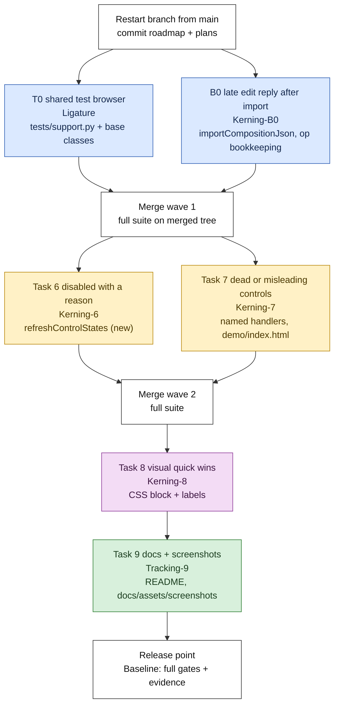

# v0.2.1 PR B: subagent-driven execution plan

Status: **active** (2026-10-03). PR #4 (PR A) merged; wave 1 running.
What each task must achieve is owned by
[the v0.2.1 plan](2026-10-03-v0.2.1-fit-and-finish.md) (Tasks T0, B0, 6-9). This file owns
**how** the work runs: waves, who owns which files and functions, the briefs, the gates and
the merge order. Roles and rules are in `AGENTS.md` (Work Model) and `CLAUDE.md`.

## Goal

Close v0.2.1. After PR B: the test suite runs in roughly half the time, no control acts on
nothing without saying why, the desktop layout passes the frontend gate's contrast and focus
checks, and the README and screenshots match the product. Then the roadmap moves to R1.

## Waves

Why this order:

- **T0 first** because every later gate run gets faster. It touches only the test harness,
  so it runs beside B0, which touches only Studio and one test module.
- **Tasks 6 and 7 in parallel** because their functions are disjoint under the contract
  below. Each gets its own new test module (the PR A lesson: parallel appends to one module
  collide on merge).
- **Task 8 alone** because CSS and label renames touch the whole file and would collide
  with anything else in flight.
- **Task 9 last** because screenshots must show Task 8's visuals.

## Ownership (binding)

One writer per file at a time; in the Studio file, one writer per named function. A task
that needs to touch something outside its row stops and reports instead.

| Task | Agent | Owns (exclusive while running) | Must not touch | New test module |
|---|---|---|---|---|
| T0 | Ligature | `tests/support.py`; the browser setup and teardown of `LiveCase` (`tests/test_studio_live.py`), `LiveIntegrationCase` (`tests/test_live_integration.py`) and `BrowserCase` (`tests/test_font_kit_studio_v011.py`); `tests/test_support.py` | any test body; any product file | - (extends `tests/test_support.py`) |
| B0 | Kerning-B0 | Studio: `importCompositionJson`, `endCompositionLink`, `endRunningReapply`, the op bookkeeping in `enqueueLiveOp` | every other Studio function | appends to `tests/test_studio_import_link.py` |
| 6 | Kerning-6 | Studio: a new `refreshControlStates()` and a new `setDisabledReason(el, reason)`, one call to `refreshControlStates()` at each existing refresh point, the `title` attributes and adjacent hint elements of static controls in the markup | `renderLiveInspector`'s arrange block; any handler Task 7 owns; CSS | `tests/test_studio_controls.py` |
| 7 | Kerning-7 | Studio: the preset select's change handler and `applyCompositionPreset`, the kit select, the one-cut chip rendering, the arrange block of `renderLiveInspector` and the Arrange sibling click handler, the Library loaded-state label, the recursion-block and invalid-colour messages, the SVG-fills note; `demo/index.html` | `refreshControlStates`, `setDisabledReason`; CSS | `tests/test_studio_dead_controls.py` |
| 8 | Kerning-8 | Studio: the `<style>` block, visible labels ("Live App" naming), bridge-bar glyphs; `scripts/dev/_frontend_gate_*.py` only if a threshold must move (reported, never silently) | script logic | `tests/test_studio_visual.py` |
| 9 | Tracking-9 | `README.md`, `docs/assets/screenshots/` | product code | - |

**Contract between Tasks 6 and 7:** Task 6 alone decides disabled state for the controls
listed in Task 6. Task 7 may keep or add a `disabled` attribute only inside markup it owns
(the "Move into" button in the arrange block). If Task 7 finds it needs a disabled reason on
a control Task 6 owns, it reports the need and the controller routes it to Task 6.

**Contract for T0:** the harness API stays the same. `self.context(engine, ...)`,
`route_virtual_origins`, `launch` and every fixture helper keep their names, arguments and
return values, so no test body changes. Only where the browser comes from changes.

## Task briefs (summary; full briefs go in `docs/implementation/tasks/v021-task-<id>-brief.md`)

### T0: share one browser per engine per test process

- Today `LiveCase`, `LiveIntegrationCase` and `BrowserCase` start a Playwright driver and
  launch a browser in every test's `setUp`, then close both. About 44 test classes inherit
  from them. Launch cost is about 0.5 s per test in Chromium here; Gecko pays more.
- Change: `tests/support.py` keeps one driver and one browser per engine for the whole
  process, launched on first use and closed at exit. Each test gets a fresh
  `browser.new_context()`, closed in `tearDown`, which keeps cookies, storage and
  permissions isolated per test.
- Before any change: list every test that relies on a fresh browser (closes the browser,
  launches with special options, depends on process-wide state) and keep those on their
  own launch. Known special launches: `tests/test_studio_live.py` near lines 638 and 2658,
  `tests/test_live_integration.py` near 1041 and 1699, `tests/test_font_kit_studio_v011.py`
  near 98.
- Evidence: the full suite before and after, same test count, all passing; wall time before
  and after on the same machine; the Firefox canary still loads (`test_support`
  `CanaryListTest`).
- Test: a harness test that two consecutive tests share the browser but not the context
  (storage set in one is absent in the next).

### B0: a late edit reply after an import

As in the v0.2.1 plan. Test first: hold the page's reply, set a font size, import a file
with a different override for the same target, release; the saved and rendered value stay
the imported one, for linked and unlinked imports. A queued user edit dropped by the import
is reported in the status, never dropped silently.

### Tasks 6, 7, 8, 9

As in the v0.2.1 plan, with the ownership and contracts above. Each test asserts what the
user sees: the rendered `disabled` state and its reason text, visible messages, computed
style and focus rings. Each task names its RED tests before writing code.

## Gates

| When | Command | Who |
|---|---|---|
| Every task, before handing back | `python scripts/verify.py --static-only`; `node --check fontkit-bridge.js`; the task's own test modules in Chromium | implementer |
| Every review | the same, plus at least one mutation per behaviour, run in a detached worktree | reviewer (Leading), one per task, in parallel |
| Every merge of a wave | the full suite on the merged tree (every task's module runs there, catching behaviour collisions) | controller |
| Release point | full suite, offline frontend gate, static, bridge syntax, commit check; evidence in `docs/implementation/verification-v0.2.md` under "v0.2.1 PR B" | Baseline |

Firefox is reported as not run locally; CI runs the canary (D037).

## Merge recipe (from CLAUDE.md, in this order)

1. Save each finished worktree's diff to the scratchpad before anything else.
2. `git add` the files that already hold another task's edits, then `git apply --3way`
   the next patch, then `git restore --staged`. Never chain `;` or `&&` past an apply.
3. Run every touched module, then the full suite, on the merged tree.
4. Commit one task at a time with `git apply --cached <task patch>`; check
   `git diff --cached --stat` before each commit.
5. Author `pterw`, Conventional Commits, a why-body, no trailers.

## Definition of done for PR B

- [ ] T0, B0, 6, 7, 8, 9 each reviewed `Approved` (or `Approved with fixes`, fixes applied
      and re-reviewed), committed and pushed.
- [ ] Full suite green with the same or higher test count; wall time recorded before and
      after T0.
- [ ] Offline frontend gate: 0 FAIL; contrast and focus checks at 1440, 1280 and 1024.
- [ ] README and screenshots current; no stale control names (grep for every renamed label).
- [ ] PR opened against `main`, template filled, session footer removed, subscribed;
      external review findings answered on their threads.
- [ ] Ledger closes the v0.2.1 plan; [roadmap](2026-10-03-roadmap.md) moves PR B to `done`
      and R1 to `next`.

## Size budget

PR B must stay under 8,000 changed lines (D036). Estimate: T0 about 300, B0 about 250,
Task 6 about 900, Task 7 about 900, Task 8 about 700, Task 9 about 300 plus screenshots.
If a task's diff passes 1,500 lines, the controller stops and splits it.

## Ledger

| Date | Event |
|---|---|
| 2026-10-03 | Plan written. T0 added at the owner's request (shared test browser). Waits on PR #4. |
| 2026-10-03 | PR #4 merged. Branch restarted from `main` (ffcab4f). Wave 1 (T0, B0) dispatched. |
