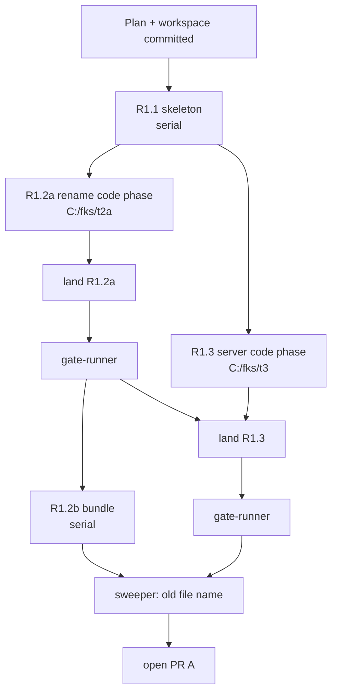

# R1 PR A (package foundation) Implementation Plan

> **For agentic workers:** REQUIRED SUB-SKILL: Use superpowers:subagent-driven-development (recommended) or superpowers:executing-plans to implement this plan task-by-task. Steps use checkbox (`- [ ]`) syntax for tracking.

Status: **active** (2026-10-04). What R1 builds is owned by
[the R1 plan](2026-10-03-r1-one-command.md); this file owns how its first pull request
runs: scope, waves, ownership, briefs and gates. Roles: `AGENTS.md` (Work Model).

**Goal:** a zero-dependency `fontkitstudio` package that bundles Studio (renamed
`fontkit-studio.html`) and the bridge at one checked version, and serves Studio on
loopback behind a per-run token. PR B builds the one command on it.

**Architecture:** an ESM package under `packages/fontkitstudio/` (D040). A build-time
`scripts/bundle.js` copies the repository's Studio and bridge into `dist/` after
`scripts/versions.js` checks their labels against `package.json`. `src/studio-server.js`
serves only `dist/fontkit-studio.html`, only with the token, only to loopback `Host`s.

**Tech Stack:** Node 22/24/26 built-ins (`node:http`, `node:crypto`, `node:test`); the
existing Python `unittest` + Playwright harness for browser checks; GitHub Actions.

## Global Constraints

- Zero runtime dependencies; `node:*` and relative imports only (global rule 8, D030, spec 4.5).
- `engines.node` is `>=22.12`; CI runs Ubuntu on Node 22, 24, 26 and macOS and Windows on Node 24 (D043).
- Package `fontkitstudio`; user-facing text says Font Kit Studio, not bare "fontkit" (D040).
- Studio file `fontkit-studio.html`; the old name forwards for one release (D041).
- One version for Studio, bridge and package; PR A keeps `0.2.1`, the R1 release point bumps to `0.3.0` (D039, D044).
- Loopback only; Host and Origin checks; a per-run token in Studio's URL (spec section 1).
- PR size: at most 8,000 lines of material change; churn reported separately (D050).
- Agents never hold npm credentials (D042).

## Scope of the three R1 pull requests

| PR | Tasks | Material size (estimate) |
|---|---|---|
| **A, package foundation** (this file) | R1.1 skeleton, R1.2 rename and bundling, R1.3 Studio server and token | about 1,500 lines; plus the rename churn (about 6,200 lines rename-aware, 12,400 in GitHub's count) |
| B, the one command | R1.4 Vite runner and plugin, R1.5 proxy, R1.6 refusal and messages | measured after R1.4 lands; R1.5 moves to its own PR if B would pass 7,700 |
| C, proof and release | R1.7 fixtures and friction test, R1.8 docs, R1.9 release pipeline, release point | measured when B merges |

R1.0 (the owner's npm steps) runs beside PR A; only R1.9 needs it.

## Waves

R1.2 is split so no implementer carries a long task: R1.2a (rename, stub, references)
needs both Python suite halves; R1.2b (bridge version header, version check, bundle step)
needs only the Node tests and the frontend gate, and builds on R1.2a's file name. R1.2a and
R1.3 share no file; R1.3's browser test reads `support.HTML`, so it passes before and after
the rename. Implementers run only the gates their diff triggers; the gate-runner runs the
full list after each landing. Each task gets an independent review (`sdd-reviewer`) before
its landing is accepted.

## Ownership (binding)

| Task | Brief | Owns |
|---|---|---|
| R1.1 | `docs/implementation/tasks/r1-task-1-brief.md` | `packages/fontkitstudio/{package.json,README.md,bin/,src/cli.js,test/package.test.js,test/cli.test.js}`, a new job in `.github/workflows/quality-gate.yml` |
| R1.2a | `docs/implementation/tasks/r1-task-2a-brief.md` | the Studio rename and stub, the file-name constants and references in tests, scripts and README, `tests/test_studio_rename.py` |
| R1.2b | `docs/implementation/tasks/r1-task-2b-brief.md` | the bridge header line, `.gitignore`, `package.json` `scripts.prepack`, `packages/fontkitstudio/scripts/`, `test/versions.test.js`, `test/bundle.test.js`, `test/helpers/fake-root.js` |
| R1.3 | `docs/implementation/tasks/r1-task-3-brief.md` | `packages/fontkitstudio/src/studio-server.js`, `test/studio-server.test.js`, `test/helpers/serve-studio.js`, `tests/test_node_studio_server.py` |
| Controller | - | `AGENTS.md`, `CHANGELOG.md`, `docs/implementation/progress.md`, `deviations.md`, this file, the R1 plan, the roadmap |

## Gates

The fenced gate list lives in the workspace's `constraints.md` (`.superpowers/sdd/r1-pr-a/`,
not tracked). It is the AGENTS.md list plus `npm --prefix packages/fontkitstudio test`,
with the Python suite split in two halves (`test_[a-r]*.py`, `test_[s-z]*.py`) so each
run stays under ten minutes.

## Definition of done for PR A

- [x] R1.1, R1.2a, R1.2b, R1.3 landed, each with an `Approved` review.
- [ ] All gates pass on the final tree; the Node job is green on all five matrix entries in CI.
- [x] No live reference to `font_kit_studio_v0.1.1.html` remains outside the stub,
      provenance and point-in-time records (sweeper list in the ledger).
- [x] CHANGELOG `[Unreleased]` names the rename and the forwarding stub.
- [x] PR body states material lines and churn lines separately (D050).

## Ledger

| Date | Event |
|---|---|
| 2026-10-04 | Plan written; branch `feat/r1-package-foundation` cut from `origin/main` at 32d2156. |
| 2026-10-04 | R1.2 split into R1.2a and R1.2b; implementers run only the gates their diff triggers, the gate-runner runs the full list per landing; stall rule added to the workspace constraints. Reason: keep each implementer run short. |
| 2026-10-04 | All four tasks landed (880666c, d48db72, ce3b094 after R1.1). Local gates pass on Windows apart from six Python failures that predate R1; the Firefox canary passed on its second run. PR A opened. |
