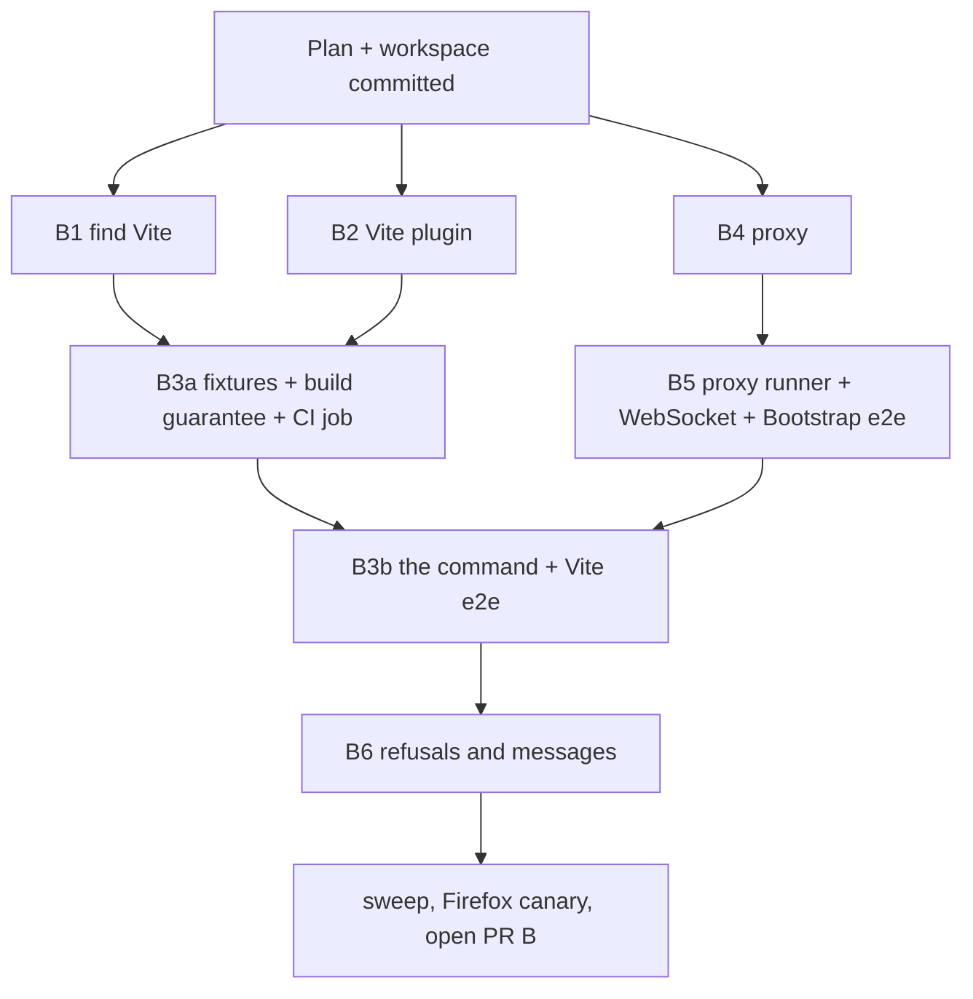

# R1 PR B (the one command) Implementation Plan

> **For agentic workers:** REQUIRED SUB-SKILL: Use superpowers:subagent-driven-development (recommended) or superpowers:executing-plans to implement this plan task-by-task. Steps use checkbox (`- [ ]`) syntax for tracking.

Status: **approved** (owner, 2026-10-04); both owner questions are answered below. What R1 builds is owned by [the R1 plan](2026-10-03-r1-one-command.md)
(R1.4-R1.6); this file owns how its second pull request runs. PR A (R1.1-R1.3) merged as
PR #8. Roles: `AGENTS.md` (Work Model). Execution lessons from PR A are folded into the
workspace constraints (`.superpowers/sdd/r1-pr-b/constraints.md`, untracked).

**Goal:** `npx fontkitstudio` in a Vite project, `fontkitStudio()` in `vite.config`, and
`npx fontkitstudio http://localhost:<port>` in front of any other local dev server each
open Studio connected to the user's app, dev only, with clear refusals and messages.

**Architecture:** the CLI starts PR A's token-guarded Studio server, then either runs the
project's own Vite (JavaScript API) with the fontkit plugin added in memory, or starts a
loopback proxy in front of the user's dev server. Both inject one tag,
`<script src="/@fontkit/fontkit-bridge.js" data-allowed-origins="<Studio origin>">` (a root-relative
src, so it resolves against the page), so the bridge comes from the app's own origin (`script-src 'self'` allows it), pins Studio's
origin, and needs no inline script. Studio opens with `?token=...&target=<app URL>`.

**Tech Stack:** Node 22/24/26 built-ins only (zero dependencies, D030); the project's own
Vite 7 or 8 (D043); Python `unittest` + Playwright for real-browser checks; GitHub Actions.

## Global Constraints

- Zero runtime dependencies and empty `devDependencies` in `packages/fontkitstudio/`;
  `node:*` and relative imports only, plus the project's Vite loaded at run time by path
  (global rule 8, D030, spec 4.5). The R1.1 import guard must keep passing; resolving the
  project's Vite goes through `createRequire(<project>/package.json).resolve('vite')` and
  `import(pathToFileURL(...))`, which the guard allows only in `src/project.js`.
- Vite 7 and 8 only; any other major is refused with a message naming the tested range (D043).
- Dev only: nothing is added to `vite build` output; plugin and proxy refuse a non-loopback
  bind (spec 1, 4.2).
- Loopback only; Host checks; the per-run token from PR A; the bridge keeps origin and
  session pinning (global rule 5). Every new boundary gets hostile tests (spec 4.3).
- No telemetry, no third-party contact by any entry point (global rule 7).
- User-facing text says "Font Kit Studio", never bare "fontkit" (D040).
- PR size: at most 8,000 material lines; lockfiles and copied fixtures are churn (D050).
- Implementers never commit; the controller lands and commits (owner, 2026-10-04; AGENTS.md).

## Owner questions (answered 2026-10-04)

1. **Open the browser by default?** Spec section 1 says the command "opens Studio connected
   to the app"; `serve.py` opens a browser only with `--open` (v0.2.1 Task 2). Proposal:
   `npx fontkitstudio` opens Studio by default and `--no-open` suppresses it, because the
   command's whole point is one step; `serve.py` keeps its rule.
   **Answer: yes.** The command opens Studio by default; `--no-open` suppresses it (D051).
2. **The page marker vs global rule 4** ("editor chrome never leaks into the target").
   Spec section 1 requires the page to show "Font Kit Studio · dev only" while it runs.
   Proposal (D051): a small non-interactive badge drawn by the bridge only when the tag
   carries `data-dev-marker`, removed on dispose and stripped from every export, the same
   kind of exception D016 made for the pop-out outline. Rule 4's text is amended in the
   same commit (global rules: never document an exception while the rule reads as absolute).
   **Answer: no page marker.** It gives a user nothing the terminal does not; the terminal
   prints "Font Kit Studio · dev only" on start. Global rule 4 is unchanged and the spec's
   page marker is dropped (D051).

## Changes to the R1 plan (addendum 2, binding when this plan is approved)

- The Next.js fixture moves from R1.5 to R1.7 (PR C): it needs a large `npm ci` and its own
  CI wiring, and the proxy's behaviour is proven on the static Bootstrap fixture first.
- The Vite fixture's CI job lands in PR B (B3a), not R1.7, so the one-command path is tested
  in CI from the PR that adds it. R1.7 adds the friction-test timing and the Next.js job.

## Tasks

Each task: one brief cut from its section below into
`docs/implementation/tasks/r1-task-<id>-brief.md`, a code phase in `C:/fks/t<id>`, an
`sdd-reviewer` verdict, a controller landing with parallel gate-runners, a controller
commit. Node tests live in `packages/fontkitstudio/test/*.test.js`.

### B1 (R1.4a) Find and check the project's Vite

- **Owns:** `packages/fontkitstudio/src/project.js`, `test/project.test.js`,
  `test/helpers/fake-project.js`; the import guard's allow-list entry for `src/project.js`
  in `test/package.test.js`.
- **Interface:** `export function findVite(projectDir): { version, major, entryUrl }` or
  throws `ProjectError` with `.message` saying what and why: no `package.json`; Vite not
  installed (names `npm install`); untested major (names "Vite 7 and 8"); `export const
  TESTED_VITE_MAJORS = [7, 8]`. `export function isViteProject(projectDir): boolean`
  (vite in dependencies or devDependencies, or a `vite.config.*` file).
- **Tests:** fake projects in temp dirs with a fake `node_modules/vite/package.json`
  (versions 6.4.0, 7.3.6, 8.3.2, 9.0.0, missing); `findVite` from a subdirectory resolves
  the nearest project; hostile: a `package.json` that is not JSON gives a message, never a
  stack trace. RED/GREEN; mutation on the major check.
- **Gates:** static, node-package, commit-messages.

### B2 (R1.4b) The Vite plugin

- **Owns:** `src/vite-plugin.js`, `test/vite-plugin.test.js`; `package.json` `exports`
  gains `"./vite": "./src/vite-plugin.js"`.
- **Interface:** `export function fontkitStudio(options = {})` returns a Vite plugin object:
  `name: 'fontkit-studio'`, `apply: 'serve'`; `configureServer(server)` adds a middleware
  answering `GET /@fontkit/fontkit-bridge.js` with the bundled bridge (`dist/`; an
  `options.bridgeFile` override for tests), `Cache-Control: no-store`; `transformIndexHtml`
  adds the script tag (`injectTo: 'head-prepend'`) with `data-allowed-origins` set to the
  Studio origin. `options.studio` is `{ origin, url(target) }` from PR A's server (the CLI
  passes it); without it, `configureServer` starts its own Studio server on loopback and
  prints `Font Kit Studio: <url>` once Vite is listening (permanent `vite.config` setup),
  and closes it when Vite's HTTP server closes.
- **Tests (no Vite needed; call the hooks with small fakes):** `apply` is `'serve'`; the
  tag carries the right `src` and `data-allowed-origins` and no inline script; the
  middleware serves the bridge bytes and passes other paths to `next()`; standalone mode
  starts and stops exactly one Studio server; an `options.studio.origin` that is not a
  loopback `http:` origin is refused at plugin creation.
- **Gates:** static, node-package, commit-messages.

### B3a (R1.4c) Vite fixtures, the build guarantee, the CI job (After: B1, B2)

- **Owns:** `fixtures/vite-react/` (Vite 8) and `fixtures/vite7-react/` (Vite 7), each with
  `package.json`, `package-lock.json`, `index.html`, `src/main.jsx`, `src/App.jsx`,
  `src/app.css`, `vite.config.js` (`plugins: [fontkitStudio()]` imported by relative path
  from the package, so no install of the package is needed); React and ReactDOM 19; JSX
  without `@vitejs/plugin-react` (classic runtime, `import React`) to keep lockfiles small;
  author `data-design-id`s on a title, a body paragraph and a button.
  `tests/test_vite_build_guarantee.py`; a `fixtures` job in
  `.github/workflows/quality-gate.yml` (Ubuntu, Node 24, `npm ci` per fixture with npm
  cache, then the fixture tests with `FKS_REQUIRE_FIXTURES=1`).
- **Behaviour:** the plugin serves the bridge from the package's `dist/`, so fixture tests
  run `npm --prefix packages/fontkitstudio run prepack` once before starting (the CI job
  too). Python tests that need a fixture's `node_modules` skip with "run npm ci in
  fixtures/<name>" locally, and fail instead when `FKS_REQUIRE_FIXTURES=1` (CI), so CI can
  never pass by skipping (anti-pattern 14).
- **Tests:** `vite build` on each fixture with the plugin in its config produces output
  with no `fontkit-bridge`, no `@fontkit` and no `data-allowed-origins` anywhere
  (spec 4.2 "never in production"); the build prints the plugin's refusal line only if B6
  has landed (not asserted here).
- **Gates:** static, node-package, the new fixture module, suite-a and suite-b (tests/
  changed), commit-messages. Lockfiles are churn (D050).

### B4 (R1.5a) The loopback proxy

- **Owns:** `src/proxy.js`, `test/proxy.test.js`, `test/helpers/upstream.js`.
- **Interface:** `export async function startProxy({ target, studio, bridgeFile, host =
  '127.0.0.1', port = 0, maxHtmlBytes = 8 * 1024 * 1024 })` returns `{ origin, port,
  close() }`. `target` must parse as `http:` with a loopback host (`localhost`,
  `127.0.0.1`, `[::1]`), else it throws "Font Kit Studio proxies only a local dev server
  (localhost or 127.0.0.1)".
- **Behaviour:** Host must be the proxy's own loopback host:port (421 otherwise, as in PR A);
  forwards method, path, query, body and headers to the target with `Host` rewritten and
  `Accept-Encoding: identity`; answers `GET /@fontkit/fontkit-bridge.js` itself (same
  origin as the app); for a `200` `text/html` response up to `maxHtmlBytes`, inserts the
  tag after `<head>` (or at the start when there is none) and fixes `Content-Length`;
  larger HTML, non-HTML and non-200 responses stream through byte for byte; the app's
  `Content-Security-Policy` header and every other header pass through unchanged (only
  `Content-Length` changes); a `Location` pointing at the target origin is rewritten to the
  proxy origin; an unreachable target answers 502 with a fixed message naming the target.
- **Hostile tests (spec 4.3):** non-loopback targets (`http://example.com`,
  `http://10.0.0.5:3000`, `https://localhost:3000`, `file:///`), wrong Host (DNS
  rebinding), `/..%2f..%2fetc/passwd` and `/@fontkit/../package.json` (only the exact
  bridge path is served locally; everything else goes to the target unchanged and the
  proxy never reads local files), the tag only in `text/html` (JSON, JS, CSS, images
  untouched byte for byte), CSP header unchanged, an HTML response one byte over the limit
  passes through untouched, gzip from a misbehaving upstream passes through untouched.
- **Gates:** static, node-package, commit-messages.

### B5 (R1.5b) Proxy runner, WebSockets and the Bootstrap fixture (After: B4)

- **Owns:** `src/run-proxy.js`, `test/run-proxy.test.js`; WebSocket upgrade handling in
  `src/proxy.js`; `fixtures/bootstrap5-static/` (an `index.html` using vendored
  `bootstrap.min.css` and `bootstrap.bundle.min.js` 5.3.x with their licence file,
  `data-design-id`s on a heading, a lead paragraph and a button);
  `tests/test_one_command_proxy.py`; `tests/helpers_csp_server.py` (a stdlib static server
  that sends `Content-Security-Policy: script-src 'self'; style-src 'self'`).
- **Interface:** `export async function runProxy({ target, open, out, err })` starts PR A's
  Studio server, then the proxy, prints `Font Kit Studio · dev only` and `Open: <Studio
  URL with target=<proxy origin + target path>>`, and returns `{ close() }`; stops both on
  SIGINT.
- **Behaviour:** `upgrade` requests are piped raw to the target (hot reload passes through
  untouched) after the same Host check.
- **Tests:** Node: an upstream WebSocket echo (raw handshake with `node:http` and
  `node:crypto`, no library) reached through the proxy sends and receives a frame
  unchanged; a wrong Host on upgrade is refused. Browser (real Studio, real bridge, real
  CSP): `runProxy` in front of the CSP server serving the Bootstrap fixture; Studio shows
  the page connected, a live font change renders in the page (computed style), the page's
  console has no CSP violation, and the app's responses carry the CSP header unchanged.
- **Gates:** static, node-package, `test_one_command_proxy` + `test_support`, suite-a,
  suite-b, commit-messages.

### B3b (R1.4d) The command (After: B3a, B5)

- **Owns:** `src/cli.js` (argument parsing and dispatch), `src/run-vite.js`,
  `test/cli.test.js` (extended), `tests/test_one_command_vite.py`.
- **Interface:** `fontkitstudio [<url>] [--no-open] [--studio-port <n>] [--help]
  [--version]`. No URL: `isViteProject(cwd)` must hold (else the unsupported-project
  message, exit 2); `runVite({ projectDir, open, out, err })` starts the Studio server,
  then the project's Vite through `createServer({ root, plugins: [fontkitStudio({ studio
  })] })` (the project's own config still loads; the plugin is added in memory), prints the
  same two lines as `runProxy`, and opens Studio unless `--no-open`. With a URL: `runProxy`.
  `--studio-port` asks for a fixed Studio port (falls back to a free one with a message), so
  Studio's per-origin settings survive between runs.
- **Tests:** CLI: unknown flag, non-URL argument, `https:` URL, a non-Vite folder, each
  with its message and exit code. Browser (real Vite fixture, real Studio, real bridge):
  `node bin/fontkitstudio.js --no-open` in `fixtures/vite-react`, read the `Open:` line,
  load it: Studio shows the page connected; a live edit renders; editing `src/App.jsx`
  (hot update) keeps the connection and the edit; stopping the command leaves no process
  (anti-pattern 13). Same connect check on `fixtures/vite7-react`.
- **Gates:** all.

### B6 (R1.6) Dev-only refusals and failure messages (After: B3b)

- **Owns:** refusal and message text in `src/vite-plugin.js`, `src/proxy.js`,
  `src/run-vite.js`, `src/run-proxy.js`; `tests/test_one_command_messages.py`. No bridge
  change and no page marker (D051).
- **Behaviour:** the plugin in `vite build` adds nothing and prints "Font Kit Studio · dev
  only: not added to this build"; a Vite `server.host` that is not loopback (`true`,
  `0.0.0.0`, a LAN address) stops with "Font Kit Studio runs only on localhost; remove
  --host or server.host to use it"; the terminal prints `Font Kit Studio · dev only` on
  start; a page that already has a bridge, a CSP that blocks
  the bridge, an untested Vite major and a non-Vite folder each get a message that says
  what happened and what to do.
- **Tests:** each refusal and message, with the exact text; the user's page carries
  nothing from Font Kit Studio but the one script tag (rule 4).
- **Gates:** all.

## Waves

A code phase starts once its `After:` tasks have landed and its files overlap no running
phase; more than three agents may run at once (owner, 2026-10-04). B1, B2 and B4 share no
file. Landings run one at a time, each followed by parallel gate-runners on the staged tree,
then the controller's commit.

## Definition of done for PR B

- [ ] B1-B6 landed, each with an `Approved` review.
- [ ] `npx fontkitstudio` connects Studio to `fixtures/vite-react` and `fixtures/vite7-react`
      with no manual step, in a real browser, in CI (`FKS_REQUIRE_FIXTURES=1`).
- [ ] `npx fontkitstudio http://localhost:<port>` connects Studio to the Bootstrap fixture
      behind a `script-src 'self'` CSP, in a real browser, in CI.
- [ ] `vite build` output carries no bridge (both fixtures, CI).
- [ ] Every hostile case listed for B4 and B5 has a test; every refusal in B6 has its text tested.
- [ ] CHANGELOG `[Unreleased]` "Added" names the command, the plugin and proxy mode.
- [ ] PR body states material and churn lines separately (D050).

## Ledger

| Date | Event |
|---|---|
| 2026-10-04 | Plan written after PR #8 merged (`main` at b92b129); branch `feat/r1-one-command`. Waits on the owner's approval; B6 also waits on Q1 and Q2. |
| 2026-10-04 | Approved by the owner. Q1: the command opens Studio by default, `--no-open` suppresses it. Q2: no page marker; the terminal line stays (D051). |
| 2026-10-04 | Wave 1 briefs written (B1, B2, B4). Details fixed at brief time: `src/project.js` also exports `loadVite()` so the computed `import()` stays in that one file, and the import guard checks it; both B2 and B4 define the `BRIDGE_PATH` literal (global rule 10); the proxy refuses absolute-form request lines, rewrites an `Origin` or `Referer` under its own origin to the target's, and sends tagged pages with `Cache-Control: no-store` and no `ETag` or `Last-Modified`, because a cached page pins the previous run's Studio origin. Owner: more than three agents may run at once. |
| 2026-10-04 | B3b briefed. Two details fixed at brief time: when the project's `vite.config` already has `fontkitStudio()`, the copy the command adds is the one that runs and the config's copy stands down (one Studio server, one tag); and the hot-update check edits `src/app.css`, not `src/App.jsx`, because the fixtures carry no React Fast Refresh, so a JSX edit reloads the page and Studio then asks before re-applying edits (global rule 6). The Studio port fallback B5 wrote inside `runProxy` moves to one exported helper both runners call. |
