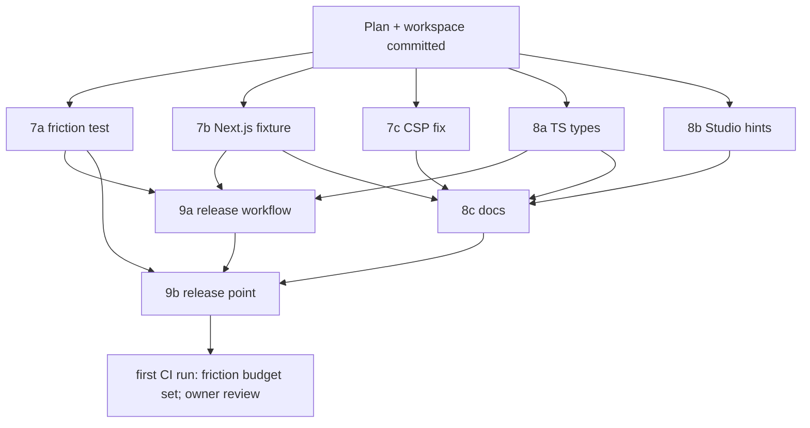

# R1 PR C (fixtures, docs, release) Implementation Plan

> **For agentic workers:** REQUIRED SUB-SKILL: Use superpowers:subagent-driven-development (recommended) or superpowers:executing-plans to implement this plan task-by-task. Steps use checkbox (`- [ ]`) syntax for tracking.

Status: **at its release point** (2026-10-04); approved by the owner, both owner questions answered below.
What R1 builds is owned by [the R1 plan](2026-10-03-r1-one-command.md) (R1.7-R1.9 and the
release point); this file owns how its third pull request runs. PR A merged as PR #8, PR B
as PR #10, and the pre-commit hooks as PR #11. Roles: `AGENTS.md` (Work Model). Execution
rules for agents: `.superpowers/sdd/r1-pr-c/constraints.md` (untracked).

**Goal:** Font Kit Studio 0.3.0 is ready to publish. A Next.js app works behind the proxy,
including its hot reload. The friction test holds the one-command start to a time budget in
CI. The docs lead with `npx fontkitstudio`. A `v*` tag publishes the package from GitHub
Actions with provenance, after the owner approves the run.

**Architecture:** no new runtime surface. Three pieces of work:

- fixtures and tests around the command PR B built;
- small corrections to what a user of the npm package sees (TypeScript types for
  `fontkitstudio/vite`, Studio's hints that name `python scripts/serve.py`, a false CSP
  warning);
- a release workflow that reuses the quality gate and then runs `npm publish` by trusted
  publishing (D042).

**Tech Stack:** Node 22/24/26 built-ins only in the package (D030); Next 16.3.8 with React
19.3.0 and TypeScript in fixtures only (D043); Python `unittest` + Playwright; GitHub Actions.

## Global Constraints

- The package keeps zero runtime dependencies and empty `devDependencies` (global rule 8,
  D030, spec 4.5). Fixtures may depend on anything, pinned by their lockfiles.
- Fixture tests skip locally without `node_modules` and fail in CI
  (`FKS_REQUIRE_FIXTURES=1`, `tests/fixture_support.py`).
- No test or fixture contacts a third party. Browser tests block every `https://` request.
  Next.js runs with `NEXT_TELEMETRY_DISABLED=1` (global rule 7).
- User-facing text says "Font Kit Studio", never the bare "fontkit" (D040).
- Agents never hold npm credentials. Publishing happens only from the release workflow,
  after the owner's approval (D042).
- PR size: at most 8,000 material lines; lockfiles and copied fixture files are churn and
  are listed by name in the PR body (D050). Keep about 300 lines free for review fixes.
- Implementers never commit; the controller lands and commits (AGENTS.md).

## Owner questions (answered 2026-10-04)

1. **Should the release workflow also make the GitHub Release?** D039 already says release
   assets come from the tag.

   - **Proposal:** after `npm publish` succeeds, a last job with `contents: write` creates
     the `vX.Y.Z` GitHub Release.
   - **What it contains:** the version's CHANGELOG section as notes, with
     `fontkit-studio.html` and `fontkit-bridge.js` attached, both taken from the tag.
   - **Without it:** someone makes the release by hand after every publish, and the notes
     can drift from the CHANGELOG.

   **Answer: yes.** The workflow makes the GitHub Release after the publish.

2. **Should the false CSP warning be fixed in this PR?** Today the plugin and the proxy warn
   that a page's policy blocks the bridge whenever `script-src` names the dev server's own
   origin (for example `script-src http://localhost:5173`). That policy actually allows the
   bridge.

   - **Proposal:** fix it here as task 7c, because the wrong warning would ship in 0.3.0
     and send users to change a policy that is already fine.
   - **The other open follow-ups** stay as documented limits in the README (task 8c):
     - Sync to file needs `serve.py`.
     - In proxy mode the app runs at the proxy's address, so its own browser storage is not
       the storage it has at its usual address.
     - A standalone plugin gets a new Studio URL when Vite restarts on a config change.
     - The plugin sees a CSP set by middleware only through meta tags.

   **Answer: yes.** Task 7c fixes it in this PR.

## Changes to the R1 plan (addendum 3, binding when this plan is approved)

- **R1.8 gains two corrections that 0.3.0 users would otherwise hit:**
  - TypeScript declarations for `fontkitstudio/vite`. Without them, the `tsc -b && vite
    build` that Vite's React TypeScript template runs fails with TS7016 once a user adds
    `fontkitStudio()` to `vite.config.ts`.
  - Studio wording for runs under `npx fontkitstudio`. Today Studio tells an npm user to
    run `python scripts/serve.py`, a file the package does not contain.
- **R1.7's fixture CI job follows D043:**
  - Node 22, 24 and 26 on Linux, and Node 24 on macOS and Windows.
  - Today it runs only Node 24 on Linux.
  - The Next.js fixture gets its own job, Node 24 on Linux, because of its install size.
- **R1.9 publishes from a workflow that calls the quality gate** (`workflow_call`), so a
  release runs exactly the gates a pull request runs. The npm tarball's file list gets a
  test.
- **A CSP false-positive fix** (task 7c) joins R1.6's messages.

## Tasks

Each task gets:

- a brief cut from its section below into `docs/implementation/tasks/r1-task-<id>-brief.md`;
- a code phase in `C:/fks/t<id>`, which returns a patch and a report;
- an `sdd-reviewer` verdict;
- a controller landing, gated by parallel Haiku gate-runners on the staged tree, then a
  controller commit.

Task ids follow PR A's numbering (`r1-task-7a`). PR B's `C1`-`C4` records are its Codex
fixes.

**Shared files.** Only a landing edits these; code phases return the text in their Handoff:

- `.github/workflows/quality-gate.yml`;
- `CHANGELOG.md`;
- `docs/implementation/progress.md`;
- the plan files.

### 7a (R1.7a) The friction test

- **Owns:** `tests/test_friction.py`.
- **Behaviour:**
  - **What it runs:** the real command with `--no-open` in `fixtures/vite-react`, with
    `stdin` closed, so no step can wait for a person. The test then plays the browser that
    `open` would have launched.
  - **Clock start:** when the process is spawned.
  - **Clock stop:** when Studio's `#bridgeStatusBadge` matches
    `^Connected \(\d+ targets?\)$` and the frame holds `vite.hero.title`.
  - **What it prints:** `friction: <seconds> s (budget <budget> s)` on stderr, for the
    ledger.
  - **Failure:** above `FRICTION_BUDGET_S`.
  - **Setting the budget (R1 plan, question 4):**
    1. The budget starts at 60 s.
    2. After the first green CI run on the PR branch, the controller sets it to the slowest
       fixture cell's time plus 50 percent, rounded up to a whole second.
    3. That change is a commit of its own, with the measured times recorded in the ledger.
- **Proof that it is not vacuous:**
  - A budget below the measured time fails.
  - A run whose Studio never connects fails at the badge wait, not at the budget.
- **Handoff:** add the friction test module to the fixtures job's test list. At this
  landing the controller also widens the fixtures job to the D043 matrix (addendum 3).

### 7b (R1.7b) Next.js behind the proxy

- **Owns:**
  - `fixtures/next-app/`:
    - `package.json` with `next` 16.3.8 and `react`/`react-dom` 19.3.0;
    - `package-lock.json`;
    - `app/layout.jsx`, `app/page.jsx`, `app/globals.css`.
  - `tests/test_one_command_next.py`.
- **Page content:** author ids `next.hero.title` (`<h1>`), `next.hero.lead` and
  `next.hero.cta`.
- **What the test does:**
  - **Start Next:** `next dev --hostname 127.0.0.1 --port <free>`, with
    `NEXT_TELEMETRY_DISABLED=1`. It waits for the server to answer, then stops it by PID
    in a cleanup (Ctrl-Break on Windows, as `serve.py`'s helper does).
  - **Start the command:** `fontkitstudio http://localhost:<port> --no-open`, read its
    `Open:` line, block `https://`, and open Studio.
  - **Connected:** wait for the Connected badge.
  - **Live edit:** select `next.hero.title` and type `56` into `#liveFontSize` with
    keystrokes. The frame's computed `font-size` becomes `56px`.
  - **Hot reload through the proxy's WebSocket:** edit `app/globals.css` to change the
    lead's colour (restored in `finally`). Wait until the frame's computed colour changes,
    with no page reload: a `window` marker set before the edit survives. The badge is still
    Connected and the title is still `56px`.
  - **No errors:** no page error and no hydration warning in the frame's console. React 19
    skips the injected head tag during hydration; this assertion proves it on Next.
- **Handoff:** a `next-fixture` CI job (Linux, Node 24, npm cache on
  `fixtures/next-app/package-lock.json`, `FKS_REQUIRE_FIXTURES=1`).
- **Risk:** Next 16 may refuse dev resources (`/_next/*`, the HMR socket) to an origin it
  does not expect. The proxy already rewrites `Host`, `Origin` and `Referer` to the
  target's on HTTP and on upgrade (PR B, B4/B5); if Next still refuses, the implementer
  stops and reports NEEDS_CONTEXT rather than changing the proxy.

### 7c (R1.6 follow-up) No CSP warning for a policy that allows the bridge

- **Owns:**
  - `packages/fontkitstudio/src/csp.js`;
  - the calls to `blocksSameOriginScript` in `src/vite-plugin.js` and `src/proxy.js`;
  - `test/csp.test.js`, plus additions to `test/vite-plugin.test.js` and
    `test/proxy.test.js`.
- **Interface:** `blocksSameOriginScript(policy, pageOrigin)`. A host-source that matches
  `pageOrigin` allows the bridge, in each of these forms:
  - the full origin;
  - a host with the right port;
  - `localhost:*`-style wildcards;
  - the scheme-only `http:` (already allowed).

  `'strict-dynamic'` still blocks. With `pageOrigin` missing, behaviour is unchanged.
- **Which origin each caller passes:**
  - the plugin: the origin the browser uses (the Vite server's resolved local URL);
  - the proxy: its own origin, not the target's, because the page is served from the
    proxy.
- **Hostile cases:**
  - another port or host;
  - `https:` with the same host;
  - a path-qualified source (`http://localhost:5173/js/`), which does not match the
    bridge's path;
  - a wildcard subdomain;
  - an empty directive.
- **Handoff:** a CHANGELOG line under Unreleased, Fixed.

### 8a (R1.8a) TypeScript declarations for `fontkitstudio/vite`

- **Owns:**
  - `packages/fontkitstudio/src/vite-plugin.d.ts`;
  - `package.json` `exports["./vite"]`, which becomes `{ "types":
    "./src/vite-plugin.d.ts", "default": "./src/vite-plugin.js" }`;
  - additions to `test/package.test.js`;
  - `fixtures/vite-ts/`: `package.json` with `vite` 8.3.2, `typescript` and `"fontkitstudio":
    "file:../../packages/fontkitstudio"`, plus `package-lock.json`, `tsconfig.json` (strict)
    and `vite.config.ts`, the way a user writes it;
  - `tests/test_vite_types.py`.
- **Declaration:** `export function fontkitStudio(): import('vite').Plugin`. The options
  the command passes in are internal and stay out of the public type. This is a type-only
  import of the project's own Vite, so no dependency is added.
- **Tests:**
  - `tsc --noEmit -p fixtures/vite-ts` exits 0.
  - The same config with the `.d.ts` removed fails with TS7016 (the RED).
  - A file calling `fontkitStudio()` in a non-plugin position fails with a type error.
  - The Node test checks that `exports["./vite"].types` names a file inside `files` and that
    the tarball file list includes it.
- **Handoff:** add the `vite-ts` install and the type test to the fixtures job, and a
  CHANGELOG line under Unreleased, Added.

### 8b (R1.8b) Studio's hints under `npx fontkitstudio`

- **Owns:** the hint and message strings in `fontkit-studio.html` (`#bridgeHint`,
  `BLOCKED_LOOPBACK_TEXT`, the two Sync-unavailable messages) and the code that picks them,
  plus a new `tests/test_studio_npx_hints.py`.
- **Behaviour:** when Studio's own URL carries `token=` (it is served by the package), each
  message names what an npm user can do. When there is no token, Studio keeps today's
  `serve.py` wording.

  | Message | Wording with a token |
  |---|---|
  | No bridge answered | "`npx fontkitstudio` adds the bridge itself; if nothing connects, the terminal where it runs says why." |
  | Sync to file | "Sync to file is not available under `npx fontkitstudio`; use Copy or Download in the CSS tab." |
- **Tests:** Studio served by the package's Studio server (the `test_node_studio_server.py`
  pattern) shows the npm wording; Studio served by `serve.py` shows today's wording. Assert
  the rendered text, not the source. Run the frontend gate, because Studio changes.
- **Handoff:** a CHANGELOG line under Unreleased, Changed.

### 8c (R1.8c) README, package README, CONTRIBUTING (After: 7b, 7c, 8a, 8b)

- **Owns:** `README.md`, `packages/fontkitstudio/README.md`, `CONTRIBUTING.md`.
- **README content:**
  - The Quickstart leads with the one command: a Vite project, a URL for any other local
    dev server (Next.js named), and `fontkitStudio()` for a permanent setup.
  - `python scripts/serve.py` and the script tag stay documented as the path with no Node.
  - The Vite and Next.js recipes use the package.
  - A "Known limits" list holds the follow-ups named in question 2.
  - The security model gains the package's server (token, loopback, Host and Origin
    checks, dev only).
  - Development and testing names the Node tests, the fixtures and the friction test.
  - Headings and copy say Font Kit Studio (D040).
- **Package README:** it is npm's page. It gives the three commands, the flags (`--no-open`,
  `--studio-port`), the requirements (Node 22.12 or later, Vite 7 or 8), the D040 note about
  `fontkit-bridge.js`, and a link to the repository README.
- **CONTRIBUTING:** how to work on the package (`npm test`, `npm ci` in a fixture,
  `prepack`).
- **Claims:** every claim is checked against the code at landing (`sweeper` on the old
  wording).

### 9a (R1.9) The release workflow (After: 7a, 7b, 8a)

- **Owns:**
  - `.github/workflows/release.yml`;
  - `scripts/dev/release_notes.py`;
  - `tests/test_release.py`;
  - the npm-pack file-list test in `packages/fontkitstudio/test/package.test.js`. 8a adds
    to the same file, so 9a lands after 8a, and its code phase starts from 8a's landing.
  - `.github/workflows/quality-gate.yml`: `workflow_call:` and any step a called run from a
    tag needs. 7a, 7b and 8a change that file at their landings first, so 9a's code phase
    starts after those three have landed.
- **Workflow:**
  - **Trigger:** `on: push: tags: ['v*']` only. Top-level `permissions: contents: read`.
  - **`gates`:** calls `quality-gate.yml`. The landing adds `workflow_call:` to that file's
    triggers.
  - **`publish`:**
    - `needs: gates`, `environment: npm-release`, `permissions: { id-token: write,
      contents: read }`, Node 24, then `npm install -g npm@^11.5.1`.
    - It checks that the tag equals `v` + `package.json` `version`; `prepack` already checks
      Studio's and the bridge's labels.
    - Then `npm publish` in `packages/fontkitstudio`. No token secret is named anywhere.
  - **`release`**: `needs: publish`, `permissions: contents: write`.
    `release_notes.py <version>` writes the notes; `gh release create` attaches Studio and
    the bridge from the checked-out tag.
- **`release_notes.py <version>`:**
  - prints the body of `## [<version>] - YYYY-MM-DD` from `CHANGELOG.md`;
  - exits 1 with a message when the section is missing, undated or `Unreleased`.
- **Tests (`tests/test_release.py`):**
  - each `release_notes.py` case, against temporary changelogs;
  - the workflow, read as text, asserting:
    - the tag-only trigger;
    - the publish job's environment and exact permissions;
    - `needs` order;
    - no `secrets.` and no `NODE_AUTH_TOKEN`;
    - `working-directory: packages/fontkitstudio`.
- **The `npm pack --dry-run --json` test:** the tarball holds exactly `package.json`,
  `README.md`, `LICENSE`, `bin/fontkitstudio.js`, `src/*.js`, `src/vite-plugin.d.ts`,
  `dist/fontkit-studio.html` and `dist/fontkit-bridge.js`. It has no `test/`, `scripts/` or
  fixture files.
- **Owner steps (named in the report, not done by agents):** create the `npm-release`
  environment with the owner as required reviewer and deployments limited to `v*` tags.
  The plan's Ledger gives the PowerShell `gh api` commands at landing time.

### 9b The 0.3.0 release point (After: everything above)

The controller does this one: small, already-located edits (CLAUDE.md), with gate-runners
and a sweeper.

- **Version 0.3.0** in Studio's title and eyebrow, the bridge header and `package.json`
  (D039, D044). `prepack`'s version check proves they agree.
- **Changelog:** `CHANGELOG.md` `[0.3.0] - <date>`, with a one-line summary over the
  Unreleased entries.
- **Evidence:** `docs/implementation/verification-r1.md` records:
  - static checks, ruff, the bridge syntax check and the commit-message check;
  - the Python suite (Chromium) and the Firefox canary;
  - Node tests on the D043 matrix (CI), the fixtures and the friction time;
  - the frontend gate;
  - the `npm pack` file list with the tarball's SHA-512.
- **Sweep:** `docs/implementation/sweep-r1.md` (dead code, contract drift, stale docs).
- **Records:**
  - The roadmap row and log: R1 waits on the owner's tag and approval.
  - `progress.md` Current state, including PR #11's merge.
  - The R1 plan's boxes.
  - Product direction "Where it stands": 0.3.0 is released once it is published, not
    before.
- **After the owner merges:**
  1. The owner tags the merge commit `v0.3.0` (annotated) and pushes the tag.
  2. The owner approves the `npm-release` run.
  3. The controller checks
     `npm view fontkitstudio@0.3.0 dist.attestations` and records the provenance in the
     ledger.

## Waves

- **Wave 1:** five code phases run at once (no shared files).
- **Wave 2:** 9a and 8c.
- **Landings:** one at a time, each followed by parallel gate-runners, then the
  controller's commit.
- **Pull request:** opens after the first landing, so CI runs the fixtures early.

## Definition of done for PR C

- [x] 7a-9a landed, each with an `Approved` review; 9b done.
- [x] `npx fontkitstudio http://localhost:<port>` connects Studio to `next dev`, live edits
      apply, and a CSS hot update arrives through the proxy, in CI.
- [x] The friction test runs in the fixtures job on the D043 matrix, with its budget set
      from the first green run.
- [x] `tsc` passes on a strict `vite.config.ts` that uses `fontkitStudio()`.
- [x] Studio under `npx fontkitstudio` never tells the user to run `scripts/serve.py`.
- [x] `release.yml` publishes only from a `v*` tag, only after the gates and the owner's
      approval, with no token; the tarball's file list is tested.
- [x] Versions read 0.3.0 everywhere; CHANGELOG dated; `verification-r1.md` and
      `sweep-r1.md` written.
- [ ] PR body states material and churn lines separately (D050).

## Ledger

| Date | Event |
|---|---|
| 2026-10-04 | Plan written after PR #10 and PR #11 merged (`main` at a6c666f); branch `feat/r1-release`. Waits on the owner's approval and questions 1 and 2. |
| 2026-10-04 | Approved by the owner. Q1: the release workflow also makes the GitHub Release. Q2: the CSP false positive is fixed here (7c). |
| 2026-10-04 | All tasks landed, each Approved (7a d1afd36, 7c 38fbb92, 7b 3dbeb1a, 8a 7feaaf9, 8b 0c4d57b, 9a da92566, 8c 2014319), plus three fixes CI found: select-all on macOS (60accb0), the friction budget from the first CI run (60cf025, owner: 2 s in CI, 10 s locally) and a race between Node test files (8eb645d). 0.3.0 at 320c601; release-point evidence in `verification-r1.md`, sweep in `sweep-r1.md`. |
